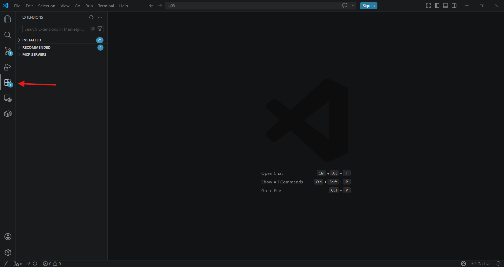
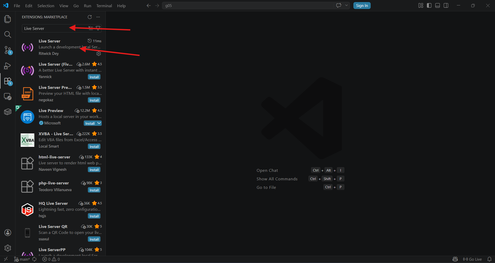
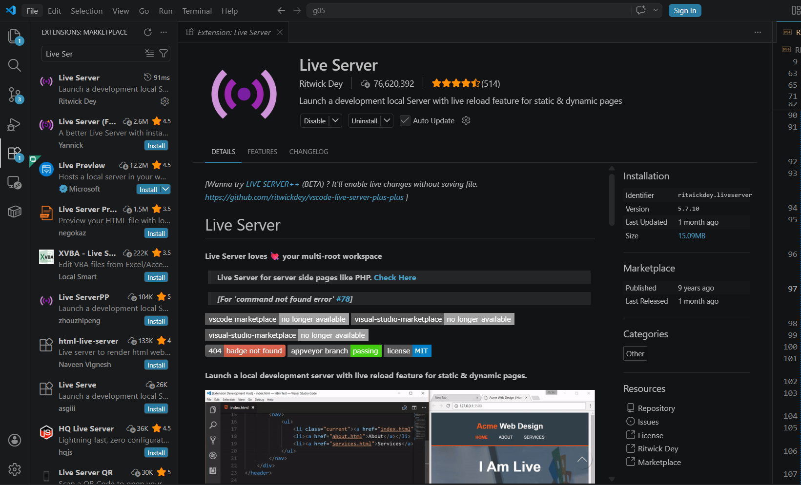
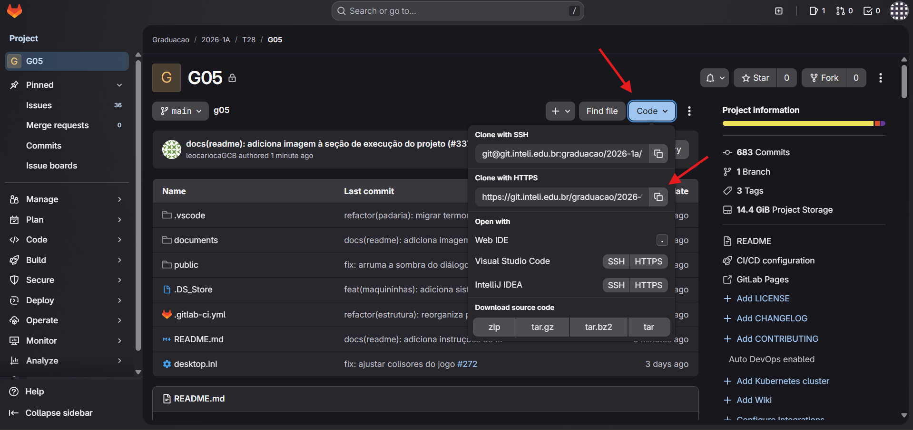
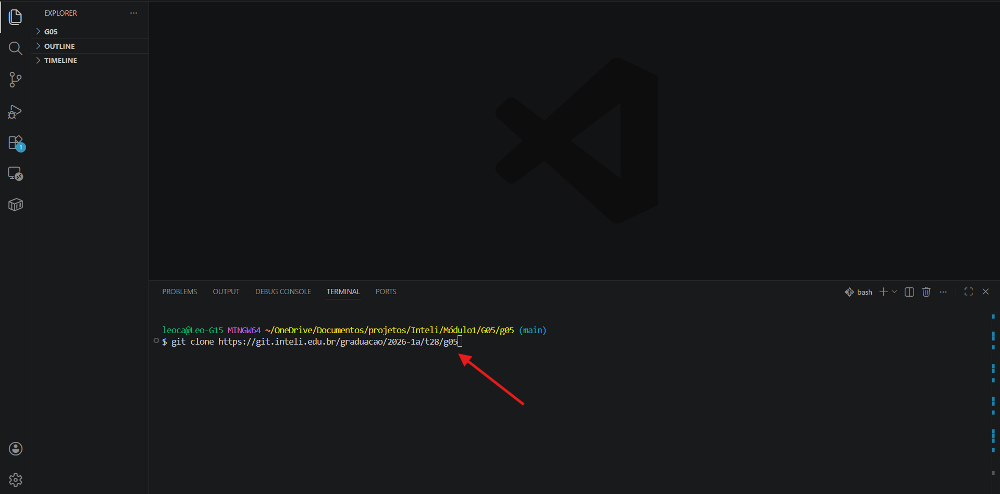
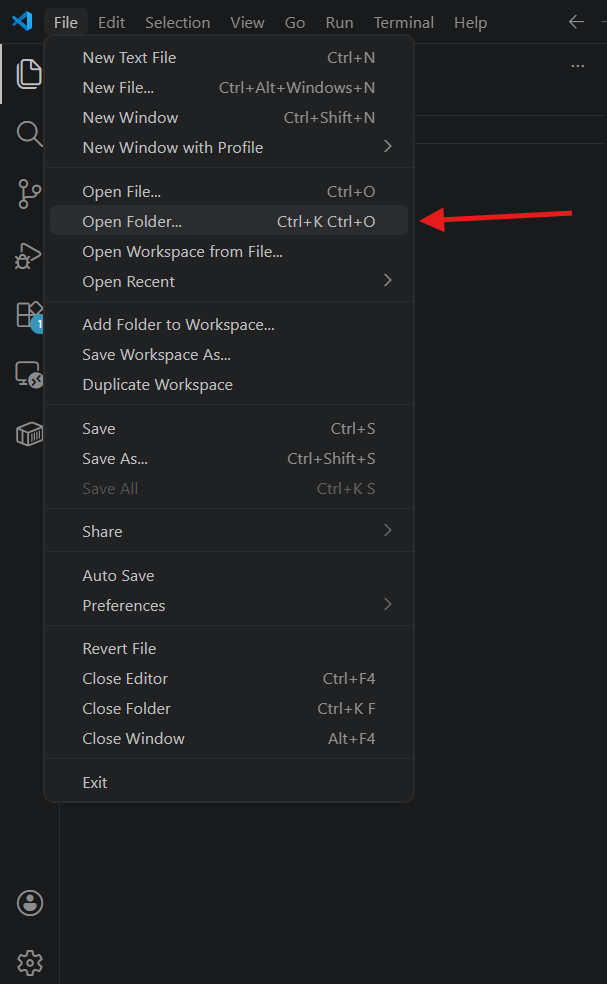
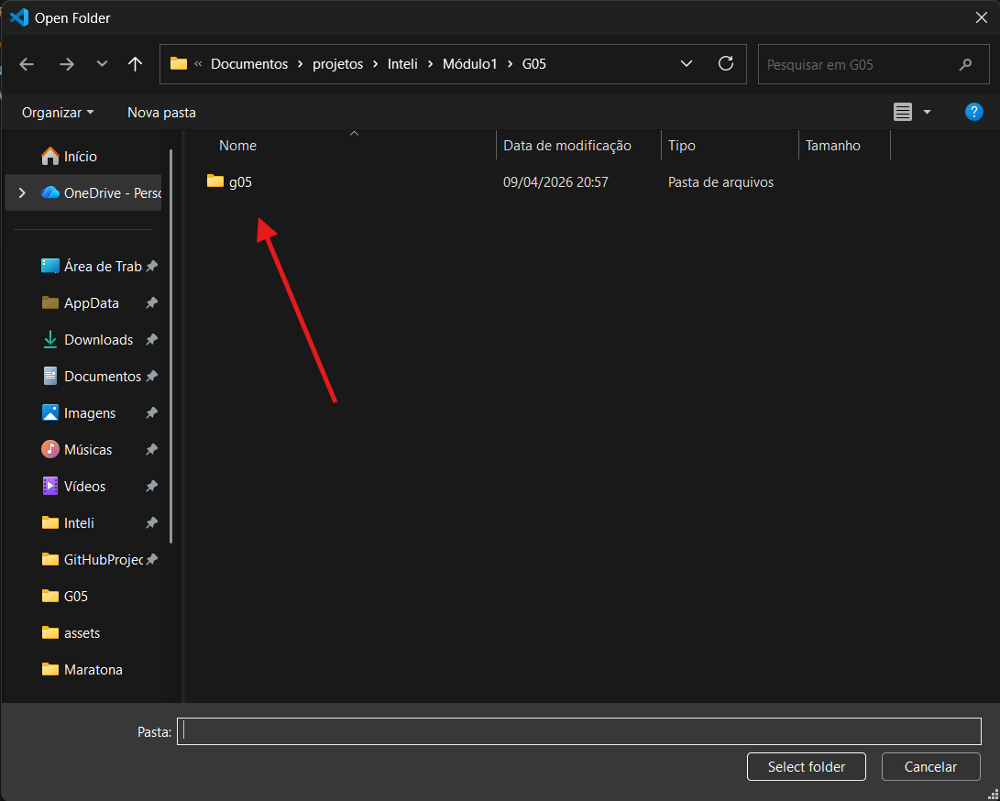
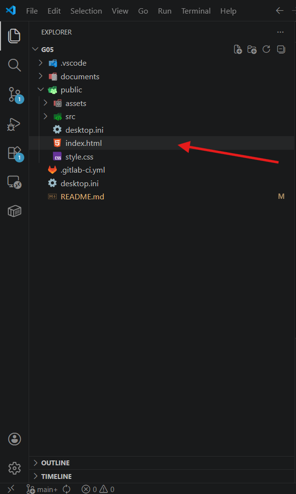
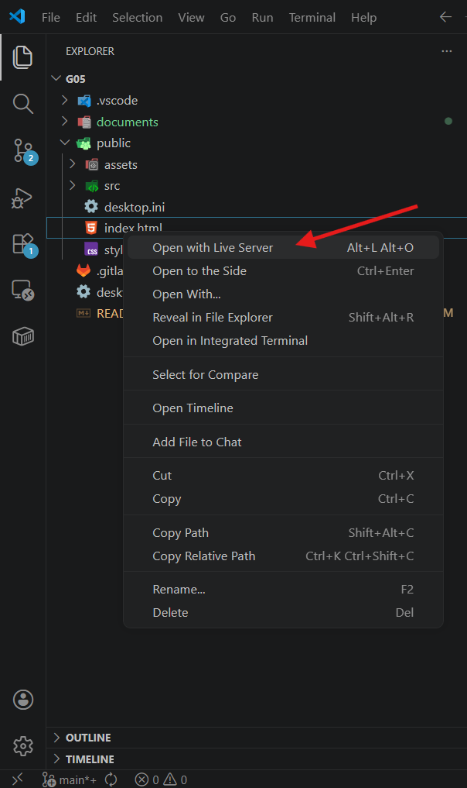
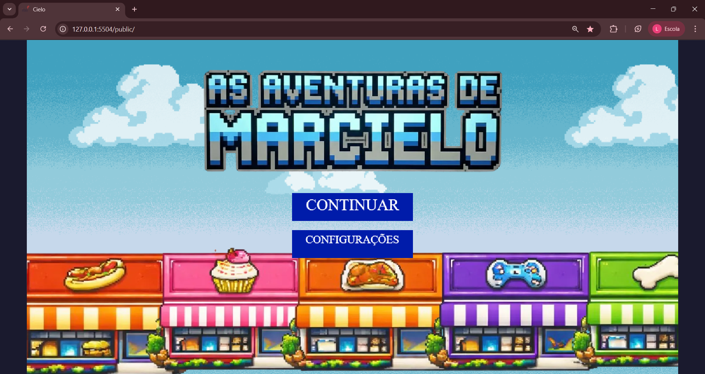

# Inteli - Instituto de Tecnologia e Liderança

<p align="center">
<a href= "https://www.inteli.edu.br/"></a>
</p>

<br>

# As Aventuras de Marcielo

## Os Marcielos — Grupo 5

## 👨‍🎓 Integrantes:

- <a href="https://www.linkedin.com/in/gabriel-gomes-pimentel/">Gabriel Gomes Pimentel</a>
- <a href="https://www.linkedin.com/in/tiago-brun-de-arruda-17959a3a9/">Tiago Brun de Arruda</a>
- <a href="https://www.linkedin.com/in/sofia-freitas-80a96538b/">Beatriz Sofia Freitas Sena</a>
- <a href="https://www.linkedin.com/in/fernanda-steiner-938806313/">Fernanda Jawetz Steiner</a>
- <a href="https://www.linkedin.com/in/vinícius-alves-04227a306/">Vinícius da Silva Alves</a>
- <a href="https://www.linkedin.com/in/luca-scolfaro-06b5563a9/">Luca do Val Scolfaro</a>
- <a href="https://www.linkedin.com/in/cassio-reis-costa-0989803b9/">Cassio Reis Costa</a>
- <a href="https://www.linkedin.com/in/leonardo-galdino-carioca-braz-15256133a/">Leonardo Galdino Carioca Braz</a>

## 👩‍🏫 Professores:

### Orientador(a)

- <a href="https://www.linkedin.com/in/vanunes/">Vanessa Nunes</a>

### Instrutores

- <a href="https://www.linkedin.com/in/cristiano-benites-ph-d-687647a8//">Cristiano Benites</a>
- <a href="https://www.linkedin.com/in/fabiana-martins-de-oliveira-8993b0b2/">Fabiana Martins</a>
- <a href="https://www.linkedin.com/in/geraldo-magela-severino-vasconcelos-22b1b220/">Geraldo Vasconcelos</a>
- <a href="https://www.linkedin.com/in/anacristinadossantos/">Ana Cristina</a>
- <a href="https://www.linkedin.com/in/pedroteberga/">Pedro Teberga</a>

## 📜 Descrição

As Aventuras de Marcielo é um serious game educacional desenvolvido em Phaser 3 para a Cielo, empresa líder no mercado brasileiro de adquirência. O jogador assume o papel de Marcielo, um gerente de negócios da Cielo que percorre um mapa urbano com 12 lojas, cada uma representando um perfil diferente de cliente — desde uma autoescola até uma joalheria.

O objetivo é treinar vendedores reais de forma prática e engajadora, simulando situações do dia a dia comercial da Cielo. Ao entrar em cada loja, o jogador interage com o cliente por meio de um quiz de argumentação de vendas. As respostas possuem quatro níveis de qualidade — excelente, boa, neutra e incorreta — refletindo a gradação real de uma negociação, não apenas certo ou errado.

O jogo utiliza um sistema de maquininhas como recurso gerenciável: o jogador começa sem nenhuma e precisa visitar a Central da Cielo para se reabastecer antes de atender os clientes. Ao conquistar um cliente com sucesso, uma maquininha é consumida. Essa mecânica simula a pressão de gerenciar uma carteira de clientes com recursos limitados.

O progresso é salvo automaticamente via localStorage, permitindo que o jogador continue de onde parou. Um HUD de progresso exibe quais NPCs já foram conquistados, e a pontuação acumulada reflete a qualidade das vendas realizadas ao longo da partida.

🎮 **Para jogar clique aqui:** [https://graduacao.pages.git.inteli.edu.br/2026-1a/t28/g05](https://graduacao.pages.git.inteli.edu.br/2026-1a/t28/g05)

## 📁 Estrutura de pastas

```
g05/
├── documents/
├── .vscode
├── documents
├── public
├── src\scenes
├── .gitlab-ci.yml
└── README.md
```

## 🔧 Como executar o código

### ⚙️ Pré-requisitos e Instalação

Antes de executar o jogo, é necessário instalar alguns programas básicos. Não se preocupe — o processo é simples e guiado.

---

#### 📦 Pré-requisitos

##### 🔹 1. Visual Studio Code

Editor de código utilizado para abrir e executar o projeto.

- Download: https://code.visualstudio.com/
- Versão recomendada: versão mais recente disponível

---

##### 🔹 2. Node.js

Necessário para rodar ferramentas auxiliares e servidor local.

- Download: https://nodejs.org/
- Versão utilizada no projeto: LTS (recomendada)

---

##### 🔹 3. Extensão do VS Code: Live Server

Permite executar o jogo diretamente no navegador.

Selecione a aba de extensões no canto esquerdo:


Pesquise por Live Server e selecione essa opção:


Por fim basta clicar em instalar na janela de extensões:


---

#### 📥 Como baixar o projeto (GitLab)

##### 🔹 Clonar o repositório com Git

1. Acesse o repositório no GitLab
2. Clique no botão **Code**
3. Copie a URL do repositório em **Clone With HTTPS**



---

4. Abra o terminal (Prompt de Comando, PowerShell ou Git Bash)
5. Execute o comando abaixo:

```bash
git clone URL_DO_REPOSITORIO
```

6. Aguarde o download do projeto



---

#### 📂 Abrindo o projeto

1. Abra o Visual Studio Code
2. Clique em **File → Open Folder**
3. Selecione a pasta do projeto clonada




---

#### ▶️ Como executar o jogo

1. No VS Code, localize o arquivo **index.html**
2. Clique com o botão direito sobre ele
3. Selecione **Open with Live Server**




---

#### 🌐 Resultado esperado

- O navegador abrirá automaticamente
- O jogo será carregado e pronto para uso



---

#### 🔄 Observações importantes

- Sempre execute o projeto pelo **Live Server** (não abra o HTML diretamente)
- O navegador atualiza automaticamente ao salvar alterações no código


---

## 🗃 Histórico de lançamentos

- 0.5.0 - 28/03/2026
  - Sistema de maquininhas com HUD e ciclo de recarga na Central da Cielo
  - HUD de progresso dos NPCs com painel expandido
  - Sistema de áudio completo com 20 sons (ambiente por loja, passos, clique, menu)
  - Interior da Central da Cielo implementado
  - Tela de configurações (volume, som, contraste, velocidade)
  - Minimapa com marcador do jogador
  - Transições entre cenas com fade azul Cielo
  - Persistência de progresso via localStorage
- 0.4.0 - 16/03/2026
  - Refatoração completa da estrutura de pastas seguindo padrão do professor
  - Renomeação de arquivos JS para português
  - Correção de caminhos de imagens no GDD
  - Balões decorativos nas lojas conquistadas
- 0.3.0 - 11/03/2026
  - Novo mapa da cidade implementado
  - Nova sprite animada do jogador (Marcielo)
  - NPCs específicos para cada loja adicionados ao mapa
  - Banco de perguntas expandido para todas as lojas
  - GDD atualizado com seções 3.2, 3.3, 3.4, 3.6 e 3.7
- 0.2.0 - 13/02/2026
  - Menu inicial com design melhorado
  - Publicação no GitLab Pages configurada
  - Ajustes visuais de tamanho e remoção de fundos das imagens
- 0.1.0 - 10/02/2026
  - Estrutura base do jogo criada com Phaser 3
  - Cena de cidade com movimentação do jogador
  - Sistema de quiz básico implementado
  - GDD inicial criado com análise de mercado (Porter, SWOT)

## 📋 Licença/License

<p xmlns:cc="http://creativecommons.org/ns#" xmlns:dct="http://purl.org/dc/terms/"><a property="dct:title" rel="cc:attributionURL" href="https://git.inteli.edu.br/graduacao/2026-1a/t28/g05">As Aventuras de Marcielo</a> by <a rel="cc:attributionURL dct:creator" property="cc:attributionName" href="https://www.inteli.edu.br/">Inteli</a>, <a href="https://www.linkedin.com/in/gabriel-gomes-pimentel/">Gabriel Gomes Pimentel</a>, <a href="https://www.linkedin.com/in/tiago-brun-de-arruda-17959a3a9/">Tiago Brun de Arruda</a>, <a href="https://www.linkedin.com/in/sofia-freitas-80a96538b/">Beatriz Sofia Freitas Sena</a>, <a href="https://www.linkedin.com/in/fernanda-steiner-938806313/">Fernanda Jawetz Steiner</a>, <a href="https://www.linkedin.com/in/vinícius-alves-04227a306/">Vinícius da Silva Alves</a>, <a href="https://www.linkedin.com/in/luca-scolfaro-06b5563a9/">Luca do Val Scolfaro</a>, <a href="https://www.linkedin.com/in/cassio-reis-costa-0989803b9/">Cassio Reis Costa</a>, <a href="https://www.linkedin.com/in/leonardo-galdino-carioca-braz-15256133a/">Leonardo Galdino Carioca Braz</a> is licensed under <a href="http://creativecommons.org/licenses/by/4.0/?ref=chooser-v1" target="_blank" rel="license noopener noreferrer" style="display:inline-block;">Attribution 4.0 International</a>.</p>
