# GDD - Game Design Document - Módulo 1 - Inteli

**_Os trechos em itálico servem apenas como guia para o preenchimento da seção. Por esse motivo, não devem fazer parte da documentação final_**

## Nome dos integrantes Grupo

Gabriel Gomes Pimentel <br>
Tiago Brun de Arruda <br>
Beatriz Sofia Freitas Sena <br>
Fernanda Jawetz Steiner <br>
Vinícius da Silva Alves <br>
Luca do Val Scolfaro <br>
Cassio Reis Costa <br>
Leonardo Galdino Carioca Braz <br>

## Link Do Jogo
https://git.inteli.edu.br/graduacao/2026-1a/t28/g05/pages#overview

## Sumário

[1. Introdução](#c1)

[2. Visão Geral do Jogo](#c2)

[3. Game Design](#c3)

[4. Desenvolvimento do jogo](#c4)

[5. Casos de Teste](#c5)

[6. Conclusões e trabalhos futuros](#c6)

[7. Referências](#c7)

[Anexos](#c8)

<br>

# <a name="c1"></a>1. Introdução (sprints 1 a 4)

## 1.1. Plano Estratégico do Projeto

### 1.1.1. Contexto da indústria (sprint 2)

A Cielo atua no mercado brasileiro de adquirência, com modelo baseado em MDR e terminais POS, em um setor marcado por escala elevada e competição com Rede, Getnet, Stone e PagSeguro. Em 2023, a companhia processou cerca de 7,9 bilhões de transações e atendeu mais de 870 mil estabelecimentos (Cielo, 2023). Em 2024, o mercado de cartões manteve relevância no volume transacionado, ainda sob pressão da expansão do Pix, da digitalização do varejo e da atuação de fintechs (ABECS, 2024; Reuters, 2026).

#### 1.1.1.1. Modelo de 5 Forças de Porter (sprint 2)

#### 1.1.1.1.1 Ameaça de Novos Entrantes (nível: moderado)
A ameaça de novos entrantes é moderada. Embora o setor exija alto investimento inicial em tecnologia, prevenção a fraudes e capacidade operacional, também há barreiras regulatórias relevantes, já que participantes precisam cumprir exigências do Banco Central. Além disso, escala, reputação e rede comercial continuam sendo vantagens das incumbentes. O impacto dos novos entrantes ocorre principalmente por pressão em preços, redução de margens e maior disputa por participação de mercado (Porter, 2008; Banco Central do Brasil, 2024; Cielo S.A., 2024).

#### 1.1.1.1.2 Ameaça de Produtos ou Serviços Substitutos (nível: alto)
A ameaça de substitutos é alta. O Pix se consolidou como alternativa central aos pagamentos com cartão, reduzindo fricções de custo e prazo para parte dos lojistas e consumidores. Em paralelo, bancos digitais, marketplaces com pagamento embutido e carteiras digitais ampliam a substituição de soluções tradicionais de adquirência, sobretudo em segmentos sensíveis a taxa e experiência digital. Isso pressiona o modelo baseado em MDR e exige inovação contínua em serviços de valor agregado (Banco Central do Brasil, 2024; ABECS, 2024; Reuters, 2026).

#### 1.1.1.1.3 Poder de Barganha dos Fornecedores (nível: moderado a alto)
O poder de barganha dos fornecedores é moderado a alto, variando por grupo. Bandeiras (Visa, Mastercard, Elo e American Express) possuem poder elevado por definirem padrões e regras operacionais críticas. Bancos emissores e parceiros de liquidação têm poder moderado, enquanto fornecedores de tecnologia (antifraude, gateways e infraestrutura) tendem a moderado-alto devido ao custo de substituição e dependência técnica. Já hardware e telecom apresentam poder moderado. Esse arranjo impacta custos, prazos e capacidade de inovação das adquirentes (Banco Central do Brasil, 2024; Cielo S.A., 2024).

#### 1.1.1.1.4 Poder de Barganha dos Clientes (nível: alto)
A base de clientes inclui pequenos e médios varejistas, grandes redes, e-commerce, autônomos e segmentos como bares e restaurantes. O poder de barganha desse grupo é alto, pois há ampla oferta de provedores, baixa barreira de troca e forte sensibilidade a taxa, prazo de recebimento e qualidade de serviço. A expansão do Pix reforça essa pressão competitiva e aumenta a exigência por propostas de valor mais completas, com serviços financeiros e integração digital (Cielo S.A., 2024; Banco Central do Brasil, 2024; Reuters, 2026).

#### 1.1.1.1.5 Rivalidade entre Concorrentes Existentes (nível: muito alto)
A rivalidade no setor de adquirência é muito alta. Após o fim do modelo de exclusividade entre bandeiras e adquirentes, o mercado ficou mais pulverizado, com competição intensa em preço, tecnologia, crédito, antecipação, conta digital e integração com Pix. Concorrentes como Rede, Getnet, Stone, PagBank e Mercado Pago disputam os mesmos segmentos e pressionam margens. Para a Cielo, o impacto direto é a maior pressão sobre market share e necessidade contínua de investimento para retenção e diferenciação competitiva (Banco Central do Brasil, 2023; Cielo S.A., 2023; StoneCo Ltd., 2023; PagSeguro Digital Ltd., 2023).

### 1.1.2. Análise SWOT (sprint 2)

Nesta seção, a matriz SWOT contextualiza o posicionamento competitivo da Cielo no mercado brasileiro de adquirência, considerando sua escala operacional, estrutura de custos, pressão competitiva e oportunidades de crescimento em serviços de maior valor agregado. A análise combina fatores internos (forças e fraquezas) e externos (oportunidades e ameaças) para apoiar decisões estratégicas relacionadas a inovação, eficiência operacional, retenção de clientes e adaptação ao avanço do Pix e da digitalização dos meios de pagamento.

| FORÇAS (STRENGTHS) | FRAQUEZAS (WEAKNESSES) |
| :--- | :--- |
| **Escala e Capilaridade:** Presença em 99% dos municípios brasileiros e sólida infraestrutura de processamento. | **Dependência Bancária:** Estrutura de governança dividida entre BB e Bradesco, o que pode tornar a decisão estratégica lenta. |
| **Apoio de Acionistas:** Suporte financeiro e de distribuição através das redes de agências do Banco do Brasil e Bradesco. | **Margens sob Pressão:** Redução do lucro líquido recorrente devido à necessidade de baixar taxas para manter clientes. |
| **Inovação em Produtos:** Investimentos crescentes em tecnologia (IA, pagamentos via celular/TAP e biometria). | **Perda de Market Share:** Dificuldade em reter fatia de mercado frente a competidores nativos digitais mais ágeis. |
| **Ecossistema Completo:** Oferta de serviços além da captura, como gestão de dados e antecipação de recebíveis. | **Estrutura de Custos:** Custos fixos elevados herdados do modelo tradicional de aluguel de máquinas físicas. |

<br>

| OPORTUNIDADES (OPPORTUNITIES) | AMEAÇAS (THREATS) |
| :--- | :--- |
| **Monetização de Dados:** Utilização estratégica de inteligência de dados (ICVA) para converter informações em valor, oferecendo consultoria especializada e produtos personalizados que atendam às demandas específicas do mercado moderno. | **Consolidação do Pix:** O avanço acelerado do Pix no mercado brasileiro reduz drasticamente a receita vinda de taxas de cartões de débito tradicionais, exigindo novas estratégias de monetização para as instituições financeiras. |
| **Expansão em PMEs:** Foco intensivo na aceleração do volume de transações e no fortalecimento da presença junto a Pequenas e Médias Empresas, visando escala e maior capilaridade no setor. | **Guerra das Maquininhas:** Existe uma competição extremamente agressiva de taxas com empresas consolidadas como Stone, PagBank e Getnet, o que pressiona as margens de lucro e força a busca por diferenciais competitivos. |
| **Digitalização do Varejo:** Fomento ao crescimento contínuo do e-commerce através da implementação de soluções inovadoras de pagamento invisível, eliminando fricções e otimizando a jornada de compra do consumidor final. |**Regulação e Cibersegurança:** Observamos um aumento significativo nos custos operacionais com segurança digital e adaptação às novas normas rígidas impostas pelo Banco Central. |


---
### Análise SWOT


#### **1. Forças (Strengths)**
A Cielo S.A. fundamenta sua liderança de mercado em uma escala operacional massiva, atingindo 99% dos municípios brasileiros. Esta robustez é amplificada pela aliança estratégica com seus controladores, o Banco do Brasil e o Bradesco, que proporcionam um canal de distribuição capilar e reduzem drasticamente o custo de aquisição de clientes (Cielo S.A., 2024). Além disso, a companhia detém uma infraestrutura tecnológica resiliente, capaz de processar bilhões de transações com alta segurança e baixa latência.

#### **2. Fraquezas (Weaknesses)**
Apesar de sua solidez, a complexidade da estrutura de governança dividida entre dois grandes bancos tradicionais é uma fraqueza que pode comprometer a agilidade estratégica. Em um mercado dinâmico, essa lentidão burocrática dificulta a resposta a inovações disruptivas quando comparada a rivais ágeis e nativos digitais como Stone e PagBank (Moraes & Silva, 2021). Outro ponto crítico é a manutenção de uma estrutura de custos fixos elevada, focada em terminais físicos (POS), enquanto o setor migra progressivamente para soluções de software.

#### **3. Oportunidades (Opportunities)**
A vasta base de dados transacionais acumulada pela Cielo oferece uma oportunidade única de monetização através da inteligência de negócios. Por meio do ICVA (Índice Cielo do Varejo), a empresa pode converter informações em consultoria estratégica para lojistas e indústrias, criando novas linhas de receita (Cielo S.A., 2024). Há também um campo fértil para a expansão de serviços financeiros integrados, como a oferta de crédito personalizado e a antecipação de recebíveis.

#### **4. Ameaças (Threats)**
A principal ameaça ao modelo de negócio tradicional é a consolidação do Pix, que reduz a dependência dos cartões de débito e impacta diretamente as receitas provenientes de taxas de intercâmbio (Banco Central do Brasil, 2024). Paralelamente, a intensa "guerra das maquininhas" promove uma competição predatória de taxas, forçando a compressão das margens líquidas (Moraes & Silva, 2021). O cenário é agravado pela entrada de Big Techs no fluxo de pagamentos e pelas constantes atualizações regulatórias do Banco Central (Banco Central do Brasil, 2024).

---

Com base nos dados levantados nesta sprint, fica claro que a Cielo possui uma infraestrutura massiva e um apoio bancário sólido, mas enfrenta o desafio de converter esse tamanho em agilidade. As informações retiradas mostram que, embora a empresa domine a capilaridade no Brasil, ela sofre com a pressão nas margens de lucro e a concorrência agressiva de modelos digitais mais leves. Em conclusão, o sucesso da Cielo dependerá de sua capacidade de transformar sua vasta base de dados em novos produtos de inteligência, compensando a queda nas taxas tradicionais e se adaptando à nova realidade de pagamentos instantâneos, como o Pix.

---

### 1.1.3. Missão / Visão / Valores (sprint 2)

Missão: Criar um jogo digital que simule situações reais de vendas, promovendo aprendizado prático e acessível para os Gerentes de Negócios da Cielo.

Visão: Desenvolver uma solução digital prática e eficaz, que contribua para reduzir as barreiras geográficas nos treinamentos da Cielo.

Valores: Aprendizado contínuo, inovação responsável, colaboração em equipe e compromisso com impacto educacional.


### 1.1.4. Proposta de Valor (sprint 4)

_Posicione aqui o canvas de proposta de valor. Descreva os aspectos essenciais para a criação de valor da ideia do produto com o objetivo de ajudar a entender melhor a realidade do cliente e entregar uma solução que está alinhado com o que ele espera._

### 1.1.5. Descrição da Solução Desenvolvida (sprint 4)

_Descreva brevemente a solução desenvolvida para o parceiro de negócios. Descreva os aspectos essenciais para a criação de valor da ideia do produto com o objetivo de ajudar a entender melhor a realidade do cliente e entregar uma solução que está alinhado com o que ele espera. Observe a seção 2 e verifique que ali é possível trazer mais detalhes, portanto seja objetivo aqui. Atualize esta descrição até a entrega final, conforme desenvolvimento._

### 1.1.6. Matriz de Riscos (sprint 4)

_Registre na matriz os riscos identificados no projeto, visando avaliar situações que possam representar ameaças e oportunidades, bem como os impactos relevantes sobre o projeto. Apresente os riscos, ressaltando, para cada um, impactos e probabilidades com plano de ação e respostas._

### 1.1.7. Objetivos, Metas e Indicadores (sprint 4)

_Definição de metas SMART (específicas, mensuráveis, alcançáveis, relevantes e temporais) para seu projeto, com indicadores claros para mensuração_

## 1.2. Requisitos do Projeto (sprints 1 e 2)

Esta seção apresenta os requisitos do sistema, organizados em requisitos funcionais (RF) e requisitos não funcionais (RNF). Os requisitos funcionais descrevem as funcionalidades e comportamentos que o sistema deve oferecer ao usuário. Já os requisitos não funcionais definem características de qualidade e restrições do sistema, como desempenho, usabilidade e ambiente de execução. As tabelas a seguir detalham cada um desses requisitos, identificados por código e acompanhados de suas respectivas descrições.

### 1.2.1. Requisitos Funcionais

| ID | Requisito Funcional | Descrição |
| --- | --- | --- |
| RF01 | Menu inicial | O sistema deve apresentar um menu inicial que permita ao jogador iniciar a partida e acessar as opções principais do jogo. |
| RF02 | Menu de configurações e novo jogo | O sistema deve disponibilizar um menu de configurações com opção para ajustar o volume do jogo e um botão de novo jogo, responsável por iniciar uma nova partida apagando os dados do jogo anterior. |
| RF03 | Progresso da sessão | O sistema deve manter o progresso do jogador apenas durante a sessão ativa, sem persistência após o encerramento da aplicação. |
| RF04 | Tutorial inicial | O sistema deve apresentar um tutorial interativo explicando movimentação, interação com NPCs, funcionamento dos quizzes e sistema de pontuação antes da primeira partida. |
| RF05 | Sistema de quizzes de negociação | O sistema deve disponibilizar quizzes interativos de negociação com NPCs sobre produtos da Cielo. Cada estabelecimento terá 3 perguntas com 4 opções de resposta (1 correta). O jogador conquista o cliente ao acertar pelo menos 2 perguntas; caso erre 2, a negociação falha e o cliente é perdido. |
| RF06 | Sistema de variáveis do cliente | O sistema deve controlar variáveis dinâmicas de tempo de atendimento e humor do cliente, influenciando o resultado das interações e o desempenho do jogador. |
| RF07 | Sistema de pontuação | O sistema deve calcular automaticamente a pontuação considerando escolhas do quiz e estado de humor do cliente ao final da interação. |
| RF08 | Painel de desempenho em tempo real | O sistema deve exibir painel visual com indicadores da partida atual, incluindo pontuação, status do cliente e progresso do jogador, sendo reiniciado ao final da sessão. |
| RF09 | Interação com NPCs | O sistema deve permitir interação com NPCs distribuídos no mapa para iniciar negociações e acessar quizzes. |
| RF10 | Navegação em mundo aberto | O sistema deve permitir movimentação livre do jogador em ambiente 2D top-down, possibilitando exploração e seleção de clientes. |
| RF11 | Sistema de feedback educativo | O sistema deve apresentar um feedback educativo após cada resposta selecionada no quiz, mostrando qual é a alternativa correta, caso tenha errado. Ao final de cada cena, o sistema deve exibir um feedback geral da negociação: positivo caso o jogador conquiste o NPC cliente ou negativo caso não consiga concluir a negociação com sucesso. |

### 1.2.2. Requisitos Não Funcionais

| ID | Requisito Não Funcional | Descrição |
| --- | --- | --- |
| RNF01 | Ambiente gráfico | O jogo deve ser desenvolvido em ambiente 2D com perspectiva top-down, priorizando navegação simples, leitura visual clara e baixa complexidade operacional. |
| RNF02 | Plataforma de execução | O jogo deve ser executável diretamente em navegadores web modernos, sem necessidade de instalação ou configuração adicional. |
| RNF03 | Usabilidade e linguagem | O jogo deve utilizar linguagem clara, objetiva e adequada ao contexto comercial e educacional da Cielo. |
| RNF04 | Interface do usuário | O sistema deve apresentar interface visual organizada e intuitiva, facilitando a navegação e interação do jogador. |
| RNF05 | Identidade visual | O sistema deve manter padronização de cores, tipografia e elementos gráficos conforme a identidade visual do projeto. |
| RNF06 | Acessibilidade | A interface deve priorizar leitura clara, contraste adequado e elementos visuais compreensíveis para diferentes perfis de usuários. |
| RNF07 | Desempenho | O jogo deve manter execução fluida em navegadores corporativos padrão, evitando quedas perceptíveis de desempenho. |
| RNF08 | Acessibilidade operacional | As mecânicas devem exigir baixo nível de habilidade gamer, permitindo uso por usuários sem experiência prévia com jogos digitais. |

## 1.3. Público-alvo do Projeto (sprint 2)

O jogo é direcionado aos colaboradores da equipe comercial da Cielo, com faixa etária média aproximada de 44 anos. Trata-se de um público adulto inserido em ambiente corporativo, com experiência prévia em vendas, negociação e relacionamento com clientes.

Perfil Demográfico

Profissionais da área de vendas e relacionamento comercial

Faixa etária média: 40–50 anos

Usuários com familiaridade funcional com tecnologia digital

Predominantemente non-gamers ou jogadores ocasionais

Tempo limitado para atividades de treinamento devido à rotina profissional

Perfil Psicográfico e Preferências

Esse público tende a demonstrar maior engajamento com experiências de aprendizado que:

Possuam aplicação prática no contexto profissional

Simulem situações do cotidiano de vendas e negociação

Apresentem feedback claro de desempenho

Incentivem evolução contínua e melhoria de resultados

Necessidades de Aprendizagem

Considerando o contexto de atuação da equipe comercial, destacam-se como relevantes para o público:

Persuasão e argumentação em vendas

Tomada de decisão em situações de negociação

Interpretação de perfis de clientes

Estratégias de marketing e negociação

Comunicação clara e assertiva
# <a name="c2"></a>2. Visão Geral do Jogo (sprint 2)

## 2.1. Objetivos do Jogo (sprint 2)

O objetivo do jogo é desenvolver as habilidades de negociação do jogador por meio de simulações de vendas em contextos realistas. Para avançar nas fases, o jogador deve participar de interações com clientes e responder quizzes relacionados às situações de negociação. A progressão no jogo depende do desempenho nessas atividades, sendo necessário atingir a pontuação mínima definida a partir das respostas corretas e das decisões tomadas durante a interação com o cliente. Durante as simulações, espera-se que o jogador demonstre compreensão do perfil e das necessidades apresentadas, aplique corretamente conhecimentos sobre produtos e soluções e responda de maneira adequada às objeções propostas pelo sistema. O avanço ocorre à medida que o jogador obtém êxito nas negociações simuladas; ao fechar negócios com sucesso, ele progride de nível e passa a interagir com clientes mais exigentes e cenários progressivamente mais complexos.
O jogo é concluído quando todas as fases são finalizadas com sucesso, indicando que o jogador conseguiu manter um bom desempenho e evoluir ao longo dos diferentes cenários de negociação.

## 2.2. Características do Jogo (sprint 2)

O jogo é uma simulação interativa de negociação focada no desenvolvimento de habilidades comerciais em um ambiente virtual. Ele é organizado em fases progressivas, nas quais o jogador interage com diferentes perfis de clientes por meio de quizzes que representam situações comuns do processo de vendas. Ao longo da experiência, são utilizados elementos de gamificação, como pontuação, níveis e aumento gradual da dificuldade, permitindo que o jogador experimente estratégias, tome decisões e perceba os resultados de suas escolhas. Dessa forma, o jogo combina engajamento com aprendizagem prática, oferecendo um espaço seguro para treinar comunicação, argumentação e tomada de decisão.

### 2.2.1. Gênero do Jogo (sprint 2)

O jogo pode ser classificado como um serious game de simulação com quizzes.

### 2.2.2. Plataforma do Jogo (sprint 2)

Atualmente o jogo está sendo feito apenas para desktop em navegadores web.

### 2.2.3. Número de jogadores (sprint 2)

Apenas 1 jogador.

### 2.2.4. Títulos semelhantes e inspirações (sprint 2)

Os jogos Pokémon Fire Red, Pokémon Leaf Green e Pokémon Emerald além de serem semelhantes, foram usados como inspiração para o nosso jogo.

### 2.2.5. Tempo estimado de jogo (sprint 5)

Aproximadamente 15 minutos.

# <a name="c3"></a>3. Game Design (sprints 2 e 3)

## 3.1. Enredo do Jogo (sprints 2 e 3)

<p>O jogo se passa em uma pequena cidade comercial, com 6 quadras e 12 lojas distribuídas de forma estratégica, representando diferentes perfis de clientes e realidades do mercado brasileiro. Cada quadra conta com 2 lojas, compondo os principais ambientes de interação do jogo. Esse ambiente simboliza o dia a dia dos lojistas, com dúvidas, pressões e necessidade de tomar decisões rápidas. O cenário é simples de propósito, para que o foco do jogador esteja nas interações e na qualidade da venda. O personagem principal é um gerente da Cielo, representado por um mascote, que já atua na empresa, mas precisa evoluir suas habilidades de argumentação, conhecimento de produto e capacidade de lidar com objeções. Sua jornada dentro do jogo representa o desenvolvimento profissional esperado de qualquer gerente.</p>
<p>A história começa a partir de um desafio real enfrentado pela Cielo: a dificuldade de treinar gerentes espalhados por todos os cantos do Brasil. Os treinamentos presenciais e aulas tradicionais não conseguem alcançar todos com a mesma consistência e frequência, principalmente considerando as diferentes regiões e contextos comerciais do país. Surge então a necessidade de uma solução acessível, prática e escalável. O jogo é criado como uma ferramenta estratégica de aprendizagem, permitindo que qualquer gerente, independentemente de onde esteja, possa aprender e treinar a venda dos produtos Cielo de forma interativa e dinâmica.</p>
<p>Ao percorrer a cidade, o mascote entra nas lojas e inicia contato com os clientes, que começam vestindo camiseta vermelha, indicando que ainda não foram convencidos ou não possuem relação com a Cielo. Cada interação possui tempo limitado para resposta, simulando a pressão do mundo real, onde o lojista busca objetividade e clareza. Durante o atendimento, o jogador precisa responder perguntas sobre produtos, lidar com dúvidas e superar objeções. Além disso, há um indicador de conversão do cliente, que mostra se a condução da venda está sendo positiva ou não. Não basta apenas fechar a venda; é necessário gerar confiança e segurança.</p>
<p>Conforme o jogador avança, os clientes se tornam mais exigentes e as perguntas mais complexas, aumentando o nível de desafio. Quando a venda é bem conduzida e o cliente se sente seguro, a camiseta muda de vermelho para azul, representando que ele se tornou cliente Cielo. Essa transformação visual simboliza não apenas a conversão, mas também o impacto da boa argumentação e do conhecimento aplicado corretamente. À medida que mais clientes se tornam azuis, a cidade passa a representar crescimento, consolidação e fortalecimento da presença da Cielo naquele ambiente.</p>


## 3.2. Personagens (sprints 2 e 3)

### 3.2.1. Controláveis

<p>O nome do personagem principal é Marcielo. Trata-se de um mascote cuja função é atuar como facilitador da experiência do jogador, tendo como objetivo vender produtos da Cielo aos clientes dentro do ambiente do jogo. Para isso, ele se locomove pelo mapa e entra nas lojas a fim de interagir com os consumidores, simulando de maneira lúdica situações de venda e atendimento.</p>
<p>Sua presença contribui para tornar a dinâmica menos séria e mais envolvente, graças ao seu design amigável e expressivo. Marcielo transmite simpatia e carisma, sendo visualmente cativante e facilmente associado a uma figura confiável e acessível. Ele é representado sorrindo, com a mão levantada em um gesto cordial e piscando um dos olhos, elementos que reforçam sua personalidade acolhedora e descontraída. Dessa forma, o personagem não apenas cumpre uma função narrativa e interativa, como também torna a experiência do jogo mais leve, divertida e agradável para o público.</p>

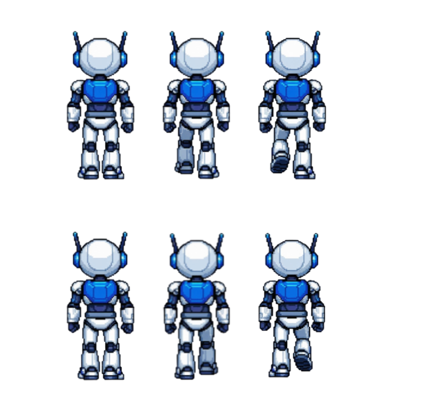
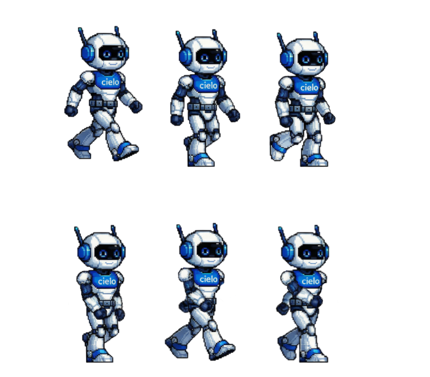
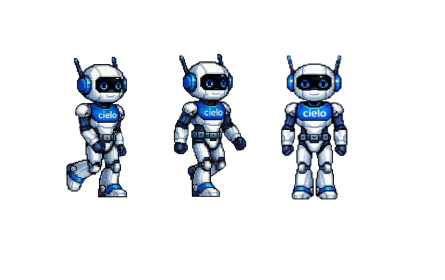
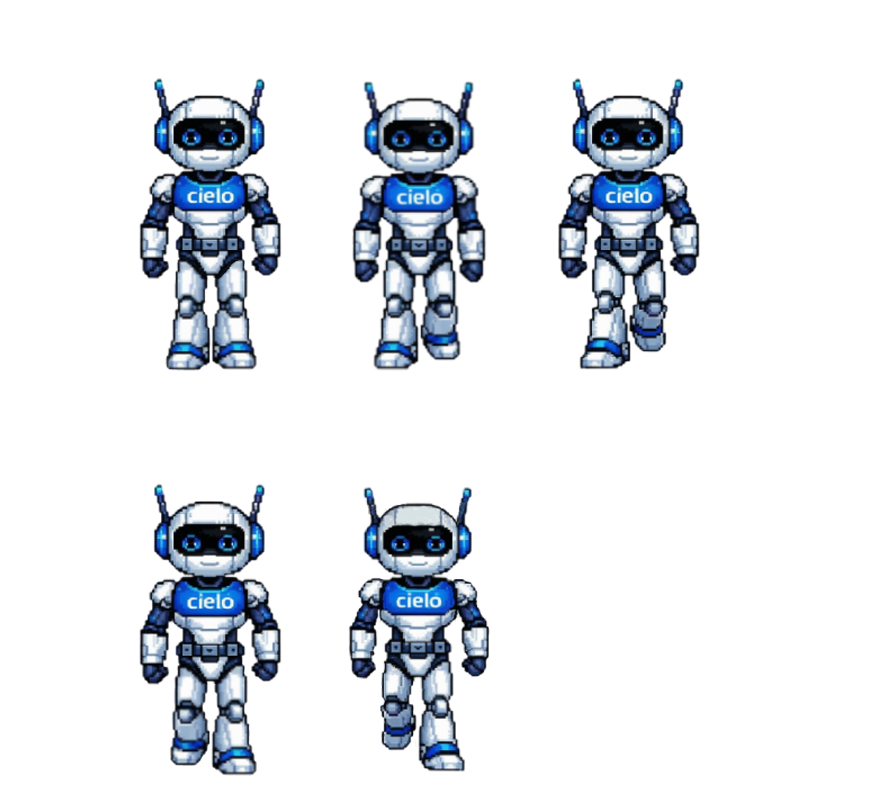

### 3.2.2. Non-Playable Characters (NPC)

<p>No jogo, haverá personagens coadjuvantes que representarão os clientes. Esses clientes estarão posicionados dentro das lojas e interagirão com o personagem principal nos momentos de negociação e venda dos produtos da Cielo.</p>
<p>Haverá dois tipos de clientes: os que utilizam camiseta vermelha e os que utilizam camiseta azul. A camiseta vermelha indica que o cliente ainda não foi convencido ou que ainda não teve contato com o vendedor. Após uma venda bem-sucedida, o cliente passará a utilizar camiseta azul, representando que se tornou um cliente Cielo.</p>
<P>Além disso, esses personagens também funcionam como um recurso para demonstrar diversidade no jogo. Por esse motivo, foram criados diferentes perfis de clientes para cada loja, com variações de aparência e características, de modo que o ambiente se torne mais representativo, dinâmico e diversificado ao longo da experiência do jogador.</p>

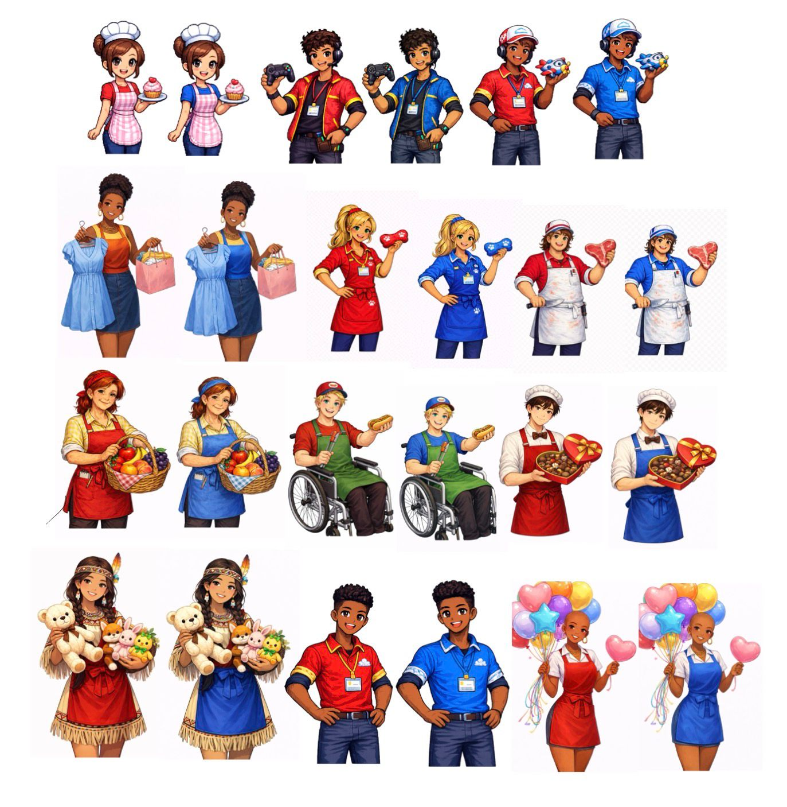

### 3.2.3. Diversidade e Representatividade dos Personagens

<p>O elenco de personagens do jogo foi concebido de forma a refletir a pluralidade da sociedade brasileira e a realidade dos clientes que os Gerentes de Negócios da Cielo encontram no cotidiano profissional.</p>

<p><strong>Alinhamento com o público-alvo:</strong> O público-alvo do jogo (seção 1.3) são profissionais da equipe comercial da Cielo, com faixa etária entre 40 e 50 anos, inseridos em ambiente corporativo e com experiência em vendas. Os NPCs, clientes que habitam as lojas, foram criados com perfis variados de idade, gênero e aparência justamente para espelhar a diversidade de estabelecimentos e proprietários que um vendedor encontra em campo: desde uma doceira jovem em uma cupcakeria até o dono de uma padaria de bairro de meia-idade. Esse realismo nos perfis dos clientes torna o treinamento mais imersivo e transferível para situações reais de trabalho.</p>

<p><strong>Representatividade dentro da sociedade brasileira:</strong> O Brasil é um país marcado por intensa diversidade étnica, geracional e de gênero. De acordo com o Censo 2022 do IBGE, mais da metade da população se autodeclara preta ou parda, e o empreendedorismo de micro e pequenos negócios é amplamente distribuído entre diferentes perfis sociodemográficos. Para refletir essa realidade, os personagens coadjuvantes foram desenhados com variações de tom de pele, gênero, faixa etária e características físicas distintas, evitando a homogeneização do público consumidor que o vendedor deverá atender.</p>

<p><strong>Impacto esperado:</strong> A diversidade intencional nos personagens produz dois efeitos principais. Primeiro, amplia a identificação do jogador com o universo do jogo: vendedores de diferentes origens reconhecem nos clientes representações próximas à realidade que vivenciam. Segundo, reforça de forma implícita o valor da inclusão no relacionamento comercial, comunicando que os produtos da Cielo são relevantes para todos os perfis de estabelecimento, independentemente de quem seja o proprietário. Ao normalizar essa diversidade dentro da mecânica de treinamento, o jogo contribui para desenvolver uma postura comercial mais empática e culturalmente sensível nos colaboradores da Cielo.</p>


## 3.3. Mundo do jogo (sprints 2 e 3)

### 3.3.1. Locações Principais e/ou Mapas (sprints 2 e 3)

<p>O ambiente do jogo será estruturado de forma simples e objetiva, a fim de garantir que o jogador compreenda com clareza para onde deve se dirigir, evitando a perda de tempo ao se deslocar pelo mapa sem propósito. O cenário será composto por uma pequena cidade, organizada em 6 quadras com 2 lojas em cada uma, totalizando 12 lojas que funcionarão como os principais ambientes do jogo. No interior desses estabelecimentos ocorrerão as negociações e as vendas dos produtos da Cielo.</p>

Segue abaixo o mapa: 

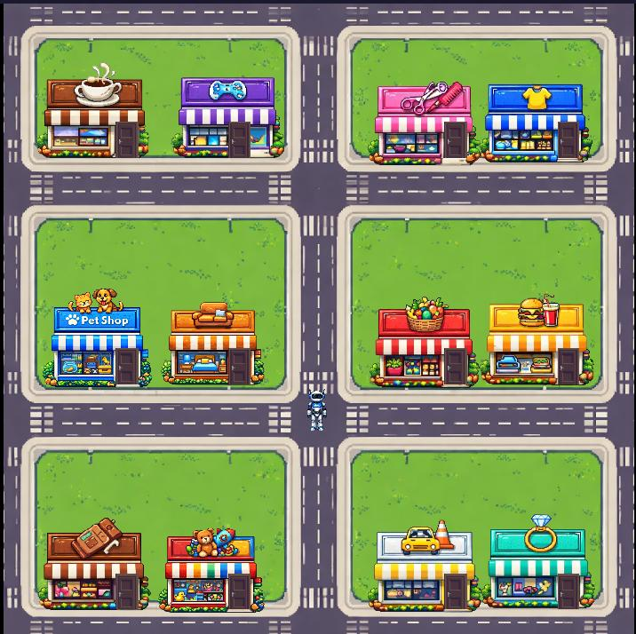


### 3.3.2. Navegação pelo mundo (sprints 2 e 3)

<p>O personagem terá acesso a todas as lojas do mapa, podendo se locomover entre elas livremente. Ao chegar a uma loja, entrará no ambiente interno, onde realizará a negociação e a venda do produto ao cliente. Após a conclusão da venda, o personagem sairá da loja correspondente e seguirá para a próxima, dando continuidade ao processo e buscando novos clientes ao longo do mapa.</p>


### 3.3.3. Condições climáticas e temporais (sprints 2 e 3)

Não se aplica 

### 3.3.4. Concept Art (sprint 2)

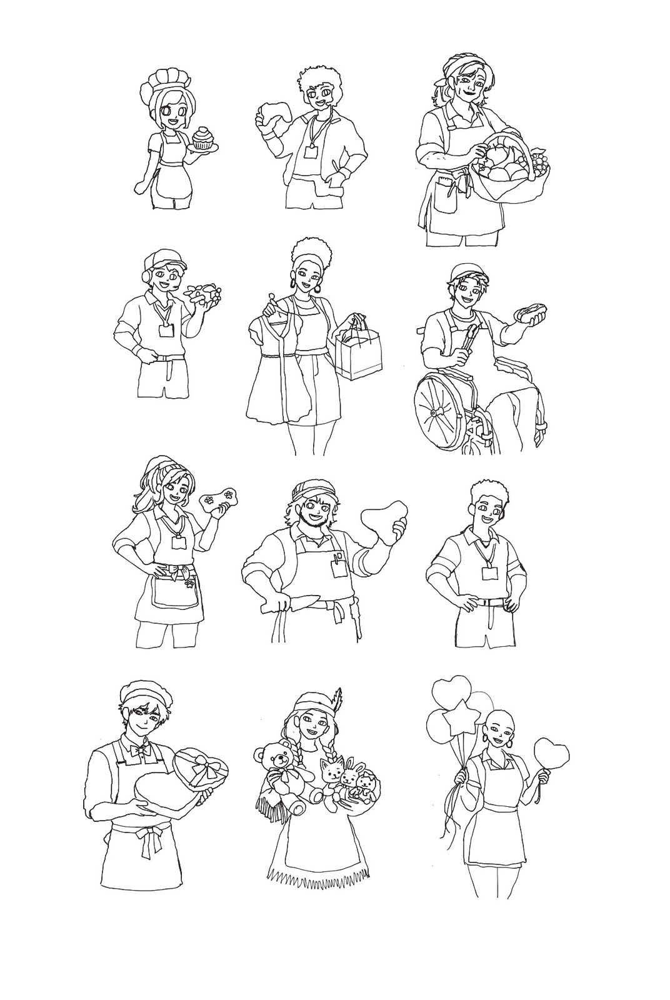

Figura 1: desenhos dos clientes feito a mão 

### 3.3.5. Trilha sonora (sprint 4)

_Descreva a trilha sonora do jogo, indicando quais músicas serão utilizadas no mundo e nas fases. Utilize listas ou tabelas para organizar esta seção. Caso utilize material de terceiros em licença Creative Commons, não deixe de citar os autores/fontes._

_Exemplo de tabela_
\# | titulo | ocorrência | autoria
--- | --- | --- | ---
1 | tema de abertura | tela de início | própria
2 | tema de combate | cena de combate com inimigos comuns | Hans Zimmer
3 | ...

## 3.4. Inventário e Bestiário (sprint 3)

### 3.4.1. Inventário

O jogo não possui um inventário tradicional com coleta, armazenamento ou uso de itens. Em vez disso, a experiência é estruturada a partir de recursos sistêmicos que acompanham o desempenho do jogador durante as interações de venda.
Esses recursos funcionam como indicadores de progresso e apoio à tomada de decisão, reforçando a proposta de treinamento corporativo do jogo.

**Itens e Recursos Implementados**

| Nº | Item / Recurso                 | Como obter / ativar                                         | Função no jogo                           | Impacto no desempenho                    |
| -- | ------------------------------ | ----------------------------------------------------------- | ---------------------------------------- | ---------------------------------------- |
| 1  | Tempo de Atendimento           | Inicia automaticamente ao começar a interação com o cliente | Limita o tempo disponível para responder | Estimula decisões rápidas e estratégicas |
| 2  | Nível de Conversão do Cliente  | Alterado conforme as respostas escolhidas                   | Mede o avanço da negociação              | Influencia o resultado da interação      |
| 3  | Feedback de Desempenho         | Exibido ao término do atendimento                           | Apresenta avaliação das decisões tomadas | Permite aprendizado e melhoria contínua  |

**Descrição dos Itens e Recursos**

**1. Tempo de Atendimento**

Cada negociação possui um limite de tempo. Caso o jogador demore para responder, pode comprometer o resultado do atendimento.
Esse recurso simula situações reais de pressão no ambiente comercial.

**2. Nível de Conversão do Cliente**

As escolhas realizadas durante o quiz de negociação impactam diretamente o nível de conversão do cliente. Respostas adequadas aumentam a conversão, enquanto decisões inadequadas podem reduzi-la.
Esse sistema reforça o aspecto estratégico e educativo do jogo.

**3. Feedback de Desempenho**

Ao final de cada atendimento, o jogador recebe um resumo com sua pontuação e avaliação geral.
Esse feedback tem função pedagógica, permitindo que o jogador compreenda seus erros e melhore em futuras interações.

**4. Considerações**

Os recursos do jogo foram planejados para reforçar a proposta de treinamento corporativo, priorizando a tomada de decisão estratégica, a análise de cenários e a avaliação de desempenho em vez de mecânicas tradicionais baseadas em coleta de itens ou combate.

### 3.4.2. Bestiário

O jogo não possui bestiário, pois sua proposta é voltada para simulações de negociação comercial e interação com clientes, e não para confrontos com inimigos.

Os personagens não jogáveis presentes no mapa são NPCs que representam lojistas e responsáveis pelos estabelecimentos. Eles funcionam como agentes de interação para os quizzes e para o desenvolvimento das situações de venda, sem exercer papel de adversários dentro da experiência.

## 3.5. Gameflow (Diagrama de cenas) (sprint 2)

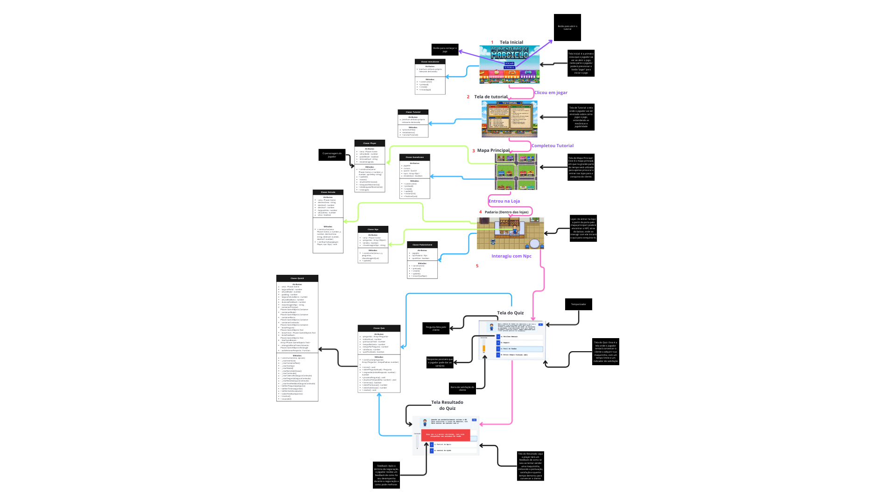

Devido à baixa qualidade da imagem, o link para melhor visualização encontra-se nas referências.

## 3.6. Regras do jogo (sprint 3)

No jogo, o usuário assume o papel de um vendedor da Cielo e tem como objetivo vender as maquininhas e os serviços de pagamento da empresa para diferentes estabelecimentos distribuídos pelo mapa.

O jogador percorre o mapa, entra nos comércios e inicia negociações com os responsáveis. As interações ocorrem por meio de quizzes que simulam situações reais de venda. Cada pergunta possui tempo limite para resposta, aproximando a experiência de um cenário real de negociação.

Durante a interação, o jogo apresenta um indicador de conversão do cliente, fornecendo feedback imediato sobre as decisões tomadas.

O objetivo do jogador é visitar todos os estabelecimentos do mapa e completar os quizzes de negociação com sucesso, conquistando cada cliente e demonstrando seu conhecimento sobre os produtos e serviços da Cielo.

Cada cliente oferece ao jogador apenas uma tentativa de diálogo. Ao iniciar a negociação com um estabelecimento, o jogador realiza o quiz e, ao final, o resultado é definitivo: se o cliente for conquistado, a venda é concluída; caso contrário, não é possível tentar novamente com aquele cliente. Essa regra simula a realidade do ambiente comercial, onde uma oportunidade mal aproveitada raramente se repete.

## 3.7. Mecânicas do jogo (sprint 3)

| Comando                 | Tipo de Entrada | Ação Executada                         | Consequência no Jogo                                          |
| ----------------------- | --------------- | -------------------------------------- | ------------------------------------------------------------- |
| W                       | Teclado         | Move o personagem para cima            | Permite navegação pelo mapa                                   |
| A                       | Teclado         | Move o personagem para a esquerda      | Permite navegação pelo mapa                                   |
| S                       | Teclado         | Move o personagem para baixo           | Permite navegação pelo mapa                                   |
| D                       | Teclado         | Move o personagem para a direita       | Permite navegação pelo mapa                                   |
| Aproximação do NPC      | Movimento       | Colisão com o NPC dentro da loja       | Inicia automaticamente o diálogo de negociação (quiz)         |
| Botão esquerdo do mouse | Mouse           | Seleciona alternativa no quiz          | Afeta o nível de conversão do cliente e o resultado da venda |

## 3.8. Implementação Matemática de Animação/Movimento (sprint 4)

### 3.8.1. Descrição

A animação de entrada dos balões decorativos das lojas conquistadas utiliza cinemática bidimensional. Ao entrar na cena da cidade, cada balão parte de um ponto A e se move até um ponto B simultaneamente nos dois eixos: o eixo X utiliza **Movimento Uniforme (MU)** e o eixo Y utiliza **Movimento Uniformemente Variado (MUV)**, com velocidade inicial nula.

### 3.8.2. Parâmetros do Modelo

| Parâmetro | Descrição |
| --- | --- |
| $x_i$ | Posição X inicial do elemento (40px à esquerda da posição final) |
| $y_i$ | Posição Y inicial do elemento (300px abaixo da posição final) |
| $x_f$ | Posição X final do elemento (posição decorativa sobre a loja) |
| $y_f$ | Posição Y final do elemento (posição decorativa sobre a loja) |
| $T$ | Duração total da animação em segundos |
| $t$ | Tempo decorrido desde o início da animação (em segundos) |

### 3.8.3. Modelagem Matemática

**Eixo X — Movimento Uniforme (MU)**

Velocidade constante necessária para percorrer a distância horizontal em tempo $T$:

$$v_x = \frac{x_f - x_i}{T}$$

Posição em função do tempo:

$$x(t) = x_i + v_x \cdot t$$

**Eixo Y — Movimento Uniformemente Variado (MUV)**

O elemento parte do repouso ($v_{y0} = 0$). A aceleração necessária para percorrer a distância vertical em tempo $T$ é:

$$a_y = \frac{2 \cdot (y_f - y_i)}{T^2}$$

Velocidade instantânea:

$$v_y(t) = a_y \cdot t$$

Posição em função do tempo:

$$y(t) = y_i + \frac{1}{2} \cdot a_y \cdot t^2$$

### 3.8.4. Implementação em Código

A função implementada é `animarElemento`, localizada em [`public/src/cenas/cena-cidade.js`](../public/src/cenas/cena-cidade.js) na **linha 498**.

Ela recebe os parâmetros `(xInicial, yInicial, xFinal, yFinal, duracao, elemento)`, calcula `vx` e `ay` pelas fórmulas acima e armazena os dados no objeto `_anim` do sprite. A cada frame, o método `update` aplica as fórmulas para atualizar a posição e imprime no console:

```js
// MU — eixo X
balao.x = a.xInicial + a.vx * a.t;
console.log(`[MU]  x: ${balao.x.toFixed(1)} | vx: ${a.vx.toFixed(2)}`);

// MUV — eixo Y
const vy = a.ay * a.t;
balao.y = a.yInicial + 0.5 * a.ay * a.t * a.t;
console.log(`[MUV] y: ${balao.y.toFixed(1)} | vy: ${vy.toFixed(2)} | ay: ${a.ay.toFixed(2)}`);
```

A animação para quando `t >= duracao`.

### 3.8.5. Fonte

HALLIDAY, D.; RESNICK, R.; WALKER, J. **Fundamentos de Física — Vol. 1: Mecânica**. 10. ed. Rio de Janeiro: LTC, 2016. Cap. 2 — Movimento em Linha Reta.

# <a name="c4"></a>4. Desenvolvimento do Jogo

## 4.1. Desenvolvimento preliminar do jogo (sprint 1)

Primeira Versão do Jogo (MVP)
1. Visão Geral
Esta é a primeira versão do jogo, desenvolvida como um protótipo inicial.
Ela não representa o produto final, mas sim uma base estrutural que permite visualizar como o jogo funcionará futuramente.
O objetivo desta versão é construir o ambiente inicial e preparar a estrutura para a implementação das mecânicas principais.
2. Ambiente do Jogo
Ao iniciar o jogo, o jogador visualiza:
Um cenário urbano em estilo pixel art
Rua com faixa de pedestre
Prédios comerciais
Estabelecimentos que representam possíveis empresas ou clientes
Um personagem controlável
Esse ambiente representa a cidade onde, no futuro, ocorrerão as negociações comerciais.
3. Funcionalidades Atuais
Na versão atual, o jogador pode:
Controlar o personagem
Movimentar-se pelo mapa
Explorar o cenário
Neste momento, o jogo funciona como um espaço explorável.
Ainda não existem interações comerciais ativas.

4. Funcionalidades Planejadas (Ainda Não Implementadas)
A proposta completa do jogo é ser um simulador de negociação comercial.
Os seguintes elementos fazem parte do conceito original, mas ainda não estão presentes no protótipo:
4.1 Sistema de Cards
Durante uma negociação, o jogador escolheria respostas em formato de cards.
Cada card representaria um argumento estratégico diferente.
Esse sistema ainda não foi implementado.

4.2 Tempo de Resposta
O jogador teria tempo limitado para responder às falas do cliente (exemplo: 15 segundos), simulando pressão real de negociação.
Essa funcionalidade ainda não está disponível.

4.3 Indicador de Conversão
O cliente teria uma barra visual indicando seu nível de conversão.
Essa barra aumentaria ou diminuiria conforme as decisões do jogador.
Esse sistema ainda não existe na versão atual.

4.4 Fechamento de Negócios
O objetivo de cada interação futura será fechar um negócio com sucesso.
Atualmente, não há sistema de negociação ativa nem fechamento de contratos.

4.5 Sistema de Pontuação
O conceito prevê:
Pontos acumulados a cada negociação bem-sucedida
Recompensa por decisões estratégicas corretas
Esse sistema ainda não está implementado.

4.6 Sistema de Níveis
O jogador deverá:
Subir de nível conforme acumula pontos
Enfrentar clientes mais exigentes em níveis mais altos
Experimentar aumento progressivo de dificuldade
A progressão de níveis ainda não está presente.

4.7 Nível Máximo (Certificação)
O objetivo final do jogo completo é alcançar o nível máximo.
Esse nível representará que o usuário está devidamente qualificado para exercer sua função dentro da empresa.
Essa certificação gamificada ainda não foi implementada.

5. Objetivo do MVP
Esta primeira versão foi criada para:
Construir a base visual do projeto
Testar a movimentação do personagem
Estruturar o ambiente onde ocorrerão as futuras negociações
Criar a fundação técnica para o desenvolvimento completo
O foco desta versão é estrutural, não funcional.


## 4.2. Desenvolvimento básico do jogo (sprint 2)

Durante a Sprint 2, foi desenvolvida a primeira versão funcional do jogo, permitindo validar as principais mecânicas previstas no escopo do projeto. Esta etapa teve como objetivo estruturar a base do sistema e possibilitar a interação inicial do jogador com o ambiente virtual.
O foco principal foi implementar os elementos essenciais necessários para o funcionamento do jogo, garantindo navegação no cenário, controle do personagem e organização inicial da arquitetura do código.

### Funcionalidades implementadas

Nesta sprint foram desenvolvidos e integrados os seguintes componentes:

. Criação da janela principal do jogo utilizando a biblioteca Phaser;

. Implementação do personagem controlável pelo jogador;
. Sistema de movimentação por meio do teclado, utilizando as teclas W, A, S e D;

. Renderização do cenário 2D em perspectiva top-down;

. Implementação do game loop, responsável pela atualização contínua da tela e das ações do jogador;

. Detecção básica de colisões e posicionamento no ambiente;

. Estruturação inicial do projeto com separação de responsabilidades em arquivos e classes (Scenes do Phaser);

. Organização preliminar do fluxo do jogo, incluindo menu inicial e carregamento das cenas.

Com essas implementações, o jogo já permite ao usuário iniciar a aplicação, visualizar o ambiente gráfico e movimentar o personagem em tempo real dentro do cenário proposto.

### Ilustrações da versão básica

Figura 1 – Menu inicial do jogo

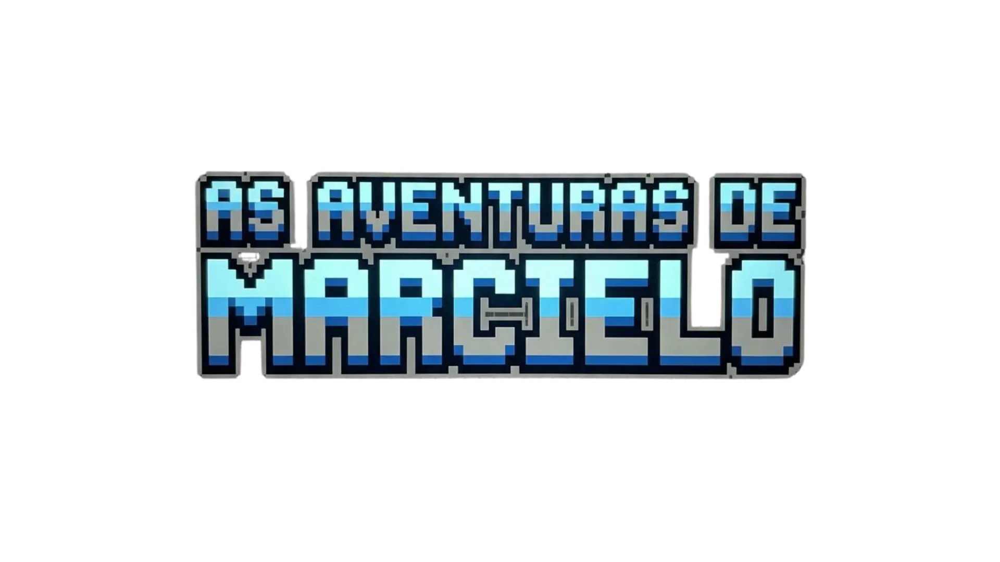

Figura 2 – Ambiente da padaria

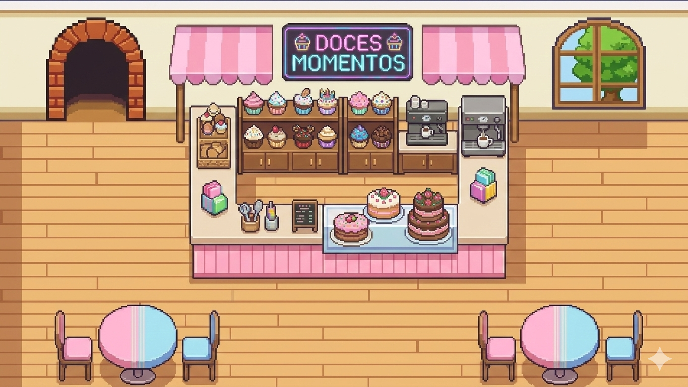

Figura 3 – Estrutura inicial de interação no ambiente


### Dificuldades encontradas

Durante o desenvolvimento da Sprint 2, alguns desafios técnicos foram identificados:

. Configuração adequada do loop principal do jogo, evitando travamentos ou atualizações inconsistentes;

. Sincronização entre movimentação do personagem e renderização gráfica;

. Implementação inicial de colisões sem gerar sobreposição de elementos;

. Organização estrutural do projeto e adaptação ao modelo de cenas da biblioteca Phaser;

. Gerenciamento correto dos arquivos JavaScript utilizando módulos (import/export).

Essas dificuldades foram superadas por meio de testes incrementais, ajustes na arquitetura do código e refatorações sucessivas, contribuindo para maior estabilidade da aplicação.

### Próximos passos

Para as próximas etapas do desenvolvimento, estão planejadas as seguintes evoluções:

. Implementação completa do tutorial interativo, apresentando instruções iniciais, funcionamento do jogo e controles do personagem;

. Ampliação do sistema de interação com NPCs, permitindo iniciar negociações com diferentes clientes distribuídos pelo mapa;

. Desenvolvimento dos quizzes de negociação, simulando situações reais de atendimento e vendas;

. Integração do sistema de pontuação, considerando decisões tomadas pelo jogador e desempenho nas interações;

. Implementação das variáveis dinâmicas do cliente, como tempo de atendimento e nível de conversão;

. Criação de um painel de desempenho em tempo real, exibindo indicadores da partida;

. Aprimoramento da interface gráfica e identidade visual alinhada ao treinamento corporativo da Cielo;

. Realização de testes de usabilidade e ajustes de jogabilidade visando melhor experiência do usuário.

## 4.3. Desenvolvimento intermediário do jogo (sprint 3)

Durante a Sprint 3, foi desenvolvida a segunda versão funcional do jogo, mantendo as principais mecânicas implementadas na sprint anterior e incorporando novas funcionalidades ao sistema. O foco desta etapa foi aprimorar elementos relacionados aos NPCs, à estrutura do mapa e às primeiras mecânicas de interação entre o jogador e os personagens do ambiente.

### Funcionalidades implementadas:

Nesta sprint foram desenvolvidos e integrados os seguintes componentes:

. Criação de NPCs em estilo pixel art para ampliar a diversidade de personagens no ambiente do jogo;

. Implementação do spritesheet do personagem principal (Marcielo), permitindo animações mais completas de movimentação;

. Desenvolvimento e organização do mapa principal do jogo;

. Implementação de ambientes internos e externos das lojas;

. Sistema de variação visual dos NPCs;

. Implementação das bordas do mapa, impedindo que o jogador ultrapasse os limites do cenário;

. Desenvolvimento inicial do sistema de quizzes para simular interações de negociação com clientes.

Com essas implementações, o jogo passou a apresentar maior variedade visual, um ambiente mais estruturado e as primeiras mecânicas de interação baseadas em decisões do jogador.

### Ilustrações da versão intermediária

Figura 1 – Tela Inicial

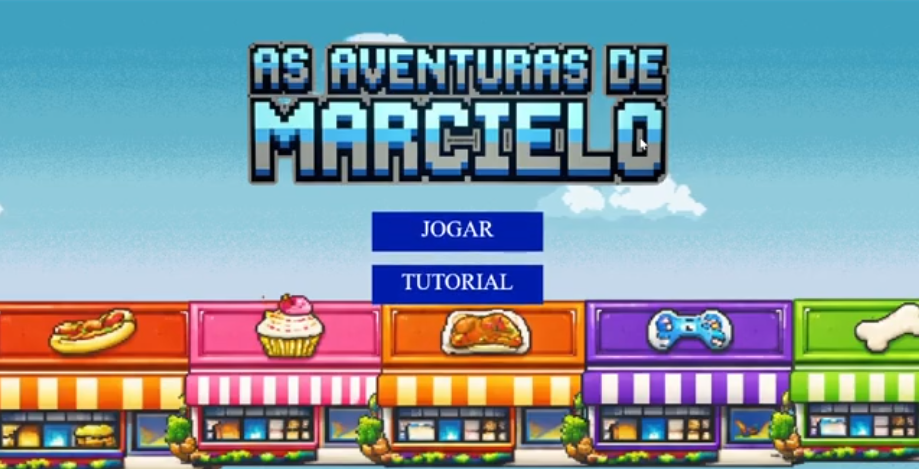

Figura 2 – Mapa Jogo

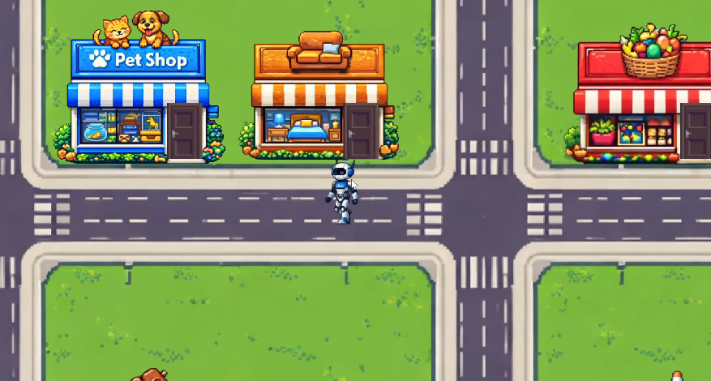

Figura 3 – Entrando na loja

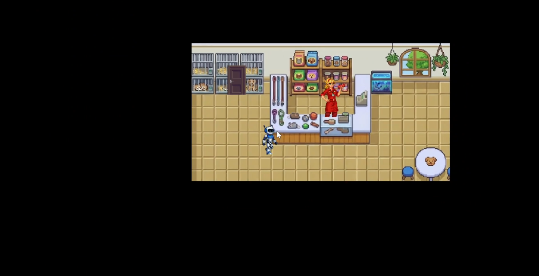

Figura 4 – Quiz

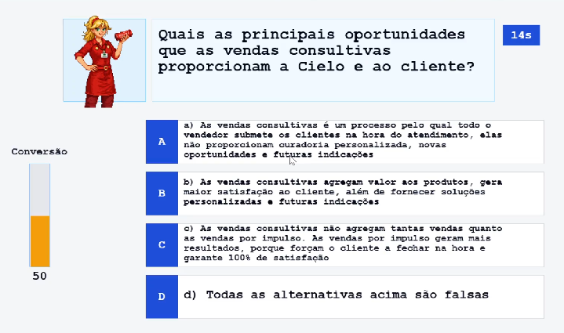

Figura 5 – Convertendo Cliente

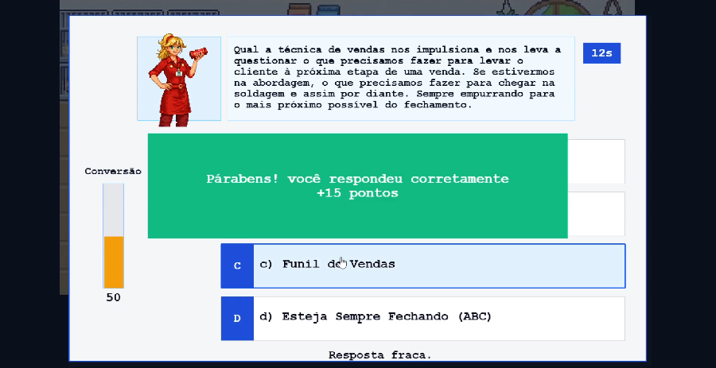

Figura 6 – Cliente muda de roupa

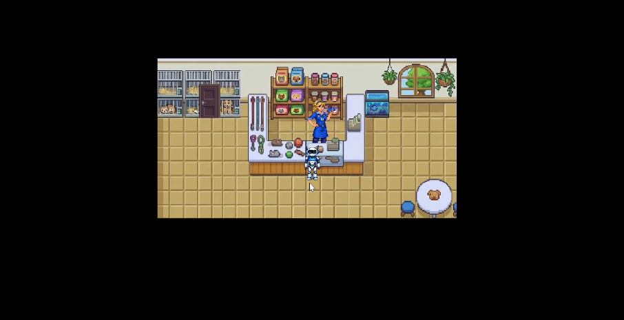

Figura 7 – Não convertendo cliente

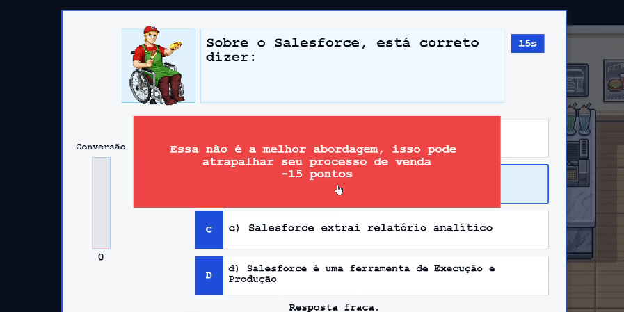

### Como executar a aplicação

Para executar o jogo, é necessário abrir o projeto em um ambiente de desenvolvimento compatível com JavaScript e iniciar o servidor local. O jogo pode ser acessado pelo navegador, onde o jogador é direcionado ao menu inicial. Durante a jogabilidade, o personagem é movimentado com as teclas W, A, S e D, e a interação com NPCs é feita a partir do momento que o usuário se aproxima de um deles.

### Dificuldades encontradas

Durante o desenvolvimento da Sprint 3, alguns desafios foram identificados:

. Integração do spritesheet do personagem principal com as animações de movimentação;

. Organização dos elementos do mapa sem gerar conflitos de colisão;

. Implementação das bordas do mapa de forma consistente com os limites do cenário;

. Desenvolvimento inicial do sistema de quizzes, equilibrando lógica de perguntas e fluxo de interação;

. Implementação do interior das lojas e das portas para entrar nelas.


### Critérios de pronto
Uma funcionalidade foi considerada concluída quando atendeu aos seguintes critérios:
. Funcionamento correto durante a execução do jogo;

. Integração adequada com as scenes do sistema;

. Ausência de erros no console do navegador;

. Possibilidade de interação do jogador com os elementos implementados;

. Validação por meio de testes realizados pelos membros da equipe responsável pela tarefa e pela review da mesma.

### Limitações atuais

Apesar dos avanços obtidos nesta sprint, algumas funcionalidades ainda se encontram em desenvolvimento:

. Quantidade limitada de quizzes disponíveis, tanto em número de questões quanto em variedade;

. Sistema de pontuação ainda em processo (Soma dos pontos totais);

. Necessidade de melhorias na interface gráfica e no sistema de progressão do jogador;

. Novos desafios planejados, como movimentação de carros nas ruas e máquinas de cartão quebradas, ainda não implementados.

### Próximos passos

Para as próximas etapas do desenvolvimento, estão planejadas as seguintes evoluções:

. Implementação do tutorial animado do jogo (Introdução do jogo);

. Adição de novos desafios, incluindo carros nas ruas e máquinas de cartão quebradas;

. Criação de um painel de desempenho em tempo real, exibindo indicadores da partida(Número de clientes convertidos e pontuação adquirida);

. Aprimoramento da interface gráfica e identidade visual alinhada ao treinamento corporativo da Cielo;

. Adição de áudio ao jogo e modificação da tela de início;

. Alteração visual das lojas após a conquista de um NPC, indicando o progresso do jogador;

. Mudar o tempo durante o quiz.


## 4.4. Desenvolvimento final do MVP (sprint 4)

_Descreva e ilustre aqui o desenvolvimento da versão final do jogo, explicando brevemente o que foi entregue em termos de MVP. Utilize prints de tela para ilustrar. Indique as eventuais dificuldades e planos futuros._

## 4.5. Revisão do MVP (sprint 5)

_Descreva e ilustre aqui o desenvolvimento dos refinamentos e revisões da versão final do jogo, explicando brevemente o que foi entregue em termos de MVP. Utilize prints de tela para ilustrar._

# <a name="c5"></a>5. Testes

## 5.1. Casos de Teste (sprints 2 a 4)

Esta seção apresenta os casos de teste funcionais utilizados para validar os principais fluxos do jogo, desde a navegação no menu até as interações com clientes e o comportamento das mecânicas de negociação. Cada linha descreve uma pré-condição (estado inicial), a ação executada pelo usuário e a pós-condição esperada, permitindo verificar de forma objetiva se o sistema está se comportando conforme os requisitos definidos.

Nos testes do quiz, o indicador principal passa a ser a barra de conversão. Quando o jogador acerta, a conversão aumenta; quando erra, a conversão diminui. A barra usa três faixas visuais para facilitar a leitura de desempenho: verde (bom), laranja (intermediário) e vermelha (ruim).

Tabela 1 - Casos de teste funcionais do jogo.


| # | pré-condição | descrição do teste | pós-condição |
| :--- | :--- | :--- | :--- |
| 1 | Jogo aberto na tela inicial | Clicar no botão "Jogar" | O jogo deve iniciar |
| 2 | Jogo na tela inicial | Clicar no botão "Configurações" | A tela de configurações deve abrir |
| 3 | Jogo na tela inicial | Clicar no botão "Tutorial" | Deve abrir uma interface intuitiva que explica as mecânicas, o objetivo do jogo e como jogar |
| 4 | Jogo com personagem parado | Pressionar D | Personagem deve se mover para a direita |
| 5 | Jogo com personagem parado | Pressionar A | Personagem deve se mover para a esquerda |
| 6 | Jogo com personagem parado | Pressionar W | Personagem deve se mover para cima |
| 7 | Jogo com personagem parado | Pressionar S | Personagem deve se mover para baixo |
| 8 | Personagem próximo de uma loja | Encostou na porta | Personagem entra no estabelecimento |
| 9 | Personagem perto de um NPC | Colisão com o NPC dentro da loja | Interface de conversa (quiz) inicia automaticamente |
| 10 | Tela de quiz com 4 respostas e barra de conversão visível | Clicar com botão esquerdo na melhor resposta | A barra de conversão aumenta |
| 11 | Tela de quiz com 4 respostas e barra de conversão visível | Clicar com botão esquerdo em resposta incorreta | A barra de conversão diminui |
| 12 | Conversão na faixa verde (última pergunta) | Responder de forma a manter ou elevar a conversão | Cliente é conquistado e negociação é concluída com sucesso |
| 13 | Conversão na faixa verde (última pergunta) | Responder de forma incorreta, mas mantendo conversão em faixa aceitável | Cliente é conquistado e negociação é concluída |
| 14 | Conversão na faixa laranja (última pergunta) | Responder incorretamente e reduzir a conversão para faixa vermelha | Cliente não é conquistado |
| 15 | Conversão na faixa vermelha (última pergunta) | Responder incorretamente ou manter desempenho ruim | Cliente não é conquistado |
| 16 | Conversão na faixa vermelha (última pergunta) | Responder corretamente, mas sem sair da faixa vermelha | Cliente não é conquistado |
| 17 | Conversão na faixa vermelha (última pergunta) | Responder corretamente e elevar para faixa laranja ou verde | Cliente é conquistado |
| 18 | Tempo limite da interação acabando | Tempo limite termina | Usuário perde o cliente e volta para o mapa |
| 19 | Negociação finalizada com sucesso ou falha | Resultado da interação é definido | Sistema exibe feedback do resultado da negociação |
| 20 | Perto de um cliente já conquistado | Se aproxima | Nada acontece, cliente permanece com camiseta azul |
| 21 | Tempo limite do jogo acabando | O tempo acaba | A gameplay se encerra |

Fonte: elaborado pelo grupo.

## 5.2. Testes de jogabilidade (playtests) (sprint 5)

### 5.2.1 Registros de testes

_Descreva nesta seção as sessões de teste/entrevista com diferentes jogadores. Registre cada teste conforme o template a seguir._

| Nome                                     | João Jonas (use nomes fictícios)                                                                                                         |
| ---------------------------------------- | ---------------------------------------------------------------------------------------------------------------------------------------- |
| Já possuía experiência prévia com games? | sim, é um jogador casual                                                                                                                 |
| Conseguiu iniciar o jogo?                | sim                                                                                                                                      |
| Entendeu as regras e mecânicas do jogo?  | entendeu as regras, mas sobre as mecânicas, apenas as essenciais, não explorou os comandos complexos                                     |
| Conseguiu progredir no jogo?             | sim, sem dificuldades                                                                                                                    |
| Apresentou dificuldades?                 | Não, conseguiu jogar com facilidade e afirmou ser fácil                                                                                  |
| Que nota deu ao jogo?                    | 9.0                                                                                                                                      |
| O que gostou no jogo?                    | Gostou de como o jogo vai ficando mais difícil ao longo do tempo sem deixar de ser divertido                                             |
| O que poderia melhorar no jogo?          | A responsividade do personagem aos controles, disse que havia um pouco de atraso desde o momento do comando até a resposta do personagem |

### 5.2.2 Melhorias

_Descreva nesta seção um plano de melhorias sobre o jogo, com base nos resultados dos testes de jogabilidade_

# <a name="c6"></a>6. Conclusões e trabalhos futuros (sprint 5)

_Escreva de que formas a solução do jogo atingiu os objetivos descritos na seção 1 deste documento. Indique pontos fortes e pontos a melhorar de maneira geral._

_Relacione os pontos de melhorias evidenciados nos testes com plano de ações para serem implementadas no jogo. O grupo não precisa implementá-las, pode deixar registrado aqui o plano para futuros desenvolvimentos._

_Relacione também quaisquer ideias que o grupo tenha para melhorias futuras_

# <a name="c7"></a>7. Referências

ABECS. (2024). *Balanço do setor de meios de pagamento*. https://abecs.org.br/balanco-do-setor-de-meios-de-pagamento

Banco Central do Brasil. (2023). *Relatório de economia bancária 2023*. https://www.bcb.gov.br/publicacoes/relatorioeconomiabancaria

Banco Central do Brasil. (2024). *Relatório de vigilância do sistema de pagamentos brasileiro*. https://www.bcb.gov.br

Banco Central do Brasil. (2025). *Relatórios de estabilidade e vigilância do SPB*. https://www.bcb.gov.br/publicacoes

Cielo S.A. (2023). *Relatório anual e demonstrações financeiras 2023*. https://ri.cielo.com.br

Cielo S.A. (2024). *Informações institucionais e dados operacionais*. https://www.cielo.com.br

Cielo S.A. (2025). *Portal de relações com investidores*. https://ri.cielo.com.br/

ClickPetróleo e Gás. (2025). *Cielo loses historic lead in the ‘card machine war’ after competitors advance, new Central Bank rules, and the rise of Pix*. https://en.clickpetroleoegas.com.br/Cielo-loses-historic-leadership-in-the-war-of-payment-machines-after-the-advance-of-competitors--new-rules-from-the-central-bank-and-the-rise-of-Pix-btl96/

CNN Brasil. (2025). *A guerra das maquininhas e a disputa no mercado de adquirentes*. https://www.cnnbrasil.com.br

IBGE. (2022). *Censo demográfico 2022: Primeiros resultados*. https://www.ibge.gov.br/censo2022

Moraes, R. A., & Silva, J. P. (2021). A guerra das maquininhas: Competição e inovação no setor de adquirência brasileiro. *Revista Brasileira de Gestão e Negócios*. https://doi.org/10.7819/rbgn.v23i2.4104

PagBank. (2024). *Relatório institucional e atuação no mercado de pagamentos*. https://www.pagbank.com.br

PagSeguro Digital Ltd. (2023). *Form 20-F: Annual report 2023*. https://investors.pagseguro.com

Reuters. (2026, 10 de fevereiro). *Instant payment system Pix poised to capture half of Brazil’s e-commerce market by 2028*. https://www.reuters.com/world/americas/instant-payment-system-pix-poised-capture-half-brazils-e-commerce-market-by-2028-2026-02-10/

Stone Co. (2024). *Formulário de referência e modelo de negócios*. https://investors.stone.co

StoneCo Ltd. (2023). *Form 20-F: Annual report 2023*. https://investors.stone.com

Valor Econômico. (2025). *Resultados financeiros da Cielo*. https://s3.glbimg.com

Vieira, S. (2025). *Mercado de adquirência: Um gigante em disputa na era do Pix* [Publicação no LinkedIn]. https://pt.linkedin.com/posts/sandra-vieira-servicos-financeiros_pagamentos-adquir%C3%AAncia-pix-activity-7350464091540336643-WWyA

Porter, M. E. (2008). *The five competitive forces that shape strategy*. Harvard Business Review.

Deloitte. (2024). *Relatórios sobre mercado financeiro e meios de pagamento*. https://www2.deloitte.com/br

PwC Brasil. (2024). *Relatórios sobre tendências do mercado financeiro*. https://www.pwc.com.br

McKinsey & Company. (2024). *Estudos sobre transformação digital e meios de pagamento*. https://www.mckinsey.com.br

Veja. (2024). *Carteiras digitais ajudam cartões de crédito a se reinventar*. https://veja.abril.com.br/economia/carteiras-digitais-ajudam-cartoes-de-credito-a-se-reinventar/

Subadquirente. (2025). *As tendências do mercado de meios de pagamentos no Brasil para 2025*. https://www.subadquirente.com/post/as-tend%25C3%25AAncias-do-mercado-de-meios-de-pagamentos-no-brasil-para-2025


# <a name="c8"></a>Anexos

_Inclua aqui quaisquer complementos para seu projeto, como diagramas, imagens, tabelas etc. Organize em sub-tópicos utilizando headings menores (use ## ou ### para isso)_

### Diagramas

Diagrama de cenas : https://www.canva.com/design/DAHCEIJ-7zY/IdmuREdNconLz6UI9TNmkw/edit?utm_content=DAHCEIJ-7zY&utm_campaign=designshare&utm_medium=link2&utm_source=sharebutton