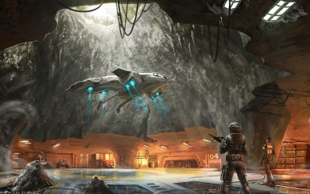
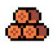
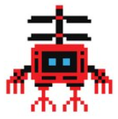

# GDD - Game Design Document - Módulo 1 - Inteli

**_Os trechos em itálico servem apenas como guia para o preenchimento da seção. Por esse motivo, não devem fazer parte da documentação final_**

## Nome dos integrantes Grupo

Gabriel Gomes Pimentel  
Tiago Brun de Arruda  
Beatriz Sofia Freitas Sena  
Fernanda Jawetz Steiner  
Vinícius da Silva Alves  
Luca do Val Scolfaro  
Cassio Reis Costa  
Leonardo Galdino Carioca Braz  

## Sumário

[1. Introdução](#c1)

[2. Visão Geral do Jogo](#c2)

[3. Game Design](#c3)

[4. Desenvolvimento do jogo](#c4)

[5. Casos de Teste](#c5)

[6. Conclusões e trabalhos futuros](#c6)

[7. Referências](#c7)

[Anexos](#c8)

 

# 1. Introdução (sprints 1 a 4)

## 1.1. Plano Estratégico do Projeto

### 1.1.1. Contexto da indústria (sprint 2)

_Posicione aqui o texto que explica o contexto da indústria/mercado do qual o parceiro de projeto faz parte. Contextualize o segmento de atuação do parceiro (pode ser indústria, comércio ou serviço). Caracterize as atividades executadas pelo negócio do parceiro e a abrangência de suas atividades (âmbito internacional, nacional ou regional)._

#### 1.1.1.1. Modelo de 5 Forças de Porter (sprint 2)

_Posicione aqui o modelo de 5 Forças de Porter para sustentar o contexto da indústria._

##### 1.1.1.1.1 Análise da Ameaça de Novos Entrantes

##### 1.1.1.1.1.1 Altos Requisitos de Capital e Tecnologia

A entrada no mercado de processamento de pagamentos exige investimentos substanciais em infraestrutura tecnológica, incluindo servidores, plataformas seguras de transações e sistemas antifraude sofisticados. Esse gasto inicial significativo funciona como uma barreira forte para empresas pequenas ou startups sem recursos robustos.

Além disso, manter e atualizar essa tecnologia — especialmente para suportar grandes volumes de transações — demanda capital contínuo.

##### 1.1.1.1.1.1.2 Complexidade Regulatória

O mercado brasileiro de meios de pagamento é altamente regulado pelo Banco Central do Brasil e requer autorizações específicas para operar como instituição de pagamento. Isso inclui estruturas de compliance, normas de segurança e conformidade com regras de prevenção à lavagem de dinheiro.

Essas exigências não são triviais: demandam tempo, especialistas jurídicos e investimentos em políticas de governança.

##### 1.1.1.1.1.1.3 Efeito de Rede e Relações com Fornecedores

A Cielo e outras adquirentes estabelecidas já têm relações consolidadas com milhares de estabelecimentos comerciais, criando um forte efeito de rede: quanto mais comerciantes usam o sistema, mais valioso ele se torna para novos usuários. Isso é difícil de replicar rapidamente por um novo competidor.

Além disso, fornecedores de hardware e software especializados (como POS e sistemas de antifraude) estão concentrados, o que torna a cadeia de suprimentos mais desafiadora de acessar para novatos.

##### 1.1.1.1.1.1.4 Lealdade à Marca e Confiança do Mercado

Empresas estabelecidas conquistaram reputação e confiança junto a clientes e instituições financeiras ao longo de anos. Para um novo entrante, romper essa confiança e convencer comerciantes a mudar de provedor pode ser custoso e demorado.

##### 1.1.1.1.1.1.5 Escala de Operações e Eficiência

O setor premia escala: quanto mais transações processadas, menores os custos por operação. Novos entrantes começam menores e, frequentemente, com margens mais estreitas até alcançarem poder de barganha e eficiência operacional.

##### 1.1.1.1.2 Análise da Ameaça de Novos Entrantes
##### 1.1.1.1.2.1 Competição Crescente e Pressão por Preço

Embora os obstáculos sejam significativos, vários fintechs e empresas digitais já entraram no mercado brasileiro de pagamentos e estão ganhando espaço. Exemplos incluem StoneCo, PagSeguro, Getnet, entre outros, que oferecem soluções competitivas, muitas vezes com tecnologia mais leve e taxas menores.

Esse aumento de concorrência tende a reduzir as margens de lucro em toda a indústria, pressionando players incumbentes como a Cielo a ajustar preços e serviços.

##### 1.1.1.1.2.2 Inovação e Modelos Digitais

Novos entrantes muitas vezes não carregam os mesmos custos de infraestrutura legada, podendo oferecer soluções mais ágeis, integradas a aplicativos móveis, análise de dados e ofertas de crédito para pequenos comerciantes.

Isso pode acelerar a adoção de alternativas às maquininhas tradicionais, especialmente entre micro e pequenos empreendedores.

##### 1.1.1.1.2.3 Disrupção via Pagamentos Instantâneos (Pix)

Embora o Pix não seja um concorrente direto de todos os serviços da Cielo, sua ampla adoção no Brasil está reduzindo a dependência de transações por cartão — especialmente débito — e alterando o comportamento de pagamento dos consumidores e comerciantes.

Isso encoraja novos modelos de negócio e soluções que não dependem do sistema tradicional de adquirência, ampliando indiretamente o leque de concorrentes.

##### 1.1.1.1.2.4 Potencial para Perda de Participação de Mercado

A entrada de novos players já tem impacto real: alguns concorrentes digitais capturaram fatias relevantes do mercado de adquirência nos últimos anos, levando empresas tradicionais a perder market share e pressionar sua lucratividade.

A tendência indica que, mesmo com barreiras expressivas, novos entrantes bem financiados e inovadores podem alterar significativamente a dinâmica competitiva no médio prazo.
### 1.1.2. Análise SWOT (sprint 2)

_Posicione aqui a análise SWOT relacionada ao parceiro de projeto. Utilize a análise SWOT para fazer uma análise ambiental do parceiro no âmbito estratégico. Leve em consideração o contexto da indústria, concorrência e as características do ambiente interno (forças e fraquezas) e externo (oportunidades e ameaças) do parceiro._

### 1.1.3. Missão / Visão / Valores (sprint 2)

_Posicione aqui a Missão, Visão e Valores do seu projeto._

### 1.1.4. Proposta de Valor (sprint 4)

_Posicione aqui o canvas de proposta de valor. Descreva os aspectos essenciais para a criação de valor da ideia do produto com o objetivo de ajudar a entender melhor a realidade do cliente e entregar uma solução que está alinhado com o que ele espera._

### 1.1.5. Descrição da Solução Desenvolvida (sprint 4)

_Descreva brevemente a solução desenvolvida para o parceiro de negócios. Descreva os aspectos essenciais para a criação de valor da ideia do produto com o objetivo de ajudar a entender melhor a realidade do cliente e entregar uma solução que está alinhado com o que ele espera. Observe a seção 2 e verifique que ali é possível trazer mais detalhes, portanto seja objetivo aqui. Atualize esta descrição até a entrega final, conforme desenvolvimento._

### 1.1.6. Matriz de Riscos (sprint 4)

_Registre na matriz os riscos identificados no projeto, visando avaliar situações que possam representar ameaças e oportunidades, bem como os impactos relevantes sobre o projeto. Apresente os riscos, ressaltando, para cada um, impactos e probabilidades com plano de ação e respostas._

### 1.1.7. Objetivos, Metas e Indicadores (sprint 4)

_Definição de metas SMART (específicas, mensuráveis, alcançáveis, relevantes e temporais) para seu projeto, com indicadores claros para mensuração_

## 1.2. Requisitos do Projeto (sprints 1 e 2)

_Posicione aqui a lista de requisitos levantados para o projeto, sejam pedidos do parceiro ou invenções do grupo. Descreva-os de forma objetiva, de modo que seja possível entender claramente como implementá-los tecnicamente._

_ATUALIZE ESTA SEÇÃO SEMPRE QUE ALGUM REQUISITO MUDAR EM SEU PROJETO_

_Exemplo de tabela de requisitos_
\# | Requisito  
--- | ---
1 | O controle do personagem será realizado usando as teclas WASD para navegação pelas fases
2 | O personagem perde uma vida toda vez que tocar em um inimigo ou em algum projétil inimigo
3 | O jogo deve possuir uma tela de abertura para o jogador selecionar se quer jogar sozinho ou em dupla
4 | ...

## 1.3. Público-alvo do Projeto (sprint 2)

_Posicione aqui uma descrição justificada do público-alvo do jogo, em termos demográficos e de preferências/gostos pessoais._

# 2. Visão Geral do Jogo (sprint 2)

## 2.1. Objetivos do Jogo (sprint 2)

_Descreva o que o jogador deve cumprir para avançar ou concluir o jogo_

## 2.2. Características do Jogo (sprint 2)

### 2.2.1. Gênero do Jogo (sprint 2)

_simulação, RPG, corrida, estratégia, esportes, ação, aventura etc._

### 2.2.2. Plataforma do Jogo (sprint 2)

_quanto ao dispositivo: desktop, smartphones, tablets, TV etc._

_quanto ao sistema: navegadores compatíveis_

### 2.2.3. Número de jogadores (sprint 2)

_1 jogador, 2 jogadores versus, 2 jogadores cooperação, multiplayer etc._

### 2.2.4. Títulos semelhantes e inspirações (sprint 2)

_Liste e descreva títulos semelhantes e jogos que inspiram e são usados como referência do projeto_

### 2.2.5. Tempo estimado de jogo (sprint 5)

_Ex. O jogo pode ser concluído em 3 horas passando por todas as fases._

_Ex. cada partida dura até 15 minutos_

# 3. Game Design (sprints 2 e 3)

## 3.1. Enredo do Jogo (sprints 2 e 3)

_Descreva o enredo/história do jogo, criando contexto para os personagens (seção 3.2) e o mundo do jogo (seção 3.3). Uma boa história costuma ter um arco narrativo de contexto, conflito e resolução. Utilize etapas sequenciais para descrever esta história._

_Caso seu jogo não possua enredo/história (ex. jogo Tetris), mencione os motivos de não existir e como o jogador pode se contextualizar com o ambiente do jogo._

## 3.2. Personagens (sprints 2 e 3)

### 3.2.1. Controláveis

_Descreva os personagens controláveis pelo jogador. Mencione nome, objetivos, características, habilidades, diferenciais etc. Utilize figuras (character art, sprite sheets etc.) para ilustrá-los. Caso utilize material de terceiros em licença Creative Commons, não deixe de citar os autores/fontes._

_Caso não existam personagens (ex. jogo Tetris), mencione os motivos de não existirem e como o jogador pode interpretar tal fato._

### 3.2.2. Non-Playable Characters (NPC)

_\<opcional\> Se existirem coadjuvantes ou vilões, aqui é o local para descrevê-los e ilustrá-los. Utilize listas ou tabelas para organizar esta seção. Caso utilize material de terceiros em licença Creative Commons, não deixe de citar os autores/fontes. Caso não existam NPCs, remova esta seção._

### 3.2.3. Diversidade e Representatividade dos Personagens

Considerando as personagens do game, analise se estas estão alinhadas ao público-alvo do jogo (seção 1.3), e compare-as dentro da realidade da sociedade brasileira. Por fim, discorra sobre qual é o impacto esperado da escolha dessas personagens.

## 3.3. Mundo do jogo (sprints 2 e 3)

### 3.3.1. Locações Principais e/ou Mapas (sprints 2 e 3)

_Descreva o ambiente do jogo, em que locais ele ocorre. Ilustre com imagens. Se houverem mapas, posicione-os aqui, descrevendo as áreas em acordo com o enredo. Se houverem fases, descreva-as também em acordo com o enredo (pode ser um jogo de uma fase só). Utilize listas ou tabelas para organizar esta seção. Caso utilize material de terceiros em licença Creative Commons, não deixe de citar os autores/fontes._

### 3.3.2. Navegação pelo mundo (sprints 2 e 3)

_Descreva como os personagens se movem no mundo criado e as relações entre as locações – como as áreas/fases são acessadas ou desbloqueadas, o que é necessário para serem acessadas etc. Utilize listas ou tabelas para organizar esta seção._

### 3.3.3. Condições climáticas e temporais (sprints 2 e 3)

_\<opcional\> Descreva diferentes condições de clima que podem afetar o mundo e as fases, se aplicável_

_Caso seja relevante, descreva como o tempo passa, se ele é um fator limitante ao jogo (ex. contagem de tempo para terminar uma fase)_

### 3.3.4. Concept Art (sprint 2)

_Inclua imagens de Concept Art do jogo que ainda não foram demonstradas em outras seções deste documento. Para cada imagem, coloque legendas, como no exemplo abaixo._

Figura 1: detalhe da cena da partida do herói para a missão, usando sua nave

### 3.3.5. Trilha sonora (sprint 4)

_Descreva a trilha sonora do jogo, indicando quais músicas serão utilizadas no mundo e nas fases. Utilize listas ou tabelas para organizar esta seção. Caso utilize material de terceiros em licença Creative Commons, não deixe de citar os autores/fontes._

_Exemplo de tabela_
\# | titulo | ocorrência | autoria
--- | --- | --- | ---
1 | tema de abertura | tela de início | própria
2 | tema de combate | cena de combate com inimigos comuns | Hans Zimmer
3 | ...

## 3.4. Inventário e Bestiário (sprint 3)

### 3.4.1. Inventário

_\<opcional\> Caso seu jogo utilize itens ou poderes para os personagens obterem, descreva-os aqui, indicando títulos, imagens, meios de obtenção e funções no jogo. Utilize listas ou tabelas para organizar esta seção. Caso utilize material de terceiros em licença Creative Commons, não deixe de citar os autores/fontes._

_Exemplo de tabela_
\# | item | | como obter | função | efeito sonoro
--- | --- | --- | --- | --- | ---
1 | moeda |  | há muitas espalhadas em todas as fases | acumula dinheiro para comprar outros itens | som de moeda
2 | madeira |  | há muitas espalhadas em todas as fases | acumula madeira para construir casas | som de madeiras
3 | ...

### 3.4.2. Bestiário

_\<opcional\> Caso seu jogo tenha inimigos, descreva-os aqui, indicando nomes, imagens, momentos de aparição, funções e impactos no jogo. Utilize listas ou tabelas para organizar esta seção. Caso utilize material de terceiros em licença Creative Commons, não deixe de citar os autores/fontes._

_Exemplo de tabela_
\# | inimigo | | ocorrências | função | impacto | efeito sonoro
--- | --- | --- | --- | --- | --- | ---
1 | robô terrestre |  | a partir da fase 1 | ataca o personagem vindo pelo chão em sua direção, com velocidade constante, atirando parafusos | se encostar no inimigo ou no parafuso arremessado, o personagem perde 1 ponto de vida | sons de tiros e engrenagens girando
2 | robô voador |  | a partir da fase 2 | ataca o personagem vindo pelo ar, fazendo movimento em 'V' quando se aproxima | se encostar, o personagem perde 3 pontos de vida | som de hélice
3 | ...

## 3.5. Gameflow (Diagrama de cenas) (sprint 2)

_Posicione aqui seu "storyboard de programação" - o diagrama de cenas do jogo. Indique, por exemplo, como o jogo começa, quais opções o jogador tem, como ele avança nas fases, quais as condições de 'game over', como o jogo reinicia. Seu diagrama deve representar as classes, atributos e métodos usados no jogo._

## 3.6. Regras do jogo (sprint 3)

_Descreva aqui as regras do seu jogo: objetivos/desafios, meios para se conseguir alcançar_

_Ex. O jogador deve pilotar o carro e conseguir terminar a corrida dentro de um minuto sem bater em nenhum obstáculo._

_Ex. O jogador deve concluir a fase dentro do tempo, para obter uma estrela. Se além disso ele coletar todas as moedas, ganha mais uma estrela. E se além disso ele coletar os três medalhões espalhados, ganha mais uma estrela, totalizando três. Ao final do jogo, obtendo três estrelas em todas as fases, desbloqueia o mundo secreto._

## 3.7. Mecânicas do jogo (sprint 3)

_Descreva aqui as formas de controle e interação que o jogador tem sobre o jogo: quais os comandos disponíveis, quais combinações de comandos, e quais as ações consequentes desses comandos. Utilize listas ou tabelas para organizar esta seção._

_Ex. Em um jogo de plataforma 2D para desktop, o jogador pode usar as teclas WASD para mecânicas de andar, mirar para cima, agachar, e as teclas JKL para atacar, correr, arremesar etc._

_Ex. Em um jogo de puzzle para celular, o jogador pode tocar e arrastar sobre uma peça para movê-la sobre o tabuleiro, ou fazer um toque simples para rotacioná-la_

## 3.8. Implementação Matemática de Animação/Movimento (sprint 4)

_Descreva aqui a função que implementa a movimentação/animação de personagens ou elementos gráficos no seu jogo. Sua função deve se basear em alguma formulação matemática (e.g. fórmula de aceleração). A explicação do funcionamento desta função deve conter notação matemática formal de fórmulas/equações. Se necessário, crie subseções para sua descrição._

# 4. Desenvolvimento do Jogo

## 4.1. Desenvolvimento preliminar do jogo (sprint 1)

_Descreva e ilustre aqui o desenvolvimento da sua primeira versão do jogo, explicando brevemente o que foi entregue em termos de código e jogo. Utilize prints de tela para ilustrar. Indique as eventuais dificuldades e próximos passos._

## 4.2. Desenvolvimento básico do jogo (sprint 2)

_Descreva e ilustre aqui o desenvolvimento da versão básica do jogo, explicando brevemente o que foi entregue em termos de código e jogo. Utilize prints de tela para ilustrar. Indique as eventuais dificuldades e próximos passos._

## 4.3. Desenvolvimento intermediário do jogo (sprint 3)

_Descreva e ilustre aqui o desenvolvimento da versão intermediária do jogo, explicando brevemente o que foi entregue em termos de código e jogo. Utilize prints de tela para ilustrar. Indique as eventuais dificuldades e próximos passos._

## 4.4. Desenvolvimento final do MVP (sprint 4)

_Descreva e ilustre aqui o desenvolvimento da versão final do jogo, explicando brevemente o que foi entregue em termos de MVP. Utilize prints de tela para ilustrar. Indique as eventuais dificuldades e planos futuros._

## 4.5. Revisão do MVP (sprint 5)

_Descreva e ilustre aqui o desenvolvimento dos refinamentos e revisões da versão final do jogo, explicando brevemente o que foi entregue em termos de MVP. Utilize prints de tela para ilustrar._

# 5. Testes

## 5.1. Casos de Teste (sprints 2 a 4)

_Descreva nesta seção os casos de teste comuns que podem ser executados a qualquer momento para testar o funcionamento e integração das partes do jogo. Utilize tabelas para facilitar a organização._

_Exemplo de tabela_
\# | pré-condição | descrição do teste | pós-condição
--- | --- | --- | ---
1 | posicionar o jogo na tela de abertura | iniciar o jogo desde seu início | o jogo deve iniciar da fase 1
2 | posicionar o personagem em local seguro de inimigos | aguardar o tempo passar até o final da contagem | o personagem deve perder uma vida e reiniciar a fase
3 | ...

## 5.2. Testes de jogabilidade (playtests) (sprint 5)

### 5.2.1 Registros de testes

_Descreva nesta seção as sessões de teste/entrevista com diferentes jogadores. Registre cada teste conforme o template a seguir._

| Nome                                     | João Jonas (use nomes fictícios)                                                                                                         |
| ---------------------------------------- | ---------------------------------------------------------------------------------------------------------------------------------------- |
| Já possuía experiência prévia com games? | sim, é um jogador casual                                                                                                                 |
| Conseguiu iniciar o jogo?                | sim                                                                                                                                      |
| Entendeu as regras e mecânicas do jogo?  | entendeu as regras, mas sobre as mecânicas, apenas as essenciais, não explorou os comandos complexos                                     |
| Conseguiu progredir no jogo?             | sim, sem dificuldades                                                                                                                    |
| Apresentou dificuldades?                 | Não, conseguiu jogar com facilidade e afirmou ser fácil                                                                                  |
| Que nota deu ao jogo?                    | 9.0                                                                                                                                      |
| O que gostou no jogo?                    | Gostou de como o jogo vai ficando mais difícil ao longo do tempo sem deixar de ser divertido                                             |
| O que poderia melhorar no jogo?          | A responsividade do personagem aos controles, disse que havia um pouco de atraso desde o momento do comando até a resposta do personagem |

### 5.2.2 Melhorias

_Descreva nesta seção um plano de melhorias sobre o jogo, com base nos resultados dos testes de jogabilidade_

# 6. Conclusões e trabalhos futuros (sprint 5)

_Escreva de que formas a solução do jogo atingiu os objetivos descritos na seção 1 deste documento. Indique pontos fortes e pontos a melhorar de maneira geral._

_Relacione os pontos de melhorias evidenciados nos testes com plano de ações para serem implementadas no jogo. O grupo não precisa implementá-las, pode deixar registrado aqui o plano para futuros desenvolvimentos._

_Relacione também quaisquer ideias que o grupo tenha para melhorias futuras_

# 7. Referências (sprint 5)

_Incluir as principais referências de seu projeto, para que seu parceiro possa consultar caso ele se interessar em aprofundar. Um exemplo de referência de livro e de site:_ 

LUCK, Heloisa. Liderança em gestão escolar. 4. ed. Petrópolis: Vozes, 2010.  
SOBRENOME, Nome. Título do livro: subtítulo do livro. Edição. Cidade de publicação: Nome da editora, Ano de publicação.  

INTELI. Adalove. Disponível em: https://adalove.inteli.edu.br/feed. Acesso em: 1 out. 2023  
SOBRENOME, Nome. Título do site. Disponível em: link do site. Acesso em: Dia Mês Ano

ANALYSIS. Swot. Disponível em: [link do site](https://swottemplate.com/products/cielo-five-forces-analysis). Acesso em: 10 fev. 2026
FIVE, Porters. Título do site. Disponível em: [link do site](https://portersfiveforce.com/products/cielo-five-forces-analysis). Acesso em: 10 fev. 2026

# Anexos

_Inclua aqui quaisquer complementos para seu projeto, como diagramas, imagens, tabelas etc. Organize em sub-tópicos utilizando headings menores (use ## ou ### para isso)_
