# GDD - Game Design Document - Módulo 1 - Inteli

## Nome dos integrantes Grupo

Gabriel Gomes Pimentel <br>
Tiago Brun de Arruda <br>
Beatriz Sofia Freitas Sena <br>
Fernanda Jawetz Steiner <br>
Vinícius da Silva Alves <br>
Luca do Val Scolfaro <br>
Cassio Reis Costa <br>
Leonardo Galdino Carioca Braz <br>

## Link Do Jogo

https://git.inteli.edu.br/graduacao/2026-1a/t28/g05/pages#overview

## Sumário

[1. Introdução](#c1)

[2. Visão Geral do Jogo](#c2)

[3. Game Design](#c3)

[4. Desenvolvimento do jogo](#c4)

[5. Casos de Teste](#c5)

[6. Conclusões e trabalhos futuros](#c6)

[7. Referências](#c7)

[Anexos](#c8)

<br>

# <a name="c1"></a>1. Introdução (sprints 1 a 4)

## 1.1. Plano Estratégico do Projeto

### 1.1.1. Contexto da indústria (sprint 2)

A Cielo atua no mercado brasileiro de adquirência, com modelo baseado em MDR e terminais POS, em um setor marcado por escala elevada e competição com Rede, Getnet, Stone e PagSeguro. Em 2023, a companhia processou cerca de 7,9 bilhões de transações e atendeu mais de 870 mil estabelecimentos (Cielo, 2023). Em 2024, o mercado de cartões manteve relevância no volume transacionado, ainda sob pressão da expansão do Pix, da digitalização do varejo e da atuação de fintechs (ABECS, 2024; Reuters, 2026).

#### 1.1.1.1. Modelo de 5 Forças de Porter (sprint 2)

Nesta seção, o modelo das Cinco Forças de Michael Porter é utilizado para analisar a estrutura competitiva do mercado brasileiro de adquirência, no qual a Cielo está inserida. A ferramenta permite avaliar o grau de atratividade do setor a partir de cinco dimensões: ameaça de novos entrantes, ameaça de produtos substitutos, poder de barganha de fornecedores, poder de barganha de clientes e rivalidade entre concorrentes existentes.

A partir dessa análise, busca-se compreender as pressões competitivas que impactam a rentabilidade da empresa, bem como identificar os principais desafios estratégicos relacionados à manutenção de market share, diferenciação de serviços e adaptação às transformações do setor de pagamentos digitais.

#### A) Ameaça de Novos Entrantes (nível: moderado)

A ameaça de novos entrantes é moderada. Embora o setor exija alto investimento inicial em tecnologia, prevenção a fraudes e capacidade operacional, também há barreiras regulatórias relevantes, já que participantes precisam cumprir exigências do Banco Central. Além disso, escala, reputação e rede comercial continuam sendo vantagens das incumbentes. O impacto dos novos entrantes ocorre principalmente por pressão em preços, redução de margens e maior disputa por participação de mercado (Porter, 2008; Banco Central do Brasil, 2024; Cielo S.A., 2024).

#### B) Ameaça de Produtos ou Serviços Substitutos (nível: alto)

A ameaça de substitutos é alta. O Pix se consolidou como alternativa central aos pagamentos com cartão, reduzindo fricções de custo e prazo para parte dos lojistas e consumidores. Em paralelo, bancos digitais, marketplaces com pagamento embutido e carteiras digitais ampliam a substituição de soluções tradicionais de adquirência, sobretudo em segmentos sensíveis a taxa e experiência digital. Isso pressiona o modelo baseado em MDR e exige inovação contínua em serviços de valor agregado (Banco Central do Brasil, 2024; ABECS, 2024; Reuters, 2026).

#### C) Poder de Barganha dos Fornecedores (nível: moderado a alto)

O poder de barganha dos fornecedores é moderado a alto, variando por grupo. Bandeiras (Visa, Mastercard, Elo e American Express) possuem poder elevado por definirem padrões e regras operacionais críticas. Bancos emissores e parceiros de liquidação têm poder moderado, enquanto fornecedores de tecnologia (antifraude, gateways e infraestrutura) tendem a moderado-alto devido ao custo de substituição e dependência técnica. Já hardware e telecom apresentam poder moderado. Esse arranjo impacta custos, prazos e capacidade de inovação das adquirentes (Banco Central do Brasil, 2024; Cielo S.A., 2024).

#### D) Poder de Barganha dos Clientes (nível: alto)

A base de clientes inclui pequenos e médios varejistas, grandes redes, e-commerce, autônomos e segmentos como bares e restaurantes. O poder de barganha desse grupo é alto, pois há ampla oferta de provedores, baixa barreira de troca e forte sensibilidade a taxa, prazo de recebimento e qualidade de serviço. A expansão do Pix reforça essa pressão competitiva e aumenta a exigência por propostas de valor mais completas, com serviços financeiros e integração digital (Cielo S.A., 2024; Banco Central do Brasil, 2024; Reuters, 2026).

#### E) Rivalidade entre Concorrentes Existentes (nível: muito alto)

A rivalidade no setor de adquirência é muito alta. Após o fim do modelo de exclusividade entre bandeiras e adquirentes, o mercado ficou mais pulverizado, com competição intensa em preço, tecnologia, crédito, antecipação, conta digital e integração com Pix. Concorrentes como Rede, Getnet, Stone, PagBank e Mercado Pago disputam os mesmos segmentos e pressionam margens. Para a Cielo, o impacto direto é a maior pressão sobre market share e necessidade contínua de investimento para retenção e diferenciação competitiva (Banco Central do Brasil, 2023; Cielo S.A., 2023; StoneCo Ltd., 2023; PagSeguro Digital Ltd., 2023).

A análise das Cinco Forças mostra que o setor de adquirência no Brasil é bastante competitivo, com forte disputa entre empresas, alto poder de negociação dos clientes e crescente presença de alternativas como o Pix.

Apesar de existirem barreiras à entrada, como exigências regulatórias e necessidade de estrutura, elas não impedem o surgimento de novos competidores, especialmente aqueles com modelos mais digitais e enxutos.

Diante desse cenário, a Cielo precisa lidar com pressão constante sobre margens e diferenciação. Assim, sua capacidade de se manter relevante no mercado depende principalmente de inovar em serviços, melhorar sua proposta de valor e acompanhar as mudanças no comportamento dos clientes e nas formas de pagamento.

### 1.1.2. Análise SWOT (sprint 2)

Nesta seção, a matriz SWOT contextualiza o posicionamento competitivo da Cielo no mercado brasileiro de adquirência, considerando sua escala operacional, estrutura de custos, pressão competitiva e oportunidades de crescimento em serviços de maior valor agregado. A análise combina fatores internos (forças e fraquezas) e externos (oportunidades e ameaças) para apoiar decisões estratégicas relacionadas a inovação, eficiência operacional, retenção de clientes e adaptação ao avanço do Pix e da digitalização dos meios de pagamento.

| FORÇAS (STRENGTHS)                                                                                                         | FRAQUEZAS (WEAKNESSES)                                                                                                         |
| :------------------------------------------------------------------------------------------------------------------------- | :----------------------------------------------------------------------------------------------------------------------------- |
| **Escala e Capilaridade:** Presença em 99% dos municípios brasileiros e sólida infraestrutura de processamento.            | **Dependência Bancária:** Estrutura de governança dividida entre BB e Bradesco, o que pode tornar a decisão estratégica lenta. |
| **Apoio de Acionistas:** Suporte financeiro e de distribuição através das redes de agências do Banco do Brasil e Bradesco. | **Margens sob Pressão:** Redução do lucro líquido recorrente devido à necessidade de baixar taxas para manter clientes.        |
| **Inovação em Produtos:** Investimentos crescentes em tecnologia (IA, pagamentos via celular/TAP e biometria).             | **Perda de Market Share:** Dificuldade em reter fatia de mercado frente a competidores nativos digitais mais ágeis.            |
| **Ecossistema Completo:** Oferta de serviços além da captura, como gestão de dados e antecipação de recebíveis.            | **Estrutura de Custos:** Custos fixos elevados herdados do modelo tradicional de aluguel de máquinas físicas.                  |

<br>

| OPORTUNIDADES (OPPORTUNITIES)                                                                                                                                                                                                                | AMEAÇAS (THREATS)                                                                                                                                                                                                                    |
| :------------------------------------------------------------------------------------------------------------------------------------------------------------------------------------------------------------------------------------------- | :----------------------------------------------------------------------------------------------------------------------------------------------------------------------------------------------------------------------------------- |
| **Monetização de Dados:** Utilização estratégica de inteligência de dados (ICVA) para converter informações em valor, oferecendo consultoria especializada e produtos personalizados que atendam às demandas específicas do mercado moderno. | **Consolidação do Pix:** O avanço acelerado do Pix no mercado brasileiro reduz drasticamente a receita vinda de taxas de cartões de débito tradicionais, exigindo novas estratégias de monetização para as instituições financeiras. |
| **Expansão em PMEs:** Foco intensivo na aceleração do volume de transações e no fortalecimento da presença junto a Pequenas e Médias Empresas, visando escala e maior capilaridade no setor.                                                 | **Guerra das Maquininhas:** Existe uma competição extremamente agressiva de taxas com empresas consolidadas como Stone, PagBank e Getnet, o que pressiona as margens de lucro e força a busca por diferenciais competitivos.         |
| **Digitalização do Varejo:** Fomento ao crescimento contínuo do e-commerce através da implementação de soluções inovadoras de pagamento invisível, eliminando fricções e otimizando a jornada de compra do consumidor final.                 | **Regulação e Cibersegurança:** Observamos um aumento significativo nos custos operacionais com segurança digital e adaptação às novas normas rígidas impostas pelo Banco Central.                                                   |

---

### Análise SWOT

#### **1. Forças (Strengths)**

A Cielo S.A. fundamenta sua liderança de mercado em uma escala operacional massiva, atingindo 99% dos municípios brasileiros. Esta robustez é amplificada pela aliança estratégica com seus controladores, o Banco do Brasil e o Bradesco, que proporcionam um canal de distribuição capilar e reduzem drasticamente o custo de aquisição de clientes (Cielo S.A., 2024). Além disso, a companhia detém uma infraestrutura tecnológica resiliente, capaz de processar bilhões de transações com alta segurança e baixa latência.

#### **2. Fraquezas (Weaknesses)**

Apesar de sua solidez, a complexidade da estrutura de governança dividida entre dois grandes bancos tradicionais é uma fraqueza que pode comprometer a agilidade estratégica. Em um mercado dinâmico, essa lentidão burocrática dificulta a resposta a inovações disruptivas quando comparada a rivais ágeis e nativos digitais como Stone e PagBank (Moraes & Silva, 2021). Outro ponto crítico é a manutenção de uma estrutura de custos fixos elevada, focada em terminais físicos (POS), enquanto o setor migra progressivamente para soluções de software.

#### **3. Oportunidades (Opportunities)**

A vasta base de dados transacionais acumulada pela Cielo oferece uma oportunidade única de monetização através da inteligência de negócios. Por meio do ICVA (Índice Cielo do Varejo), a empresa pode converter informações em consultoria estratégica para lojistas e indústrias, criando novas linhas de receita (Cielo S.A., 2024). Há também um campo fértil para a expansão de serviços financeiros integrados, como a oferta de crédito personalizado e a antecipação de recebíveis.

#### **4. Ameaças (Threats)**

A principal ameaça ao modelo de negócio tradicional é a consolidação do Pix, que reduz a dependência dos cartões de débito e impacta diretamente as receitas provenientes de taxas de intercâmbio (Banco Central do Brasil, 2024). Paralelamente, a intensa "guerra das maquininhas" promove uma competição predatória de taxas, forçando a compressão das margens líquidas (Moraes & Silva, 2021). O cenário é agravado pela entrada de Big Techs no fluxo de pagamentos e pelas constantes atualizações regulatórias do Banco Central (Banco Central do Brasil, 2024).

Com base nos dados levantados nesta sprint, fica claro que a Cielo possui uma infraestrutura massiva e um apoio bancário sólido, mas enfrenta o desafio de converter esse tamanho em agilidade. As informações retiradas mostram que, embora a empresa domine a capilaridade no Brasil, ela sofre com a pressão nas margens de lucro e a concorrência agressiva de modelos digitais mais leves. Em conclusão, o sucesso da Cielo dependerá de sua capacidade de transformar sua vasta base de dados em novos produtos de inteligência, compensando a queda nas taxas tradicionais e se adaptando à nova realidade de pagamentos instantâneos, como o Pix.

---

### 1.1.3. Missão / Visão / Valores (sprint 2)

Missão: Criar um jogo digital que simule situações reais de vendas, promovendo aprendizado prático e acessível para os Gerentes de Negócios da Cielo.

Visão: Desenvolver uma solução digital prática e eficaz, que contribua para reduzir as barreiras geográficas nos treinamentos da Cielo.

Valores: Aprendizado contínuo, inovação responsável, colaboração em equipe e compromisso com impacto educacional.

### 1.1.4. Proposta de Valor (sprint 4)

A proposta de valor é um elemento central no desenvolvimento de um produto, pois define de forma objetiva como a solução resolve problemas reais e gera benefícios concretos para o cliente. Mais do que uma descrição geral, ela orienta decisões do projeto ao deixar claro quais necessidades devem ser atendidas, quais dificuldades precisam ser superadas e quais diferenciais tornam o produto relevante em relação às alternativas existentes.

Quando bem estruturada, a proposta de valor permite compreender com mais precisão o público-alvo, considerando não apenas o que ele precisa aprender, mas também as barreiras que enfrenta no processo, como limitações de acesso, métodos pouco atrativos ou falta de engajamento. Isso garante que a solução não seja apenas funcional, mas também aplicável no dia a dia, proporcionando uma experiência de aprendizado eficiente e significativa.

<div align="center">

  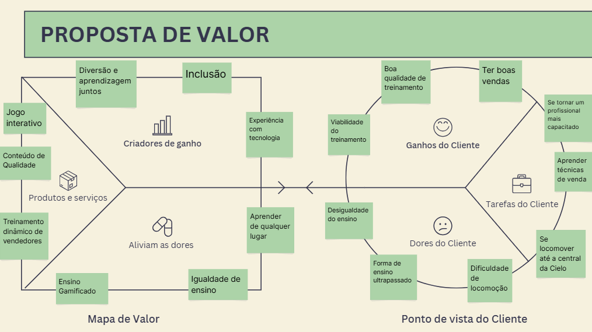<br>

</div


A relação entre o perfil do cliente e o mapa de valor evidencia como a solução foi pensada de forma estratégica. As principais dificuldades identificadas, como a limitação de acesso a treinamentos presenciais e a falta de engajamento em métodos tradicionais, são diretamente atendidas por uma plataforma digital interativa que utiliza a gamificação como ferramenta de aprendizado.

Diferente de abordagens convencionais, o uso de um jogo interativo permite que o usuário aprenda por meio da prática, simulando situações reais de vendas e recebendo feedback imediato sobre seu desempenho. O conteúdo do jogo é distintivo porque as perguntas são baseadas em cenários reais da rotina comercial da Cielo — como identificar o produto adequado para cada perfil de lojista e contornar objeções comuns — e cada resposta possui quatro níveis de qualidade (excelente, boa, neutra e incorreta), refletindo a gradação real de uma negociação em vez de tratar o conhecimento como simplesmente certo ou errado. Isso torna o processo mais dinâmico, aumenta o engajamento e contribui para uma aprendizagem mais efetiva e aplicável.

Além disso, a acessibilidade da plataforma reduz desigualdades no acesso ao conhecimento, permitindo que mais pessoas se desenvolvam profissionalmente independentemente de sua localização. Dessa forma, a solução não apenas resolve problemas existentes, mas também potencializa os resultados dos usuários, tornando o aprendizado mais eficiente, inclusivo e alinhado às demandas do mercado.

### 1.1.5. Descrição da Solução Desenvolvida (sprint 4)

A solução desenvolvida busca resolver a dificuldade enfrentada pela equipe comercial da Cielo em realizar treinamentos práticos, engajadores e eficazes, especialmente no que diz respeito à aplicação de conhecimentos no dia a dia de vendas. Nesse contexto, foi criado um jogo gamificado de simulação de vendas, no qual o usuário controla o personagem Marcielo em um mapa 2D e interage com diferentes estabelecimentos. Ao entrar nas lojas, o jogador participa de situações que simulam o processo real de vendas da Cielo, respondendo a quizzes e tomando decisões que impactam diretamente seu desempenho no jogo. Essas interações foram pensadas para reproduzir desafios cotidianos enfrentados pela equipe comercial, como identificar o perfil do cliente, contornar objeções e utilizar soluções adequadas.

O jogo foi concebido como um _serious game_, ou seja, um tipo de jogo desenvolvido com um propósito principal que vai além do entretenimento, neste caso, o aprendizado e a capacitação profissional. Diferentemente de jogos tradicionais, o foco de um serious game está na aplicação prática do conhecimento, utilizando elementos lúdicos para facilitar a assimilação de conteúdos e estimular o engajamento do usuário.

A proposta tem como objetivo tornar o treinamento do time comercial mais prático, interativo e eficiente, permitindo que os vendedores aprendam na prática como identificar necessidades dos clientes e oferecer as soluções adequadas. Além disso, o ambiente simulado proporciona um espaço seguro para erros e experimentação, sem impactos reais nos resultados da empresa. Dessa forma, a solução gera valor ao aumentar o engajamento no aprendizado, padronizar o conhecimento entre os colaboradores e melhorar a performance em vendas, alinhando-se diretamente às necessidades reais do parceiro.

**Perfil do usuário e modo de acesso:** o público-alvo direto são os gerentes de negócios (GNs) da Cielo, profissionais responsáveis pela prospecção e atendimento de lojistas. O jogo pode ser utilizado em dois contextos principais: durante o onboarding de novos GNs, como parte da trilha de capacitação inicial, e periodicamente como reforço de treinamento para equipes já formadas. O acesso é feito exclusivamente via navegador (Chrome, Firefox ou Edge), sem necessidade de instalação ou configuração — basta acessar o link publicado no GitLab Pages da Inteli. Não há dependência de infraestrutura corporativa ou VPN, o que garante acessibilidade independente da localização do colaborador.

### 1.1.6. Matriz de Riscos (sprint 4)

A matriz de riscos é uma ferramenta fundamental de gestão de projetos, utilizada para identificar, classificar e planejar respostas a eventos que possam impactar negativamente (ameaças) ou positivamente (oportunidades) o desenvolvimento do jogo. Ela permite visualizar, de forma estruturada, os principais riscos do projeto, avaliando sua probabilidade de ocorrência e o impacto potencial sobre os resultados. A análise e o acompanhamento contínuo desses riscos são essenciais para garantir a entrega do MVP no prazo, com qualidade e alinhamento aos objetivos do grupo.

#### 1.1.6.1. Classificação de Impacto, Probabilidade e Matriz


<div align="center">
  <sub>Imagem 1 - Classificação de Impacto</sub><br>
  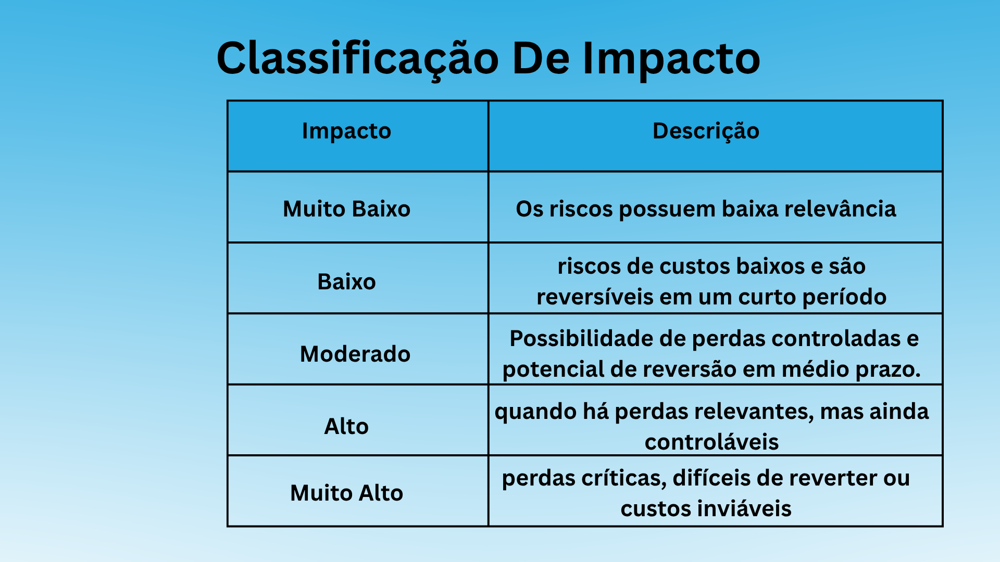<br>
  <sup>Fonte: Material produzido pelos autores, 2026</sup>
</div>

<div align="center">
  <sub>Imagem 2 - Classificação de Probabilidade</sub><br>
  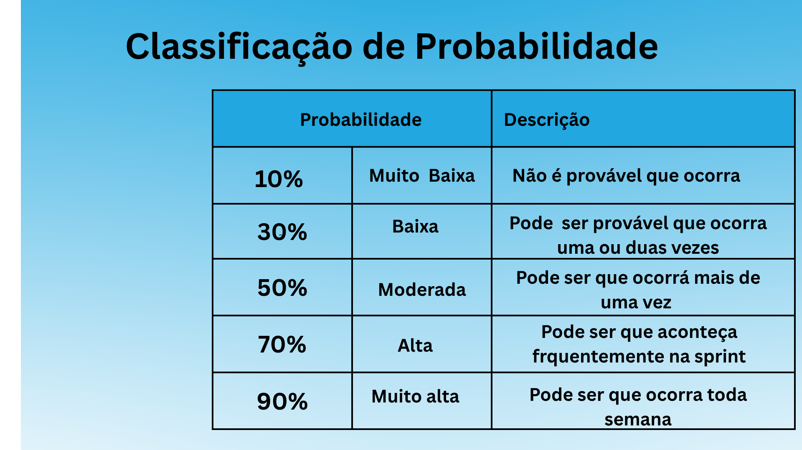<br>
  <sup>Fonte: Material produzido pelos autores, 2026</sup>
</div>

<div align="center">
  <sub>Imagem 3 - Matriz de risco</sub><br>
  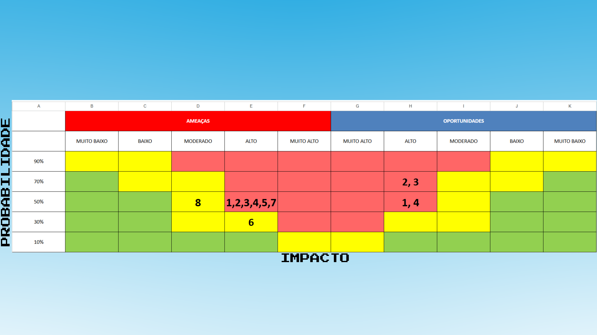<br>
  <sup>Fonte: Material produzido pelos autores, 2026</sup>
</div>


---

#### 1.1.6.2. Lista de Riscos — Ameaças

A. **Baixa adoção do jogo pelos gerentes de negócios (GNs)**
  Há o risco de o público-alvo não utilizar o jogo de forma recorrente após a entrega, seja por ausência de patrocínio interno, baixa percepção de valor ou falta de integração com o processo formal de capacitação.
  **Responsáveis:** Lyria (mentora da Cielo), coordenação de treinamento

  **Impacto:** Alto

  **Probabilidade:** Média

  **Plano de Resposta ao Risco:** Conduzir validações com GNs em cada sprint, medir taxa de conclusão e satisfação, e recomendar institucionalização do jogo no onboarding com meta mínima de adesão.

B. **Desatualização do conteúdo comercial e das regras de negócio**
  Mudanças em produtos, políticas comerciais e argumentos de venda podem tornar perguntas, feedbacks e cenários obsoletos, reduzindo a confiabilidade pedagógica do treinamento.
  **Responsáveis:** Equipe de produto da Cielo, coordenação de treinamento

  **Impacto:** Alto

  **Probabilidade:** Média

  **Plano de Resposta ao Risco:** Definir ciclo de revisão semestral do banco de perguntas, mapear responsáveis por aprovação de conteúdo e manter trilha de atualização documentada no arquivo quiz-perguntas.js.

C. **Baixa efetividade de aprendizagem (sem ganho mensurável)**
  Mesmo com o jogo funcionando, pode não haver melhoria relevante na retenção de conteúdo ou na tomada de decisão comercial dos GNs, comprometendo o objetivo de negócio da solução.
  **Responsáveis:** Equipe do projeto, mentoria da Cielo

  **Impacto:** Alto

  **Probabilidade:** Média

  **Plano de Resposta ao Risco:** Definir indicadores de aprendizagem (acurácia no quiz, tempo de resposta, evolução por tentativa), realizar testes comparativos e ajustar dificuldade e feedback com base em evidências.

D. **Dependência de validações externas para decisões críticas**
  Atrasos na agenda de validação com stakeholders da Cielo podem bloquear decisões de escopo, conteúdo e priorização, gerando retrabalho e perda de prazo.
  **Responsáveis:** Product owner acadêmico, Lyria (mentora da Cielo)

  **Impacto:** Alto

  **Probabilidade:** Média

  **Plano de Resposta ao Risco:** Agendar checkpoints fixos, enviar materiais de validação com antecedência e manter plano de decisão interna para itens não respondidos no prazo.

E. **Instabilidade técnica e baixa performance em navegadores-alvo**
  Quedas de desempenho, erros de carregamento e incompatibilidades entre navegadores podem prejudicar a experiência e inviabilizar uso em ambiente real de treinamento.
  **Responsáveis:** Equipe técnica (desenvolvimento e QA)

  **Impacto:** Alto

  **Probabilidade:** Média

  **Plano de Resposta ao Risco:** Adotar checklist de testes por navegador, monitorar FPS e tempo de carregamento por versão e manter backlog técnico dedicado para correções críticas de estabilidade.

F. **Indisponibilidade ou instabilidade da publicação do jogo**
  Falhas no ambiente de hospedagem ou no pipeline de publicação podem impedir acesso ao jogo em momentos de demonstração, validação ou uso operacional.
  **Responsáveis:** Equipe técnica (DevOps/publicação)

  **Impacto:** Alto

  **Probabilidade:** Baixa

  **Plano de Resposta ao Risco:** Manter versão estável de contingência publicada, testar deploy antes de marcos importantes e preparar roteiro offline de demonstração.

G. **Escopo acima da capacidade de entrega da sprint**
  O acúmulo de funcionalidades não essenciais pode comprometer a conclusão do núcleo do produto, elevando risco de atraso e perda de qualidade.
  **Responsáveis:** Scrum master, equipe de desenvolvimento

  **Impacto:** Alto

  **Probabilidade:** Média

  **Plano de Resposta ao Risco:** Priorizar backlog por valor de negócio, congelar novas features próximas ao fechamento da sprint e aplicar critério claro de "must-have" versus "nice-to-have".

H. **Perda de continuidade por conhecimento concentrado em poucas pessoas**
  Quando partes críticas do código ou do conteúdo ficam concentradas em poucos integrantes, ausências pontuais podem atrasar correções e evoluções do projeto.
  **Responsáveis:** Equipe de desenvolvimento

  **Impacto:** Médio

  **Probabilidade:** Média

  **Plano de Resposta ao Risco:** Reforçar documentação técnica mínima por módulo, realizar sessões rápidas de repasse entre pares e revisar ownership de componentes a cada sprint.

---

#### 1.1.6.3. Lista de Riscos — Oportunidades

A. **Gamificação aumentar a retenção de conhecimento**
   A aplicação de elementos de jogos pode tornar o aprendizado mais engajador, facilitando a compreensão e a memorização do conteúdo.  
   **Responsáveis:** Cielo

   **Impacto:** Alto

   **Probabilidade:** Média

   **Plano de Resposta ao Risco:** Adicionar elementos como desafios, animações e interações para evitar que o jogo se torne monótono.

B. **Desenvolvimento de soft skills dos membros do grupo**
   Refere-se à oportunidade de desenvolvimento de habilidades comportamentais essenciais, como comunicação, colaboração, organização, gestão de tempo, proatividade e resolução de conflitos.  
   **Responsáveis:** Luca, Tiago, Sofia, Cássio, Gabriel, Fernanda, Vinicius, Leonardo

   **Impacto:** Alto

   **Probabilidade:** Alta

   **Plano de Resposta ao Risco:** Incentivar a comunicação e a colaboração entre os integrantes para fortalecer essas habilidades.

C. **Adicionar todos os itens desejáveis planejados**
   Consiste na implementação de funcionalidades extras previstas, ampliando a experiência do usuário e agregando valor ao projeto, sem comprometer as entregas principais.  
   **Responsáveis:** Luca, Tiago, Sofia, Cássio, Gabriel, Fernanda, Vinicius, Leonardo

   **Impacto:** Alto

   **Probabilidade:** Alta

   **Plano de Resposta ao Risco:** Definir prioridades e manter uma organização eficiente para garantir a entrega completa.

D. **Demonstrar habilidades para uma grande empresa**
   Ao desenvolver o projeto, a equipe terá a oportunidade de demonstrar competências relevantes para o mercado.  
   **Responsáveis:** Luca, Tiago, Sofia, Cássio, Gabriel, Fernanda, Vinicius, Leonardo

  **Impacto:** Alto

  **Probabilidade:** Média

   **Plano de Resposta ao Risco:** Desenvolver um trabalho de alta qualidade, buscando reconhecimento dos avaliadores da Cielo.

---

#### 1.1.6.4. Conclusão e Síntese

A matriz de riscos foi utilizada de forma ativa ao longo do projeto, permitindo à equipe antecipar ameaças, planejar respostas e aproveitar oportunidades. O acompanhamento contínuo dos riscos contribuiu para a organização do grupo, a entrega do MVP no prazo e a elevação da qualidade do produto final. A análise sistemática dos riscos, aliada à comunicação eficiente e à definição clara de responsabilidades, foi fundamental para o sucesso do desenvolvimento e para a superação dos principais desafios enfrentados.

### 1.1.7. Objetivos, Metas e Indicadores (sprint 4)

Os Objetivos, Metas e Indicadores são ferramentas essenciais de gestão em projetos. Os objetivos definem o que se deseja alcançar de forma ampla e estratégica. As metas detalham esses objetivos em resultados específicos, mensuráveis, alcançáveis, relevantes e temporais (SMART). Já os indicadores permitem acompanhar o progresso e avaliar o sucesso das ações implementadas, fornecendo dados concretos para tomada de decisão e melhoria contínua.

**Descrição geral:**  
O Sprint 4 teve como foco consolidar e aprimorar a experiência do jogador, tornando o jogo mais dinâmico, acessível e engajador. Foram priorizadas melhorias estruturais, novas funcionalidades (como HUDs, sistema de sons e configurações), além da validação contínua com usuários reais para garantir alinhamento com as necessidades do público-alvo.

---

#### 🔹 Objetivo 1: Tornar o jogo mais divertido, dinâmico e acessível

- **Meta (SMART):**
  - _Específica:_ Implementar novas mecânicas, HUDs informativos, sistema de sons, menu de configurações e aprimorar o feedback visual e sonoro, validando a experiência com usuários.
  - _Mensurável:_ Atingir metas quantitativas de funcionalidades, engajamento e satisfação.
  - _Alcançável:_ Utilizando os recursos da equipe, testes internos e feedback de usuários reais.
  - _Relevante:_ Melhora a retenção, o engajamento e a qualidade do aprendizado no jogo.
  - _Temporal:_ Concluir até o final da Sprint 4.

- **Indicadores de desempenho (Key Results):**
  - **KR1:** Número de mecânicas implementadas  
    _Medição:_ Contagem de mecânicas novas (ex: HUDs, quizzes, configurações, sons, etc.)  
    _Meta:_ ≥ 7 mecânicas
  - **KR2:** Número de animações adicionadas  
    _Medição:_ Contagem de animações implementadas  
    _Meta:_ ≥ 5 animações
  - **KR3:** Número de efeitos sonoros distintos  
    _Medição:_ Contagem de efeitos sonoros únicos no jogo  
    _Meta:_ ≥ 13 sons
  - **KR4:** Implementação dos HUDs informativos  
    _Medição:_ HUD de NPCs coletados com feedback visual em tempo real e HUD de maquininhas funcionando corretamente  
    _Meta:_ Ambos HUDs implementados e validados em testes
  - **KR5:** Funcionalidade do menu de configurações  
    _Medição:_ Ajuste de volume, ativação/desativação de sons e reinício de progresso funcionando  
    _Meta:_ Todas opções disponíveis e testadas
  - **KR6:** Tempo médio de sessão dos jogadores  
    _Medição:_ Média de tempo (em minutos) por sessão  
    _Meta:_ Aumento de ≥ 20% em relação ao sprint anterior
  - **KR7:** Índice de satisfação dos usuários  
    _Medição:_ Média das avaliações em testes (escala de 1 a 5)  
    _Meta:_ ≥ 4,0

---

### 📊 Resumo dos Indicadores do Sprint

| Objetivo | Indicador                       | Meta    | Resultado Alcançado | Status        |
| -------- | ------------------------------- | ------- | ------------------- | ------------- |
| Obj. 1   | Mecânicas                       | ≥ 7     | 5                   | Não alcançado |
| Obj. 1   | Animações                       | ≥ 5     | 3                   | Não alcançado |
| Obj. 1   | Sons                            | ≥ 13    | 20                  | Alcançado     |
| Obj. 1   | HUDs implementados              | ≥2 HUDs | 2                   | Alcançado     |
| Obj. 1   | Menu de configurações funcional | 100%    | 80%                 | Não alcançado |
| Obj. 1   | Tempo médio de sessão           | +20%    | +30%                | Não alcançado |
| Obj. 1   | Satisfação dos usuários         | ≥ 4,0   | 3                   | Não alcançado |

---

### 📌 Observações

- Os indicadores foram definidos para garantir não só a entrega técnica, mas também a efetividade das melhorias na experiência do jogador.
- A validação com usuários reais foi fundamental para ajustar funcionalidades e priorizar o que realmente gera valor para o público-alvo.
- O acompanhamento desses indicadores serve de base para decisões estratégicas nos próximos sprints, promovendo melhoria contínua do produto.

## 1.2. Requisitos do Projeto (sprints 1 e 2)

Esta seção apresenta os requisitos do sistema, organizados em requisitos funcionais (RF) e requisitos não funcionais (RNF). Os requisitos funcionais descrevem as funcionalidades e comportamentos que o sistema deve oferecer ao usuário. Já os requisitos não funcionais definem características de qualidade e restrições do sistema, como desempenho, usabilidade e ambiente de execução. As tabelas a seguir detalham cada um desses requisitos, identificados por código e acompanhados de suas respectivas descrições.

### 1.2.1. Requisitos Funcionais

| ID   | Requisito Funcional              | Descrição                                                                                                                                                                                                                                                                                                                                                                                                                                                  |
| ---- | -------------------------------- | ---------------------------------------------------------------------------------------------------------------------------------------------------------------------------------------------------------------------------------------------------------------------------------------------------------------------------------------------------------------------------------------------------------------------------------------------------------- |
| RF01 | Menu inicial                     | O sistema deve apresentar um menu inicial que permita ao jogador iniciar a partida e acessar as opções principais do jogo.                                                                                                                                                                                                                                                                                                                                 |
| RF02 | Menu de configurações            | O sistema deve disponibilizar um menu de configurações acessível a partir do menu inicial, permitindo ajustar o volume dos sons do jogo, ativar/desativar efeitos sonoros e redefinir o progresso (novo jogo).                                                                                                                                                                                                                                             |
| RF03 | Progresso da sessão              | O sistema deve manter o progresso do jogador de forma persistente entre sessões, salvando via localStorage: NPCs conquistados, quantidade de maquininhas e posição de retorno no mapa. O progresso é restaurado automaticamente ao reabrir o jogo.                                                                                                                                                                                    |
| RF04 | Tutorial inicial                 | O sistema deve apresentar um tutorial interativo explicando movimentação, interação com NPCs, funcionamento dos quizzes e sistemas de HUD antes da primeira partida.                                                                                                                                                                                                                                                                                       |
| RF05 | Sistema de quizzes de negociação | O sistema deve disponibilizar quizzes interativos de negociação com NPCs sobre produtos da Cielo. Cada estabelecimento terá 3 perguntas sorteadas aleatoriamente do banco daquela loja, com 4 opções de resposta. O jogador conquista o cliente ao acertar pelo menos 2 das 3 perguntas. Caso erre 2 ou mais perguntas, não conquista o NPC e pode tentar novamente. |
| RF06 | Sistema de variáveis do cliente  | O sistema deve controlar variáveis dinâmicas de tempo de atendimento e humor do cliente, influenciando o resultado das interações e o desempenho do jogador.                                                                                                                                                                                                                                                                                               |
| RF07 | HUD de NPCs coletados            | O sistema deve exibir um HUD visual que mostra em tempo real a quantidade de NPCs coletados/interagidos, com feedback de cores atualizado conforme o progresso do jogador.                                                                                                                                                                                                                                                                                 |
| RF08 | HUD de maquininhas               | O sistema deve exibir um HUD visual indicando a quantidade de maquininhas que o personagem Marcielo está carregando para realizar vendas, atualizando em tempo real conforme as ações do jogador.                                                                                                                                                                                                                                                          |
| RF09 | Sistema de sons                  | O sistema deve reproduzir efeitos sonoros distintos para diferentes ações e ambientes do jogo, permitindo ajuste de volume e ativação/desativação pelo menu de configurações.                                                                                                                                                                                                                                                                              |
| RF10 | Interação com NPCs               | O sistema deve permitir interação com NPCs distribuídos no mapa para iniciar negociações e acessar quizzes.                                                                                                                                                                                                                                                                                                                                                |
| RF11 | Navegação em mundo aberto        | O sistema deve permitir movimentação livre do jogador em ambiente 2D top-down, possibilitando exploração e seleção de clientes.                                                                                                                                                                                                                                                                                                                            |
| RF12 | Sistema de feedback educativo    | O sistema deve apresentar um feedback educativo após cada resposta selecionada no quiz, mostrando qual é a alternativa correta, caso tenha errado. Ao final de cada cena, o sistema deve exibir um feedback geral da negociação: positivo caso o jogador conquiste o NPC cliente ou negativo caso não consiga concluir a negociação com sucesso.                                                                                                           |

### 1.2.2. Requisitos Não Funcionais

| ID    | Requisito Não Funcional       | Descrição                                                                                                                                                     |
| ----- | ----------------------------- | ------------------------------------------------------------------------------------------------------------------------------------------------------------- |
| RNF01 | Ambiente gráfico              | O jogo deve ser desenvolvido em ambiente 2D com perspectiva top-down, priorizando navegação simples, leitura visual clara e baixa complexidade operacional.   |
| RNF02 | Plataforma de execução        | O jogo deve ser executável diretamente em navegadores web modernos, sem necessidade de instalação ou configuração adicional.                                  |
| RNF03 | Usabilidade e linguagem       | O jogo deve utilizar linguagem clara, objetiva e adequada ao contexto comercial e educacional da Cielo.                                                       |
| RNF04 | Interface do usuário          | O sistema deve apresentar interface visual organizada e intuitiva, facilitando a navegação e interação do jogador.                                            |
| RNF05 | Identidade visual             | O sistema deve manter padronização de cores, tipografia e elementos gráficos conforme a identidade visual do projeto.                                         |
| RNF06 | Acessibilidade                | A interface deve priorizar leitura clara, contraste adequado e elementos visuais compreensíveis para diferentes perfis de usuários.                           |
| RNF07 | Desempenho                    | O jogo deve manter execução fluida em navegadores corporativos padrão, evitando quedas perceptíveis de desempenho.                                            |
| RNF08 | Acessibilidade operacional    | As mecânicas devem exigir baixo nível de habilidade gamer, permitindo uso por usuários sem experiência prévia com jogos digitais.                             |
| RNF09 | Experiência sonora            | O sistema deve garantir que os efeitos sonoros sejam claros, não intrusivos e ajustáveis pelo usuário, contribuindo para a imersão e acessibilidade.          |
| RNF10 | Feedback visual em tempo real | O sistema deve fornecer feedback visual imediato e dinâmico nos HUDs de NPCs coletados e maquininhas, facilitando o acompanhamento do progresso pelo jogador. |
| RNF11 | Personalização básica         | O sistema deve permitir ao usuário personalizar configurações básicas, como volume de som e reinício do progresso, de forma simples e acessível.              |

## 1.3. Público-alvo do Projeto (sprint 2)

## Público-Alvo

O jogo é direcionado aos colaboradores da equipe comercial da Cielo, com faixa etária média aproximada de 44 anos. Trata-se de um público adulto inserido em ambiente corporativo, com experiência prévia em vendas, negociação e relacionamento com clientes.

---

### Perfil Demográfico

- Profissionais da área de vendas e relacionamento comercial;
- Faixa etária média: 40–50 anos;
- Usuários com familiaridade funcional com tecnologia digital;
- Predominantemente non-gamers ou jogadores ocasionais;
- Tempo limitado para atividades de treinamento devido à rotina profissional.

---

### Perfil Psicográfico e Preferências

Esse público tende a demonstrar maior engajamento com experiências de aprendizado que:

- Possuam aplicação prática no contexto profissional;
- Simulem situações do cotidiano de vendas e negociação;
- Apresentem feedback claro de desempenho;
- Incentivem evolução contínua e melhoria de resultados.

---

### Necessidades de Aprendizagem

Considerando o contexto de atuação da equipe comercial, destacam-se como relevantes para o público:

- Persuasão e argumentação em vendas;
- Tomada de decisão em situações de negociação;
- Interpretação de perfis de clientes;
- Estratégias de marketing e negociação;
- Comunicação clara e assertiva.

# <a name="c2"></a>2. Visão Geral do Jogo (sprint 2)

## 2.1. Objetivos do Jogo (sprint 2)

O objetivo do jogo é desenvolver as habilidades de negociação do jogador por meio de simulações de vendas em contextos realistas. O jogador percorre um mapa 2D com 12 lojas e interage com os clientes (NPCs) de cada estabelecimento por meio de quizzes de negociação. Em cada quiz, é necessário acertar pelo menos 2 das 3 perguntas para conquistar o NPC. Durante as simulações, espera-se que o jogador demonstre compreensão do perfil e das necessidades apresentadas, aplique corretamente conhecimentos sobre produtos e soluções da Cielo e responda de maneira adequada às situações propostas.
O jogo é concluído quando todos os 12 NPCs são conquistados, indicando que o jogador percorreu todas as lojas e obteve sucesso nas negociações.

## 2.2. Características do Jogo (sprint 2)

O jogo é uma simulação interativa de negociação focada no desenvolvimento de habilidades comerciais em um ambiente virtual. O jogador controla o personagem Marcielo em um mapa 2D top-down com 12 lojas, cada uma com um cliente (NPC) para conquistar por meio de quizzes sobre produtos e situações de venda da Cielo. Ao longo da experiência, são utilizados elementos de gamificação como progressão visual de conquistas, gerenciamento de recursos (maquininhas) e feedback imediato por alternativa, permitindo que o jogador experimente estratégias, tome decisões e perceba os resultados de suas escolhas. Dessa forma, o jogo combina engajamento com aprendizagem prática, oferecendo um espaço seguro para treinar comunicação, argumentação e tomada de decisão.

### 2.2.1. Gênero do Jogo (sprint 2)

O jogo pode ser classificado como um serious game de simulação com quizzes.

### 2.2.2. Plataforma do Jogo (sprint 2)

Atualmente o jogo está sendo feito apenas para desktop em navegadores web.

### 2.2.3. Número de jogadores (sprint 2)

Apenas 1 jogador.

### 2.2.4. Títulos semelhantes e inspirações (sprint 2)

Os jogos Pokémon Fire Red, Pokémon Leaf Green e Pokémon Emerald além de serem semelhantes, foram usados como inspiração para o nosso jogo.

### 2.2.5. Tempo estimado de jogo (sprint 5)

Aproximadamente 15 a 20 minutos para uma partida completa (conquistar todos os 12 NPCs), considerando o tempo de deslocamento pelo mapa, os quizzes e as recargas na Central Cielo. Jogadores com maior familiaridade com jogos de navegação top-down tendem a completar mais rapidamente. O tutorial em vídeo inicial acrescenta cerca de 3 a 5 minutos na primeira sessão.

# <a name="c3"></a>3. Game Design (sprints 2 e 3)

## 3.1. Enredo do Jogo (sprints 2 e 3)

<p>O jogo se passa em uma pequena cidade comercial, com 6 quadras e 12 lojas distribuídas de forma estratégica, representando diferentes perfis de clientes e realidades do mercado brasileiro. Cada quadra conta com 2 lojas, compondo os principais ambientes de interação do jogo. Esse ambiente simboliza o dia a dia dos lojistas, com dúvidas, pressões e necessidade de tomar decisões rápidas. O cenário é simples de propósito, para que o foco do jogador esteja nas interações e na qualidade da venda. O personagem principal é um gerente da Cielo, representado por um mascote, que já atua na empresa, mas precisa evoluir suas habilidades de argumentação, conhecimento de produto e capacidade de lidar com objeções. Sua jornada dentro do jogo representa o desenvolvimento profissional esperado de qualquer gerente.</p>
<p>A história começa a partir de um desafio real enfrentado pela Cielo: a dificuldade de treinar gerentes espalhados por todos os cantos do Brasil. Os treinamentos presenciais e aulas tradicionais não conseguem alcançar todos com a mesma consistência e frequência, principalmente considerando as diferentes regiões e contextos comerciais do país. Surge então a necessidade de uma solução acessível, prática e escalável. O jogo é criado como uma ferramenta estratégica de aprendizagem, permitindo que qualquer gerente, independentemente de onde esteja, possa aprender e treinar a venda dos produtos Cielo de forma interativa e dinâmica.</p>
<p>Ao percorrer a cidade, o mascote entra nas lojas e inicia contato com os clientes, que começam vestindo camiseta vermelha, indicando que ainda não foram convencidos ou não possuem relação com a Cielo. Cada interação possui tempo limitado para resposta, simulando a pressão do mundo real, onde o lojista busca objetividade e clareza. Durante o atendimento, o jogador precisa responder perguntas sobre produtos, lidar com dúvidas e superar objeções. Além disso, há um indicador de conversão do cliente, que mostra se a condução da venda está sendo positiva ou não. Não basta apenas fechar a venda; é necessário gerar confiança e segurança.</p>
<p>Conforme o jogador avança, os clientes se tornam mais exigentes e as perguntas mais complexas, aumentando o nível de desafio. Quando a venda é bem conduzida e o cliente se sente seguro, a camiseta muda de vermelho para azul, representando que ele se tornou cliente Cielo. Essa transformação visual simboliza não apenas a conversão, mas também o impacto da boa argumentação e do conhecimento aplicado corretamente. À medida que mais clientes se tornam azuis, a cidade passa a representar crescimento, consolidação e fortalecimento da presença da Cielo naquele ambiente.</p>

## 3.2. Personagens (sprints 2 e 3)

### 3.2.1. Controláveis

<p>O nome do personagem principal é Marcielo. Trata-se de um mascote cuja função é atuar como facilitador da experiência do jogador, tendo como objetivo vender produtos da Cielo aos clientes dentro do ambiente do jogo. Para isso, ele se locomove pelo mapa e entra nas lojas a fim de interagir com os consumidores, simulando de maneira lúdica situações de venda e atendimento.</p>
<p>Sua presença contribui para tornar a dinâmica menos séria e mais envolvente, graças ao seu design amigável e expressivo. Marcielo transmite simpatia e carisma, sendo visualmente cativante e facilmente associado a uma figura confiável e acessível. Ele é representado sorrindo, com a mão levantada em um gesto cordial e piscando um dos olhos, elementos que reforçam sua personalidade acolhedora e descontraída. Dessa forma, o personagem não apenas cumpre uma função narrativa e interativa, como também torna a experiência do jogo mais leve, divertida e agradável para o público.</p>

<div align="center">
  <sub>Imagem 4 - Spritesheet Marcielo andando</sub><br>
  <br>
  <sup>Fonte: Material produzido pelos autores, 2026</sup>
</div>


<div align="center">
  <sub>Imagem 5 - Spritesheet Marcielo andando</sub><br>
  <br>
  <sup>Fonte: Material produzido pelos autores, 2026</sup>
</div>


<div align="center">
  <sub>Imagem 6 - Spritesheet Marcielo andando</sub><br>
  <br>
  <sup>Fonte: Material produzido pelos autores, 2026</sup>
</div>


<div align="center">
  <sub>Imagem 7 - Spritesheet Marcielo andando</sub><br>
  <br>
  <sup>Fonte: Material produzido pelos autores, 2026</sup>
</div>


### 3.2.2. Non-Playable Characters (NPC)

<p>No jogo, haverá personagens coadjuvantes que representarão os clientes. Esses clientes estarão posicionados dentro das lojas e interagirão com o personagem principal nos momentos de negociação e venda dos produtos da Cielo.</p>
<p>Haverá dois tipos de clientes: os que utilizam camiseta vermelha e os que utilizam camiseta azul. A camiseta vermelha indica que o cliente ainda não foi convencido ou que ainda não teve contato com o vendedor. Após uma venda bem-sucedida, o cliente passará a utilizar camiseta azul, representando que se tornou um cliente Cielo.</p>
<P>Além disso, esses personagens também funcionam como um recurso para demonstrar diversidade no jogo. Por esse motivo, foram criados diferentes perfis de clientes para cada loja, com variações de aparência e características, de modo que o ambiente se torne mais representativo, dinâmico e diversificado ao longo da experiência do jogador.</p>


<div align="center">
  <sub>Imagem 8 - Arte dos NPCs</sub><br>
  <br>
  <sup>Fonte: Material produzido pelos autores, 2026</sup>
</div>


### 3.2.3. Diversidade e Representatividade dos Personagens

<p>O elenco de personagens do jogo foi concebido de forma a refletir a pluralidade da sociedade brasileira e a realidade dos clientes que os Gerentes de Negócios da Cielo encontram no cotidiano profissional.</p>

<p><strong>Alinhamento com o público-alvo:</strong> O público-alvo do jogo (seção 1.3) são profissionais da equipe comercial da Cielo, com faixa etária entre 40 e 50 anos, inseridos em ambiente corporativo e com experiência em vendas. Os NPCs, clientes que habitam as lojas, foram criados com perfis variados de idade, gênero e aparência justamente para espelhar a diversidade de estabelecimentos e proprietários que um vendedor encontra em campo: desde uma doceira jovem em uma cupcakeria até o dono de uma padaria de bairro de meia-idade. Esse realismo nos perfis dos clientes torna o treinamento mais imersivo e transferível para situações reais de trabalho.</p>

<p><strong>Representatividade dentro da sociedade brasileira:</strong> O Brasil é um país marcado por intensa diversidade étnica, geracional e de gênero. De acordo com o Censo 2022 do IBGE, mais da metade da população se autodeclara preta ou parda, e o empreendedorismo de micro e pequenos negócios é amplamente distribuído entre diferentes perfis sociodemográficos. Para refletir essa realidade, os personagens coadjuvantes foram desenhados com variações de tom de pele, gênero, faixa etária e características físicas distintas, evitando a homogeneização do público consumidor que o vendedor deverá atender.</p>

<p><strong>Impacto esperado:</strong> A diversidade intencional nos personagens produz dois efeitos principais. Primeiro, amplia a identificação do jogador com o universo do jogo: vendedores de diferentes origens reconhecem nos clientes representações próximas à realidade que vivenciam. 

Segundo, reforça de forma implícita o valor da inclusão no relacionamento comercial, comunicando que os produtos da Cielo são relevantes para todos os perfis de estabelecimento, independentemente de quem seja o proprietário. Ao normalizar essa diversidade dentro da mecânica de treinamento, o jogo contribui para desenvolver uma postura comercial mais empática e culturalmente sensível nos colaboradores da Cielo.</p>

## 3.3. Mundo do jogo (sprints 2 e 3)

### 3.3.1. Locações Principais e/ou Mapas (sprints 2 e 3)

<p>O ambiente do jogo será estruturado de forma simples e objetiva, a fim de garantir que o jogador compreenda com clareza para onde deve se dirigir, evitando a perda de tempo ao se deslocar pelo mapa sem propósito. O cenário será composto por uma pequena cidade, organizada em 6 quadras com 2 lojas em cada uma, totalizando 12 lojas que funcionarão como os principais ambientes do jogo. No interior desses estabelecimentos ocorrerão as negociações e as vendas dos produtos da Cielo.</p>

Segue abaixo o mapa:

<div align="center">
  <sub>Imagem 9 - Mapa do jogo</sub><br>
  <br>
  <sup>Fonte: Material produzido pelos autores, 2026</sup>
</div>


### 3.3.2. Navegação pelo mundo (sprints 2 e 3)

<p>O personagem terá acesso a todas as lojas do mapa, podendo se locomover entre elas livremente. Ao chegar a uma loja, entrará no ambiente interno, onde realizará a negociação e a venda do produto ao cliente. Após a conclusão da venda, o personagem sairá da loja correspondente e seguirá para a próxima, dando continuidade ao processo e buscando novos clientes ao longo do mapa.</p>

### 3.3.3. Condições climáticas e temporais (sprints 2 e 3)

Não se aplica

### 3.3.4. Concept Art (sprint 2)

Concept art são desenhos iniciais usados para definir como o jogo vai parecer. Eles ajudam a visualizar personagens, cenários e o estilo visual antes do desenvolvimento final, servindo como base para a equipe artística.

<div align="center">
  <sub>Imagem 10 - Concept Art dos NPCs</sub><br>
  <br>
  <sup>Fonte: Material produzido pelos autores, 2026</sup>
</div>


Figura 1: desenhos dos clientes feito a mão

### 3.3.5. Trilha sonora (sprint 4)

O jogo utiliza efeitos sonoros e sons ambiente implementados via Phaser (`this.sound`). Não há trilha musical contínua — o áudio é pontual por evento ou ambiente por cena.

| #   | Identificador no código | Ocorrência                                        | Arquivo                                 |
| --- | ----------------------- | ------------------------------------------------- | --------------------------------------- |
| 1   | `portaAbrindo`          | Ao entrar em qualquer loja ou na Central da Cielo | `assets/sons/portaAbrindo.mp3`          |
| 2   | `ambienteAutoEscola`    | Som ambiente em loop dentro da Autoescola         | `assets/sons/ambienteAutoEscola.mp3`    |
| 3   | `ambientePelucia`       | Som ambiente em loop dentro da Loja de Pelúcia    | `assets/sons/ambienteBrinquedo.mp3`     |
| 4   | `ambienteChocolateria`  | Som ambiente em loop dentro da Loja de Chocolate  | `assets/sons/ambienteChocolateria.mp3`  |
| 5   | `ambientePetShop`       | Som ambiente em loop dentro do Pet Shop           | `assets/sons/ambientePetShop.mp3`       |
| 6   | `ambienteRoupas`        | Som ambiente em loop dentro da Loja de Roupas     | `assets/sons/ambienteRoupas.mp3`        |
| 7   | `ambienteSalaoDeBeleza` | Som ambiente em loop dentro do Salão de Beleza    | `assets/sons/ambienteSalaoDeBeleza.mp3` |
| 8   | `ambienteCafeteria`     | Som ambiente em loop dentro do Café               | `assets/sons/ambienteCafeteria.mp3`     |
| 9   | `ambienteFrutaria`      | Som ambiente em loop dentro da Frutaria           | `assets/sons/ambienteFrutaria.mp3`      |
| 10  | `ambienteMóveis`        | Som ambiente em loop dentro da Loja de Móveis     | `assets/sons/ambienteMóveis.mp3`        |
| 11  | `ambienteVideoGame`     | Som ambiente em loop dentro da Loja de Games      | `assets/sons/ambienteVideoGame.mp3`     |
| 12  | `ambienteJoalheria`     | Som ambiente em loop dentro da Joalheria          | `assets/sons/ambienteJoalheria.mp3`     |
| 13  | `ambienteLanchonete`    | Som ambiente em loop dentro da Lanchonete         | `assets/sons/ambienteLanchonete.mp3`    |
| 14  | `ambienteCielo`         | Som ambiente em loop dentro da Central Cielo      | `assets/sons/ambienteCielo.mp3`         |
| 15  | `andandoRua`            | Som dos passos do jogador ao se mover             | `assets/sons/andandoRua.mp3`            |
| 16  | `clienteGanho`          | Tocado ao conquistar um NPC no quiz               | `assets/sons/clienteGanho.mp3`          |
| 17  | `clientePerdido`        | Tocado ao perder um NPC no quiz                   | `assets/sons/clientePerdido.mp3`        |
| 18  | `menuSom`               | Música de fundo em loop no menu principal         | `assets/sons/menuSom.mp3`               |
| 19  | `somCidade`             | Som ambiente em loop na cena da cidade            | `assets/sons/somCidade.mp3`             |
| 20  | `somClicando`           | Tocado ao clicar em botões da interface           | `assets/sons/somClicando.mp3`           |
| 21  | `menuMorte`             | Tocado quando o personagem principal é atropelado | `assets/sons/somMorte.mp3`              |
| 22  | `somEscrita`            | Tocado quando algum texto no jogo é digitado      | `assets/sons/somEscrita.mp3`            |

## 3.4. Inventário e Bestiário (sprint 3)

### 3.4.1. Inventário

O jogo não possui um inventário tradicional com coleta, armazenamento ou uso de itens. Em vez disso, a experiência é estruturada a partir de recursos sistêmicos que acompanham o desempenho do jogador durante as interações de venda.
Esses recursos funcionam como indicadores de progresso e apoio à tomada de decisão, reforçando a proposta de treinamento corporativo do jogo.

**3.4.1.1. Itens e Recursos Implementados**

| Nº  | Item / Recurso                | Como obter / ativar                                         | Função no jogo                           | Impacto no desempenho                    |
| --- | ----------------------------- | ----------------------------------------------------------- | ---------------------------------------- | ---------------------------------------- |
| 1   | Tempo de Atendimento          | Inicia automaticamente ao começar a interação com o cliente | Limita o tempo disponível para responder | Estimula decisões rápidas e estratégicas |
| 2   | Nível de Conversão do Cliente | Alterado conforme as respostas escolhidas                   | Mede o avanço da negociação              | Influencia o resultado da interação      |
| 3   | Feedback de Desempenho        | Exibido ao término do atendimento                           | Apresenta avaliação das decisões tomadas | Permite aprendizado e melhoria contínua  |

**3.4.1.2. Descrição dos Itens e Recursos**

**A. Tempo de Atendimento**

Cada negociação possui um limite de tempo. Caso o jogador demore para responder, pode comprometer o resultado do atendimento.
Esse recurso simula situações reais de pressão no ambiente comercial.

**B. Nível de Conversão do Cliente**

As escolhas realizadas durante o quiz de negociação impactam diretamente o nível de conversão do cliente, representado por uma barra vertical visível durante o quiz. A barra começa em 50% e varia conforme a qualidade das respostas: respostas excelentes (3 pts) adicionam +30, boas (2 pts) adicionam +10, neutras (1 pt) não alteram e incorretas (0 pts) reduzem em -50. A conquista do NPC ocorre quando o jogador acumula 6 ou mais pontos ao longo das 3 perguntas (equivalente a acertar pelo menos 2).
Esse sistema reforça o aspecto estratégico e educativo do jogo.

**C. Feedback de Desempenho**

Ao final de cada atendimento, o jogador recebe um resumo com seus acertos/erros e avaliação geral.
Esse feedback tem função pedagógica, permitindo que o jogador compreenda seus erros e melhore em futuras interações.

**D. Considerações**

Os recursos do jogo foram planejados para reforçar a proposta de treinamento corporativo, priorizando a tomada de decisão estratégica, a análise de cenários e a avaliação de desempenho em vez de mecânicas tradicionais baseadas em coleta de itens ou combate.

### 3.4.2. Bestiário

O jogo não possui bestiário, pois sua proposta é voltada para simulações de negociação comercial e interação com clientes, e não para confrontos com inimigos.

Os personagens não jogáveis presentes no mapa são NPCs que representam lojistas e responsáveis pelos estabelecimentos. Eles funcionam como agentes de interação para os quizzes e para o desenvolvimento das situações de venda, sem exercer papel de adversários dentro da experiência.

## 3.5. Gameflow (Diagrama de cenas) (sprint 2)

Game flow descreve o fluxo de progressão do jogador dentro do jogo, indicando as etapas da experiência, desde o início até os objetivos finais. Ele representa como as ações do jogador, desafios, recompensas e transições entre estados se conectam para formar uma experiência contínua e coerente.


<div align="center">
  <sub>Imagem 11 - Diagrama de Cenas</sub><br>
  <br>
  <sup>Fonte: Material produzido pelos autores, 2026</sup>
</div>


> **Nota:** O diagrama acima foi elaborado na Sprint 2 e não reflete o estado final do jogo. Desde então, foram adicionadas as seguintes cenas: `CenaTutorialVideo` (tutorial em vídeo exibido antes do primeiro jogo), `CenaConfiguracoes` (acessada pelo botão Configurações do menu e pelo menu de pausa), `CenaCentral` (prédio da Cielo no mapa, com diálogos e recarga de maquininhas) e `CenaMapa` (mapa completo com legenda, aberto pela tecla M). O fluxo atualizado completo pode ser visualizado no link disponível nos Anexos (A.1).

As cenas registradas no sistema no estado final são: `CenaMenu`, `CenaTutorialVideo`, `CenaTutorial`, `CenaCidade`, `CenaPausa`, `CenaConfiguracoes`, `CenaCentral`, `CenaFinal`, `CenaMapa` e as 12 cenas de lojas (`cafeScene`, `gamesScene`, `belezaScene`, `roupasScene`, `petScene`, `movelScene`, `frutariaScene`, `lanchoneteScene`, `chocolateScene`, `peluciaScene`, `autoEscolaScene`, `joalheriaScene`).

## 3.6. Regras do jogo (sprint 3)

No jogo, o usuário assume o papel de um vendedor da Cielo e tem como objetivo vender as maquininhas e os serviços de pagamento da empresa para diferentes estabelecimentos distribuídos pelo mapa.

**Regras objetivas do jogo:**

1. O jogador percorre o mapa a pé usando as teclas WASD e pode ser morto ao colidir com qualquer carro nas 3 ruas do mapa (13 carros no total) — ao morrer, a cena reinicia.

2. Para entrar em uma loja, o jogador deve se aproximar da porta e aguardar a sobreposição de área.

3. Dentro da loja, ao se aproximar a menos de **300 px** do NPC, um ícone de interação (tecla E) aparece sobre ele — **desde que o jogador possua pelo menos 1 maquininha disponível**.

4. O jogador pressiona **E** para iniciar o quiz de negociação com o NPC.

5. Cada quiz contém **3 perguntas** sorteadas aleatoriamente do banco de perguntas daquela loja.

6. Cada pergunta tem **60 segundos** de tempo limite. Ao esgotar o tempo, a pergunta é contabilizada como erro e o quiz avança automaticamente para a próxima pergunta.

7. O cliente é conquistado se o jogador acertar **2 ou 3 perguntas** no quiz de 3 questões.

8. Se o jogador errar **2 ou 3 perguntas**, o NPC não é conquistado naquela tentativa, mas o quiz pode ser repetido.

9. O progresso é salvo automaticamente via **localStorage**: NPCs conquistados, NPCs tentados (não conquistados), quantidade de maquininhas, posição de spawn e estado das lojas persistem entre sessões.

10. O menu de pausa (ESC) oferece 3 opções: **Continuar** (retoma o jogo), **Novo Jogo** (apaga todo o progresso salvo, inclusive maquininhas) e **Menu** (volta ao menu principal).

11. A tecla **T** abre o tutorial a qualquer momento durante o jogo (cidade ou loja), sem perder o progresso da cena atual.

12. O mapa possui um prédio da **Central da Cielo** que o jogador pode visitar. Dentro da Central, ao se aproximar a menos de **300 px** do NPC e pressionar **E**, o jogador recarrega suas maquininhas até o máximo de **2 unidades** — o botão de interação só aparece quando o jogador está abaixo do limite máximo.

13. O jogador começa com **0 maquininhas**. Para realizar negociações, deve primeiro visitar a Central da Cielo e recarregar o estoque. Ao conquistar um NPC com sucesso, **1 maquininha é consumida**; ao falhar, nenhuma maquininha é descontada.

## 3.7. Mecânicas do jogo (sprint 3)

### 3.7.1. Controles

Os comandos de movimento do personagem podem ser executados tanto pelas teclas WASD quanto pelas setas direcionais do teclado, mantendo o restante das interações nas teclas dedicadas.

| Comando                 | Tipo de Entrada | Ação Executada                                 | Consequência no Jogo                                         |
| ----------------------- | --------------- | ---------------------------------------------- | ------------------------------------------------------------ |
| W                       | Teclado         | Move o personagem para cima                    | Permite navegação pelo mapa                                  |
| A                       | Teclado         | Move o personagem para a esquerda              | Permite navegação pelo mapa                                  |
| S                       | Teclado         | Move o personagem para baixo                   | Permite navegação pelo mapa                                  |
| D                       | Teclado         | Move o personagem para a direita               | Permite navegação pelo mapa                                  |
| Aproximação do NPC      | Movimento       | Chegar a menos de 300px do NPC dentro da loja  | Exibe o botão de interação (ícone E) sobre o NPC             |
| E                       | Teclado         | Pressionar E enquanto estiver próximo ao NPC   | Inicia o diálogo de negociação (quiz)                        |
| ESC                     | Teclado         | Pressionar ESC durante o jogo (cidade ou loja) | Abre o menu de pausa com opções: Continuar, Novo Jogo, Menu  |
| T                       | Teclado         | Pressionar T durante o jogo (cidade ou loja)   | Abre a tela de tutorial sem sair do jogo (modo overlay)      |
| M                       | Teclado         | Pressionar M durante a navegação pela cidade   | Abre o mapa completo da cidade com legenda e marcador da posição atual do jogador |
| Botão esquerdo do mouse | Mouse           | Seleciona alternativa no quiz                  | Afeta o nível de conversão do cliente e o resultado da venda |

### 3.7.2. Navegação pela cidade e carros

O jogador navega pelo mapa da cidade usando WASD ou as setas direcionais. O mapa contém **3 ruas com tráfego**, cada uma com carros independentes em loop horizontal. Ao colidir com qualquer carro, o método `player.morreu()` é chamado, reiniciando a cena da cidade — todo o progresso salvo é mantido, apenas a posição é resetada. Cada carro sorteia aleatoriamente uma entre três cores (branco, amarelo ou azul) ao ser criado, e o sprite é espelhado horizontalmente quando o carro se move para a esquerda.

| Rua   | Posição Y (aprox.) | Qtd. carros | Direção            | Velocidade | Espaçamento |
| ----- | ------------------ | ----------- | ------------------ | ---------- | ----------- |
| Rua 1 | y ≈ 2123           | 4           | Esquerda → Direita | 650 px/s   | 3000 px     |
| Rua 2 | y ≈ 4065           | 6           | Direita → Esquerda | 1000 px/s  | 2000 px     |
| Rua 3 | y ≈ 6359           | 3           | Esquerda → Direita | 450 px/s   | 4000 px     |

Essa mecânica introduz risco à navegação e exige que o jogador preste atenção ao atravessar as ruas.

### 3.7.3. As 12 lojas

O jogo conta com **12 lojas distintas**, cada uma com cena interna própria, NPC exclusivo, banco de perguntas específico e mobiliário com colisão física. As lojas são:

| Loja       | Banco de Perguntas    | Tema central                             |
| ---------- | --------------------- | ---------------------------------------- |
| Café       | `perguntasCafe`       | Produtos Cielo para food service         |
| Games      | `perguntasNpcRua`     | Soluções de pagamento digital            |
| Beleza     | `perguntasNpcRua`     | Pagamentos em salões de beleza           |
| Roupas     | `perguntasNpcRua`     | Pagamentos em moda e varejo              |
| Pet Shop   | `perguntasPet`        | Soluções para pet shops                  |
| Móveis     | `perguntasMovel`      | Antecipação de recebíveis e parcelamento |
| Frutaria   | `perguntasNpcRua`     | Pagamentos em hortifruti                 |
| Lanchonete | `perguntasLanchonete` | Pagamentos rápidos em lanchonetes        |
| Chocolate  | `perguntasChocolate`  | Pagamentos em confeitarias               |
| Pelúcia    | `perguntasPelucia`    | Soluções para lojas de brinquedos        |
| Autoescola | `perguntasAutoescola` | Pagamentos recorrentes e mensalidades    |
| Joalheria  | `perguntasNpcRua`     | Pagamentos de alto valor em joalherias   |


Cada loja usa a mesma classe genérica `CenaLoja`, configurada via parâmetros (nome, posição do NPC, posição da porta, escala do background). O mobiliário interno é definido pelo dicionário `ObjetosInterior`, com posição, escala e hitbox customizada por objeto.

### 3.7.4. Sistema de entrada nas lojas

Ao se aproximar da porta de uma loja na cidade, o jogador entra automaticamente por sobreposição de área. Um bloqueio de reentrada imediata impede que o jogador entre novamente na mesma loja de onde acabou de sair — o sistema usa um timer de **900 ms** e uma distância mínima de **260 px** antes de liberar a entrada. Isso evita loops acidentais de troca de cena.

Ao sair de uma loja, o jogador reaparece exatamente na frente dela, usando o sistema de spawn dinâmico (`definirProximoSpawnCidade` / `consumirSpawnCidade`).

### 3.7.5. Quiz de negociação

Ao pressionar E próximo ao NPC, inicia-se o quiz:

- **3 perguntas** sorteadas aleatoriamente do banco daquela loja (sem repetição na mesma sessão).
- Cada pergunta tem **60 segundos** de timer. Tempo esgotado conta como erro e o quiz avança automaticamente.
- O NPC é conquistado quando o jogador acerta **2 ou 3 perguntas**.
- Se o jogador errar **2 ou 3 perguntas**, o NPC não é conquistado e a tentativa pode ser refeita.
- O NPC muda visualmente de **vermelho para azul** ao ser conquistado.

### 3.7.6. Progressão persistente e balões decorativos

O progresso do jogador é salvo via **localStorage** a cada conquista: IDs dos NPCs conquistados, ponto de spawn de retorno e estado de cada loja. Os dados persistem entre sessões do navegador e são restaurados ao recarregar o jogo.

Ao conquistar uma loja, **balões decorativos** aparecem flutuando sobre ela no mapa da cidade. A animação usa cinemática bidimensional (detalhada na seção 3.8): MU no eixo X e MUV no eixo Y, criando uma trajetória parabólica de entrada. Cada balão tem duração diferente (2,0 s, 2,3 s, 2,6 s) para evitar sincronismo visual.

### 3.7.7. Menu principal e tela de tutorial

A tela inicial (`CenaMenu`) exibe o logotipo do jogo, fundo de céu com nuvens em scroll horizontal contínuo, uma imagem de loja decorativa na parte inferior e dois botões: **Jogar** e **Configurações**. Ambos os botões possuem efeito de hover (cor e escala) e animação de flutuação suave (oscilação vertical em loop).

Ao clicar em **Jogar**, o jogo inicia a `gameScene` com o parâmetro `mostrarTutorial: true`, que exibe a tela de tutorial automaticamente sobre o mapa antes de liberar o controle ao jogador.

Ao clicar em **Configurações**, a cena `configScene` é lançada por cima do menu (modo overlay), sem encerrá-lo.

A tela de tutorial (`CenaTutorial`) funciona como overlay transparente sobre qualquer cena ativa — pode ser aberta tanto ao iniciar o jogo quanto a qualquer momento pressionando a tecla **T**. Ela exibe uma imagem estática com as mecânicas básicas do jogo e um botão **SAIR** para fechar e retornar à cena anterior.

### 3.7.8. Menu de pausa

Acessado pela tecla ESC tanto na cidade quanto dentro de qualquer loja (incluindo a Central da Cielo). Oferece três opções clicáveis:

- **Continuar** — retoma o jogo de onde parou.
- **Novo Jogo** — apaga todo o progresso salvo no localStorage e reinicia do zero.
- **Menu** — volta para a tela inicial do jogo.

Pressionar ESC novamente enquanto o menu de pausa estiver aberto também fecha o pause e retoma o jogo (equivalente ao botão Continuar).

### 3.7.9. Central da Cielo

No mapa da cidade existe um prédio especial que representa a **Central da Cielo** (`CenaCentral`). O jogador pode entrar nele da mesma forma que entra nas lojas — por sobreposição com a porta ao se aproximar do prédio. A Central da Cielo é implementada como uma cena própria (`centralScene`), com interior dedicado, câmera que segue o jogador e porta de saída que retorna à cidade. A tecla ESC também funciona dentro da Central, abrindo o menu de pausa. No contexto do enredo, a Central representa a base de operações do personagem Marcielo.

### 3.7.10. Sistema de transição entre cenas

Todas as trocas de cena do jogo utilizam um efeito de transição visual implementado em [`public/src/utilitarios/transicao-cena.js`](../public/src/utilitarios/transicao-cena.js). O sistema é composto por duas funções:

- **`transicionarPara(cena, nomeCena, dados, texto)`** — chamada antes de iniciar uma nova cena. Para todos os sons ativos, executa um fade da câmera principal para a cor azul da Cielo (`#009FDA`) em 400 ms e, ao concluir, exibe um texto centralizado (ex: _"Entrando..."_, _"Voltando à cidade..."_) sobre a tela azul antes de iniciar a cena de destino.
- **`revelarCena(cena)`** — chamada no `create()` de cada cena de destino. Executa o fade inverso, partindo do azul Cielo para transparente em 400 ms, revelando o cenário gradualmente.

O efeito usa o sistema nativo de câmera do Phaser (`cameras.main.fadeOut` / `cameras.main.fadeIn`), o que garante compatibilidade com qualquer nível de zoom sem ajustes adicionais.

| Transição         | De → Para        | Função utilizada                   |
| ----------------- | ---------------- | ---------------------------------- |
| Clicar em Jogar   | Menu → Cidade    | `transicionarPara` + `revelarCena` |
| Entrar em loja    | Cidade → Loja    | `transicionarPara` + `revelarCena` |
| Sair de loja      | Loja → Cidade    | `transicionarPara` + `revelarCena` |
| Entrar na Central | Cidade → Central | `transicionarPara` + `revelarCena` |
| Novo Jogo (pausa) | Pausa → Cidade   | `transicionarPara` + `revelarCena` |
| Menu (pausa)      | Pausa → Menu     | `transicionarPara` + `revelarCena` |

## 3.8. Implementação Matemática de Animação/Movimento (sprint 4)

### 3.8.1. Descrição

Quando o jogador conquista uma loja, balões decorativos aparecem flutuando sobre ela. Para tornar essa entrada visualmente dinâmica, foi implementada uma animação baseada em **cinemática bidimensional** — o estudo do movimento de objetos considerando dois eixos ao mesmo tempo (horizontal e vertical).

Cada balão parte de um ponto A (abaixo e à esquerda da posição final) e se move até o ponto B (posição decorativa sobre a loja), com dois tipos de movimento acontecendo simultaneamente:

- **Eixo X — Movimento Uniforme (MU):** o balão se desloca lateralmente sempre com a mesma velocidade, sem acelerar nem desacelerar. É como um carro rodando em velocidade constante numa estrada reta — percorre sempre a mesma distância a cada segundo.

- **Eixo Y — Movimento Uniformemente Variado (MUV):** o balão sobe a partir do repouso (velocidade zero) e vai acelerando progressivamente até chegar à posição final. É semelhante a uma bola lançada para cima: começa devagar e vai ganhando velocidade. Isso cria a sensação visual de leveza e fluidez na entrada do balão.

A combinação de MU no eixo X com MUV no eixo Y resulta numa **trajetória parabólica** — o mesmo tipo de curva que uma bola faz quando lançada diagonalmente. O resultado visual é que cada balão entra em diagonal, subindo e se deslocando levemente para o lado, com cada um em um ritmo diferente para evitar que fiquem sincronizados.

### 3.8.2. Parâmetros do Modelo

Parâmetros de entrada da função `animarElemento`:

| Parâmetro | Descrição                             | Valor no jogo                         |
| --------- | ------------------------------------- | ------------------------------------- |
| $x_i$     | Posição X inicial do balão            | 150px à esquerda da posição final     |
| $y_i$     | Posição Y inicial do balão            | 300px abaixo da posição final         |
| $x_f$     | Posição X final do balão              | Posição decorativa sobre a loja       |
| $y_f$     | Posição Y final do balão              | Posição decorativa sobre a loja       |
| $T$       | Duração total da animação em segundos | 2,0s (1º balão), 2,3s (2º), 2,6s (3º) |

Variável interna de execução (não é parâmetro de entrada):

| Variável | Descrição                                                                                                                                              |
| -------- | ------------------------------------------------------------------------------------------------------------------------------------------------------ |
| $t$      | Tempo decorrido desde o início da animação, em segundos. Incrementado a cada frame pelo método `update` com `dt = delta / 1000`. Varia de $0$ até $T$. |

### 3.8.3. Modelagem Matemática

> **Sistema de coordenadas do Phaser:** No motor gráfico utilizado, o eixo Y é invertido em relação ao plano cartesiano tradicional — o valor de Y **aumenta** conforme descemos na tela e **diminui** conforme subimos. Por isso, um balão que sobe tem $y_f < y_i$, e a aceleração $a_y$ é negativa.
>
> ```
> (0,0) ──────────────► X
>   │
>   │     tela do jogo
>   │
>   ▼
>   Y
> ```

O movimento é bidimensional. Em qualquer instante $t$, a posição do balão é representada pelo vetor posição:

$$
ec{r}(t) = x(t)\,\hat{i} + y(t)\,\hat{j}
$$

E o vetor velocidade instantânea é:

$$
ec{v}(t) = v_x\,\hat{i} + v_y(t)\,\hat{j}
$$

Onde $\hat{i}$ é o vetor unitário no eixo X (horizontal) e $\hat{j}$ é o vetor unitário no eixo Y (vertical no sistema do Phaser).

---

**Eixo X — Movimento Uniforme (MU)**

No eixo X não há aceleração: o balão se desloca lateralmente sempre com a mesma velocidade. Para garantir que o balão percorra a distância $x_f - x_i$ exatamente em $T$ segundos, a velocidade constante é calculada por:

$$v_x = \frac{x_f - x_i}{T}$$

Como $x_f > x_i$ (o balão se move para a direita), $v_x$ é positivo. A posição em função do tempo é:

$$x(t) = x_i + v_x \cdot t$$

Isso significa que a cada segundo que passa, o balão avança exatamente $v_x$ pixels no eixo X, de forma linear e previsível.

---

**Eixo Y — Movimento Uniformemente Variado (MUV)**

No eixo Y, o balão parte do repouso ($v_{y0} = 0$) e acelera continuamente até chegar à posição final. A aceleração necessária para percorrer a distância vertical $y_f - y_i$ em tempo $T$, partindo do repouso, é:

$$a_y = \frac{2 \cdot (y_f - y_i)}{T^2}$$

Como o balão sobe no Phaser ($y_f < y_i$), $a_y$ é negativo — a aceleração aponta para cima. A velocidade aumenta em módulo a cada instante:

$$v_y(t) = a_y \cdot t$$

E a posição em função do tempo é dada pela equação horária do MUV com velocidade inicial nula:

$$y(t) = y_i + \frac{1}{2} \cdot a_y \cdot t^2$$

O termo $\frac{1}{2} \cdot a_y \cdot t^2$ representa o deslocamento acumulado: no início o balão move-se devagar e vai acelerando progressivamente, criando a sensação visual de leveza.

### 3.8.4. Exemplo Numérico

Usando valores reais do jogo para o primeiro balão da Pet Shop ($T = 2{,}0$ s):

| Parâmetro | Valor     |
| --------- | --------- |
| $x_i$     | $360$ px  |
| $y_i$     | $700$ px  |
| $x_f$     | $400$ px  |
| $y_f$     | $400$ px  |
| $T$       | $2{,}0$ s |

**Calculando as constantes de movimento:**

$$v_x = \frac{400 - 360}{2{,}0} = \frac{40}{2} = 20 \text{ px/s}$$

$$a_y = \frac{2 \cdot (400 - 700)}{2{,}0^2} = \frac{2 \cdot (-300)}{4} = -150 \text{ px/s}^2$$

**Posições em instantes intermediários:**

| $t$ (s) | $x(t)$ (px) | $v_x$ (px/s) | $y(t)$ (px) | $v_y(t)$ (px/s) | $\Delta y$ (px) |
| ------- | ----------- | ------------ | ----------- | --------------- | --------------- |
| 0,0     | 360         | 20           | 700         | 0               | —               |
| 0,5     | 370         | 20           | 681         | −75             | −19             |
| 1,0     | 380         | 20           | 625         | −150            | −56             |
| 1,5     | 390         | 20           | 531         | −225            | −94             |
| 2,0     | 400         | 20           | 400         | −300            | −131            |

Observando a coluna $\Delta y$ (deslocamento vertical a cada 0,5 s): 19 → 56 → 94 → 131 px. Os valores crescem a cada intervalo, confirmando que o balão **acelera** no eixo Y — característica central do MUV. No eixo X, o balão avança sempre 10 px a cada 0,5 s, confirmando o **MU**.

Ao final ($t = T = 2{,}0$ s), o balão chega exatamente em $(400, 400)$, que é a posição decorativa sobre a loja.

### 3.8.5. Implementação em Código

A função implementada é `animarElemento`, localizada em [`public/src/cenas/cena-cidade.js`](../public/src/cenas/cena-cidade.js) na **linha 713**.

Ela recebe os parâmetros `(xInicial, yInicial, xFinal, yFinal, duracao, elemento)`, calcula `vx` e `ay` pelas fórmulas acima e armazena os dados no objeto `_anim` do sprite. A cada frame, o método `update` incrementa `t` com o tempo do frame (`dt`) e aplica as fórmulas para atualizar a posição:

```js
// MU — eixo X: x(t) = xi + vx * t
balao.x = a.xInicial + a.vx * a.t;

// MUV — eixo Y: y(t) = yi + ½ * ay * t²
balao.y = a.yInicial + 0.5 * a.ay * a.t * a.t;
```

A animação para quando `t >= duracao`, momento em que o balão está exatamente sobre a loja.

### 3.8.6. Glossário

| Termo                     | Significado                                                                                                                                          |
| ------------------------- | ---------------------------------------------------------------------------------------------------------------------------------------------------- |
| **Frame**                 | Uma "fotografia" do jogo. O jogo roda tipicamente a 60 frames por segundo — a cada frame, todas as posições são recalculadas e a tela é redesenhada. |
| **`update`**              | Método chamado automaticamente pelo Phaser a cada frame. É onde a lógica de movimento é executada continuamente.                                     |
| **`dt` (delta time)**     | Tempo em segundos que passou desde o último frame. Usado para que a animação tenha a mesma velocidade independente do desempenho do computador.      |
| **Pixel (px)**            | Unidade de medida de posição no jogo. Um pixel corresponde a um ponto na grade do mapa.                                                              |
| **Coordenadas do Phaser** | Sistema onde o ponto (0, 0) fica no canto superior esquerdo da tela, X cresce para a direita e Y cresce para baixo.                                  |

# <a name="c4"></a>4. Desenvolvimento do Jogo

Nesta seção, são apresentados os avanços iniciais no desenvolvimento do jogo, incluindo a definição da ideia principal, das mecânicas básicas e da estrutura geral. Até o momento, o foco foi organizar os elementos essenciais e realizar testes iniciais para orientar as próximas etapas do projeto.

## 4.1. Desenvolvimento preliminar do jogo (sprint 1)

### Primeira Versão do Jogo (MVP)

### 4.1.1. Visão Geral

Esta é a primeira versão do jogo, desenvolvida como um protótipo inicial.
Ela não representa o produto final, mas sim uma base estrutural que permite visualizar como o jogo funcionará futuramente.
O objetivo desta versão é construir o ambiente inicial e preparar a estrutura para a implementação das mecânicas principais.

### 4.1.2. Ambiente do Jogo

Ao iniciar o jogo, o jogador visualiza:
Um cenário urbano em estilo pixel art
Rua com faixa de pedestre
Prédios comerciais
Estabelecimentos que representam possíveis empresas ou clientes
Um personagem controlável
Esse ambiente representa a cidade onde, no futuro, ocorrerão as negociações comerciais.

### 4.1.3. Funcionalidades Atuais

Na versão atual, o jogador pode:
Controlar o personagem
Movimentar-se pelo mapa
Explorar o cenário
Neste momento, o jogo funciona como um espaço explorável.
Ainda não existem interações comerciais ativas.

### 4.1.4. Funcionalidades Planejadas para as próximas sprints

A proposta completa do jogo é ser um simulador de negociação comercial. Os seguintes elementos fazem parte do conceito previsto para as sprints seguintes:

**Sistema de Quiz por NPC:** durante uma negociação, o jogador responderia perguntas de múltipla escolha sobre produtos e situações de venda da Cielo, com 4 opções por pergunta. Implementado a partir da Sprint 3.

**Tempo de Resposta:** cada pergunta teria um timer de 60 segundos, simulando a pressão real de negociação. Implementado a partir da Sprint 3.

**Indicador de Conversão:** o cliente teria uma barra visual indicando seu nível de conversão, que variaria conforme a qualidade das respostas. Implementado a partir da Sprint 3.

**Fechamento de Negócios:** o objetivo de cada interação seria conquistar o NPC acertando pelo menos 2 das 3 perguntas. Implementado a partir da Sprint 3.

**Persistência de Progresso:** o jogo salvaria o estado da partida (NPCs conquistados, maquininhas, posição de spawn) via localStorage. Implementado a partir da Sprint 3.

### 4.1.5. Objetivo do MVP

Esta primeira versão foi criada para:
Construir a base visual do projeto
Testar a movimentação do personagem
Estruturar o ambiente onde ocorrerão as futuras negociações
Criar a fundação técnica para o desenvolvimento completo
O foco desta versão é estrutural, não funcional.

## 4.2. Desenvolvimento básico do jogo (sprint 2)

Durante a Sprint 2, foi desenvolvida a primeira versão funcional do jogo, permitindo validar as principais mecânicas previstas no escopo do projeto. Esta etapa teve como objetivo estruturar a base do sistema e possibilitar a interação inicial do jogador com o ambiente virtual.
O foco principal foi implementar os elementos essenciais necessários para o funcionamento do jogo, garantindo navegação no cenário, controle do personagem e organização inicial da arquitetura do código.

### 4.2.1. Funcionalidades implementadas

Nesta sprint foram desenvolvidos e integrados os seguintes componentes:

. Criação da janela principal do jogo utilizando a biblioteca Phaser;

. Implementação do personagem controlável pelo jogador;
. Sistema de movimentação por meio do teclado, utilizando as teclas W, A, S e D e também as setas direcionais;

. Renderização do cenário 2D em perspectiva top-down;

. Implementação do game loop, responsável pela atualização contínua da tela e das ações do jogador;

. Detecção básica de colisões e posicionamento no ambiente;

. Estruturação inicial do projeto com separação de responsabilidades em arquivos e classes (Scenes do Phaser);

. Organização preliminar do fluxo do jogo, incluindo menu inicial e carregamento das cenas.

Com essas implementações, o jogo já permite ao usuário iniciar a aplicação, visualizar o ambiente gráfico e movimentar o personagem em tempo real dentro do cenário proposto.

### 4.2.2. Ilustrações da versão básica


<div align="center">
  <sub>Imagem 12 - Menu inicial do jogo</sub><br>
  <br>
  <sup>Fonte: Material produzido pelos autores, 2026</sup>
</div>

<div align="center">
  <sub>Imagem 13 - Estrutura inicial de interação no ambientes</sub><br>
  <br>
  <sup>Fonte: Material produzido pelos autores, 2026</sup>
</div>


### 4.2.3. Dificuldades encontradas

Durante o desenvolvimento da Sprint 2, alguns desafios técnicos foram identificados:

. Configuração adequada do loop principal do jogo, evitando travamentos ou atualizações inconsistentes;

. Sincronização entre movimentação do personagem e renderização gráfica;

. Implementação inicial de colisões sem gerar sobreposição de elementos;

. Organização estrutural do projeto e adaptação ao modelo de cenas da biblioteca Phaser;

. Gerenciamento correto dos arquivos JavaScript utilizando módulos (import/export).

Essas dificuldades foram superadas por meio de testes incrementais, ajustes na arquitetura do código e refatorações sucessivas, contribuindo para maior estabilidade da aplicação.

### 4.2.4. Próximos passos

Para as próximas etapas do desenvolvimento, estão planejadas as seguintes evoluções:

. Implementação completa do tutorial interativo, apresentando instruções iniciais, funcionamento do jogo e controles do personagem;

. Ampliação do sistema de interação com NPCs, permitindo iniciar negociações com diferentes clientes distribuídos pelo mapa;

. Desenvolvimento dos quizzes de negociação, simulando situações reais de atendimento e vendas;

. Integração do sistema de resultado dos quizzes, considerando acertos e erros nas interações;

. Implementação das variáveis dinâmicas do cliente, como tempo de atendimento e nível de conversão;

. Criação de um painel de desempenho em tempo real, exibindo indicadores da partida;

. Aprimoramento da interface gráfica e identidade visual alinhada ao treinamento corporativo da Cielo;

. Realização de testes de usabilidade e ajustes de jogabilidade visando melhor experiência do usuário.

## 4.3. Desenvolvimento intermediário do jogo (sprint 3)

Durante a Sprint 3, foi desenvolvida a segunda versão funcional do jogo. O foco foi implementar o núcleo da experiência: 12 lojas com interiores únicos, sistema de quiz completo com timer, progressão persistente via localStorage, spawn dinâmico de retorno e os carros como mecânica de risco na cidade.

### 4.3.1. Funcionalidades implementadas

**Arquitetura data-driven das lojas**

As 12 lojas (Café, Games, Beleza, Roupas, Pet, Móveis, Frutaria, Lanchonete, Chocolate, Pelúcia, Autoescola, Joalheria) usam uma única classe genérica `CenaLoja`, configurada por parâmetros. Não há duplicação de código entre lojas — cada uma define nome, posições de NPC/porta/player e escala do background. O mobiliário interno é configurado pelo dicionário `ObjetosInterior` com posição, escala e hitbox customizada por objeto.

**Sistema de quiz**

Cada loja possui um banco de perguntas específico em `quiz-perguntas.js` (12 conjuntos no total: `perguntasCafe`, `perguntasPet`, `perguntasMovel`, `perguntasLanchonete`, `perguntasChocolate`, `perguntasPelucia`, `perguntasAutoescola` e `perguntasNpcRua` compartilhado por Games, Beleza, Roupas, Frutaria e Joalheria). O mapeamento é feito por nome de loja:

```js
// cena-loja.js — mapa de perguntas por loja
const perguntasPorLoja = {
  Cafe: perguntasCafe,
  Pet: perguntasPet,
  Movel: perguntasMovel,
  Lanchonete: perguntasLanchonete,
  Chocolate: perguntasChocolate,
  Pelucia: perguntasPelucia,
  Autoescola: perguntasAutoescola,
};
// Lojas sem entrada no mapa (Games, Beleza, Roupas, Frutaria, Joalheria) usam perguntasNpcRua como fallback
const perguntasOriginais = perguntasPorLoja[this.nomeLoja] ?? perguntasNpcRua;
```

A cada quiz, 3 perguntas são sorteadas aleatoriamente sem repetição na mesma sessão (`_carregarPerguntasJaFeitas()`). O timer de 60 segundos por pergunta é controlado por `Phaser.Time.addEvent`. Ao esgotar, a pergunta é contabilizada como erro e o quiz avança automaticamente.

A conquista do cliente ocorre quando o jogador acerta **2 ou 3 perguntas** no quiz:

```js
// quiz.js — verificação de conquista ao finalizar
_verificarConquista() {
  if (this.acertos >= 2) {
        this.npcAtual.visualConquistado();
        salvarProgressoNpc(this.npcAtual.idNpc);
    }
}
```

O zoom da câmera é normalizado ao abrir o quiz (`cameras.main.setZoom(1)`) e restaurado ao fechar, garantindo legibilidade da interface independente do zoom do mapa.

**Progressão persistente via localStorage**

Dados salvos com `salvarDados` / `carregarDados`, protegidos por `try/catch` para evitar erros em modo privado ou com localStorage desabilitado:

```js
// armazenamento.js
static salvarDados(chave, valor) {
    try {
        localStorage.setItem(chave, JSON.stringify(valor));
    } catch (erro) {
        console.warn("Storage.salvarDados erro:", erro);
    }
}
```

O que é persistido entre sessões: IDs dos NPCs conquistados, ponto de spawn de retorno por loja e estado visual das lojas (balões decorativos). O menu de pausa oferece "Novo Jogo" que apaga todas as chaves do localStorage e reinicia do zero.

**Spawn dinâmico e bloqueio de reentrada**

Ao sair de uma loja, o jogador reaparece na frente dela usando `definirProximoSpawnCidade` / `consumirSpawnCidade`. Um bloqueio triplo de reentrada imediata evita loops acidentais: flag `nomeLojaRetornoBloqueada`, timer de **900 ms** e distância mínima de **260 px** antes de liberar a porta novamente.

**Animação cinemática dos balões (MU + MUV)**

Ao conquistar uma loja, balões decorativos aparecem com animação baseada em cinemática bidimensional. O eixo X usa Movimento Uniforme (velocidade constante) e o eixo Y usa Movimento Uniformemente Variado (aceleração constante a partir do repouso):

```js
// cena-cidade.js — animarElemento
animarElemento(xInicial, yInicial, xFinal, yFinal, duracao, elemento) {
    const vx = (xFinal - xInicial) / duracao;              // MU no eixo X
    const ay = 2 * (yFinal - yInicial) / (duracao * duracao); // MUV no eixo Y
    elemento._anim = { xInicial, yInicial, vx, ay, t: 0, duracao };
}

// No update():
balao.x = a.xInicial + a.vx * a.t;                        // x(t) = xi + vx·t
balao.y = a.yInicial + 0.5 * a.ay * a.t * a.t;            // y(t) = yi + ½·ay·t²
```

**Carros e mecânica de risco**

13 carros distribuídos em 3 ruas, cada um com cor sorteada aleatoriamente (branco, amarelo ou azul) ao spawnar. Colisão chama `player.morreu()`, reiniciando a cena da cidade mantendo o progresso salvo. As configurações definitivas de velocidade, quantidade e direção por rua foram implementadas na Sprint 5 e estão detalhadas na seção 3.7.2.

**NPCs e variação visual**

NPCs começam com sprite vermelho e mudam para azul ao serem conquistados. O método `aplicarVisualConquistado()` é chamado no `create()` da loja, garantindo que lojas já conquistadas exibem o NPC azul desde o carregamento da cena.

### 4.3.2. Ilustrações da versão intermediária

<div align="center">
  <sub>Imagem 14 - Tela inicial</sub><br>
  <br>
  <sup>Fonte: Material produzido pelos autores, 2026</sup>
</div>

<div align="center">
  <sub>Imagem 15 - Mapa jogo</sub><br>
  <br>
  <sup>Fonte: Material produzido pelos autores, 2026</sup>
</div>

<div align="center">
  <sub>Imagem 16 - Entrando na loja</sub><br>
  <br>
  <sup>Fonte: Material produzido pelos autores, 2026</sup>
</div>

<div align="center">
  <sub>Imagem 17 - Quiz</sub><br>
  <br>
  <sup>Fonte: Material produzido pelos autores, 2026</sup>
</div>

<div align="center">
  <sub>Imagem 18 - Convertendo Cliente</sub><br>
  <br>
  <sup>Fonte: Material produzido pelos autores, 2026</sup>
</div>

<div align="center">
  <sub>Imagem 19 - Cliente muda de roupa</sub><br>
  <br>
  <sup>Fonte: Material produzido pelos autores, 2026</sup>
</div>

<div align="center">
  <sub>Imagem 20 - Não convertendo cliente</sub><br>
  <br>
  <sup>Fonte: Material produzido pelos autores, 2026</sup>
</div>


### 4.3.3. Como executar a aplicação

Para executar o jogo, é necessário abrir o projeto em um ambiente de desenvolvimento compatível com JavaScript e iniciar o servidor local. O jogo pode ser acessado pelo navegador, onde o jogador é direcionado ao menu inicial. Durante a jogabilidade, o personagem é movimentado com as teclas W, A, S e D ou com as setas direcionais, e a interação com NPCs é feita a partir do momento que o usuário se aproxima de um deles.

### 4.3.4. Dificuldades encontradas

Durante o desenvolvimento da Sprint 3, alguns desafios foram identificados:

. Integração do spritesheet do personagem principal com as animações de movimentação;

. Organização dos elementos do mapa sem gerar conflitos de colisão;

. Implementação das bordas do mapa de forma consistente com os limites do cenário;

. Desenvolvimento inicial do sistema de quizzes, equilibrando lógica de perguntas e fluxo de interação;

. Implementação do interior das lojas e das portas para entrar nelas.

### 4.3.5. Critérios de pronto

Uma funcionalidade foi considerada concluída quando atendeu aos seguintes critérios:
. Funcionamento correto durante a execução do jogo;

. Integração adequada com as scenes do sistema;

. Ausência de erros no console do navegador;

. Possibilidade de interação do jogador com os elementos implementados;

. Validação por meio de testes realizados pelos membros da equipe responsável pela tarefa e pela review da mesma.

### 4.3.6. Limitações atuais

Apesar dos avanços obtidos nesta sprint, algumas funcionalidades ainda se encontram em desenvolvimento:

. Quantidade limitada de perguntas por loja — algumas lojas compartilham o mesmo banco de perguntas (`perguntasNpcRua`), reduzindo a variedade;

. Ausência de efeitos sonoros e trilha sonora durante a jogabilidade;

. Interface gráfica do quiz ainda sem animações de transição entre perguntas;

. Sem suporte a dispositivos móveis — controles exclusivamente por teclado e mouse.

### 4.3.7. Próximos passos

Para as próximas etapas do desenvolvimento, estão planejadas as seguintes evoluções:

. Implementação do tutorial animado do jogo (Introdução do jogo);

. Adição de novos desafios, incluindo carros nas ruas e máquinas de cartão quebradas;

. Criação de um painel de desempenho em tempo real, exibindo indicadores da partida (número de clientes convertidos, taxa de acerto e tempo de jogo);

. Aprimoramento da interface gráfica e identidade visual alinhada ao treinamento corporativo da Cielo;

. Adição de áudio ao jogo e modificação da tela de início;

. Alteração visual das lojas após a conquista de um NPC, indicando o progresso do jogador;

. Mudar o tempo durante o quiz.

## 4.4. Desenvolvimento final do MVP (sprint 4)

Durante a Sprint 4, foi realizada a consolidação final do MVP do jogo. O foco principal esteve na integração dos sistemas implementados nas sprints anteriores, no refinamento da experiência do usuário e na estabilização do fluxo completo de jogo.

Ao final da sprint, o MVP passou a operar de ponta a ponta: menu inicial, tutorial, entrada na Central da Cielo, exploração da cidade, entrada nas lojas, interação com NPCs por meio de quizzes, retorno ao mapa e persistência do progresso. Além das funcionalidades visíveis ao jogador, esta etapa também concentrou melhorias estruturais, como persistência de estado, reaproveitamento de cenas de lojas e controle de transições entre ambientes.

### 4.4.1. Funcionalidades implementadas

Nesta sprint foram desenvolvidas e integradas as seguintes funcionalidades, organizadas de acordo com o fluxo de uso do jogador:

1. **Menu inicial e acesso ao jogo**
O menu principal recebeu refinamento visual, organização dos botões e efeitos de hover, além da inclusão do botão de configurações. Esse ponto passou a atuar como porta de entrada estável do fluxo completo da aplicação.

2. **Tutorial integrado ao início da experiência**
Ao clicar em “Jogar”, o usuário é direcionado ao tutorial antes de iniciar a exploração do mapa. O tutorial apresenta os comandos básicos e pode ser reaberto durante a partida pela tecla `T`, sem perda do estado atual.

3. **Fluxo de cenas e transições**
Foi consolidada a navegação entre menu, tutorial, Central da Cielo, cidade e interiores de lojas. As transições passaram a utilizar controle de cena com fade, bloqueio de reentrada e retomada correta da cena anterior.

4. **Central da Cielo e coleta de maquininhas**
A Central da Cielo foi implementada como ponto de apoio do jogador. Nesse ambiente, o usuário recebe instruções iniciais de contexto e pode reabastecer maquininhas, recurso necessário para efetivar as interações comerciais com os NPCs.

5. **Gerenciamento de maquininhas**
O sistema de maquininhas foi integrado ao ciclo principal de jogo. O jogador inicia a experiência sem unidades, consome 1 maquininha ao conquistar um NPC e precisa retornar à Central para reabastecer o estoque. Isso introduz uma camada de gerenciamento de recursos conectada à exploração do mapa.

6. **Exploração do mapa e spawn dinâmico**
Na cidade, o jogador se movimenta livremente com `W`, `A`, `S` e `D`. Ao sair de uma loja, o sistema reposiciona o personagem em frente ao estabelecimento correspondente, evitando deslocamentos incoerentes e preservando a continuidade espacial.

7. **Mecânica de risco com carros**
Foram adicionados carros em movimento nas ruas da cidade. Esses elementos funcionam como obstáculos dinâmicos e tornam a travessia do mapa mais desafiadora, adicionando risco à navegação entre os objetivos.

8. **HUDs de apoio ao jogador**
Foram integradas interfaces de apoio com atualização em tempo real, incluindo HUD de progresso dos NPCs conquistados e HUD de quantidade de maquininhas. Essas informações reforçam o objetivo da partida e orientam a tomada de decisão do jogador.

9. **Entrada nas lojas e apresentação do cliente**
Ao acessar uma loja, o jogador entra em um interior específico e recebe uma apresentação inicial do cliente antes da negociação. Cada ambiente interno possui identidade visual própria e áudio ambiente dedicado.

10. **Arquitetura data-driven para as lojas**
As lojas passaram a ser construídas a partir de uma estrutura parametrizada. Em vez de duplicar lógica, uma cena base reutiliza configurações específicas de cada estabelecimento, como posições, escala, NPC, som e banco de perguntas.

11. **Sistema de quizzes por loja**
As interações com os clientes são realizadas por meio de quizzes. Cada loja utiliza um conjunto de perguntas próprio, com sorteio aleatório sem repetição dentro da sessão, temporizador por pergunta e regra de conquista por acertos (mínimo de 2 acertos em 3 perguntas).

12. **Feedback visual de conquista**
Quando o jogador conclui o quiz com sucesso, o NPC passa ao estado de conquistado e sua aparência é alterada visualmente. Esse feedback permite identificar rapidamente quais clientes já foram convertidos.

13. **Feedback no mapa com balões animados**
Após a conquista de um cliente, a loja correspondente passa a exibir balões animados sobre o prédio no mapa. Esse recurso reforça a progressão visual e funciona como memória espacial do avanço do jogador.

14. **Persistência de progresso**
O jogo passou a salvar localmente os principais estados da partida utilizando `localStorage`, incluindo NPCs conquistados, perguntas já realizadas, quantidade de maquininhas e pontos de retorno no mapa.

15. **Menu de pausa**
Foi implementado o menu de pausa acionado por `ESC`, com opções para continuar, iniciar novo jogo ou retornar ao menu. O sistema interrompe a cena ativa sem perder o progresso da execução em andamento.

### 4.4.2. Fluxo técnico consolidado

O fluxo principal do MVP consolidado na Sprint 4 pode ser resumido da seguinte forma:

```text
Menu inicial
  -> Tutorial
    -> Central da Cielo
      -> Cidade
        -> Loja
          -> Quiz / feedback
            -> Retorno à cidade
              -> Nova loja ou retorno à Central
```

### 4.4.3. Organização técnica da arquitetura

A implementação final do MVP foi estruturada em quatro camadas principais:

1. **Cenas**
Responsáveis por menu, tutorial, cidade, central, interiores e telas de apoio.

2. **Entidades**
Responsáveis por jogador, NPCs, portas de entrada e elementos dinâmicos do mapa.

3. **Sistemas**
Responsáveis por quiz, HUDs, maquininhas e interfaces auxiliares.

4. **Utilitários**
Responsáveis por persistência, transições, configuração de ambiente, spawns e estados globais.

### 4.4.4. Ilustrações da versão final

<div align="center">
  <sub>Imagem 21 - Menu inicial do jogo</sub><br>
  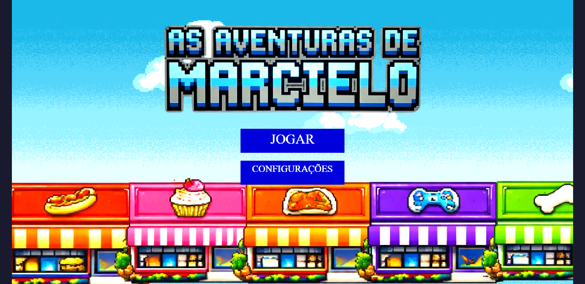<br>
  <sup>Fonte: Material produzido pelos autores, 2026</sup>

Tela inicial com opções de navegação, incluindo botão “Jogar” e configurações. 


  <sub>Imagem 22 - Tela de tutorial</sub><br>
  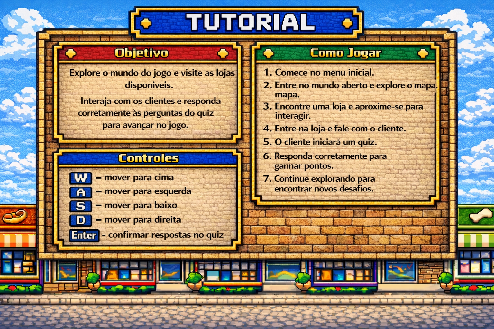<br>
  <sup>Fonte: Material produzido pelos autores, 2026</sup>

Apresentação das instruções do jogo antes do início da gameplay.

  <sub>Imagem 23 - Mapa da cidade</sub><br>
  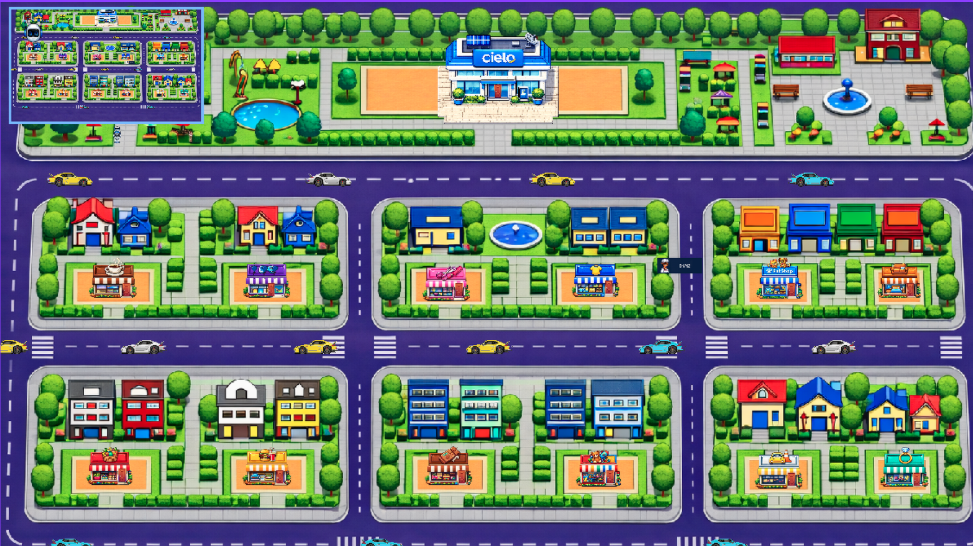<br>
  <sup>Fonte: Material produzido pelos autores, 2026</sup>


 Ambiente principal do jogo onde o jogador se movimenta livremente.


<sub>Imagem 24 - Base da Cielo (coleta de maquininhas)</sub><br>
  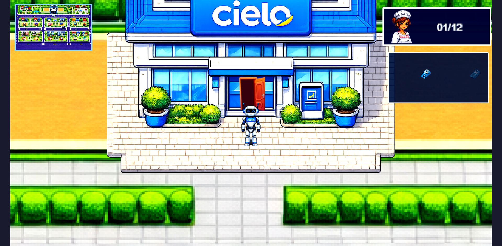<br>
  <sup>Fonte: Material produzido pelos autores, 2026</sup>

  <sub>Imagem 25 - Base da Cielo (coleta de maquininhas)</sub><br>
  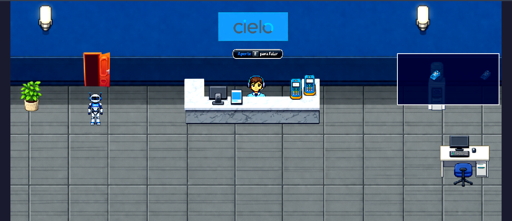<br>
  <sup>Fonte: Material produzido pelos autores, 2026</sup>

Local no mapa onde o jogador coleta maquininhas para continuar realizando interações com clientes.

<sub>Imagem 26 -HUD de progresso dos NPCs</sub><br>
  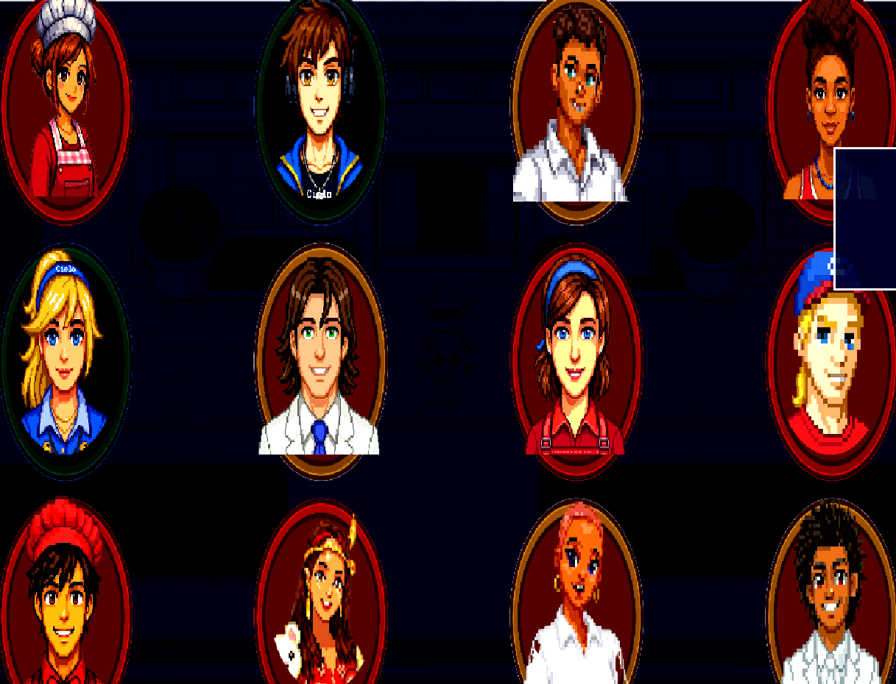<br>
  <sup>Fonte: Material produzido pelos autores, 2026</sup>

  Interface que exibe quais clientes já foram conquistados pelo jogador.


<sub>Imagem 27 - Entrada em uma loja</sub><br>
  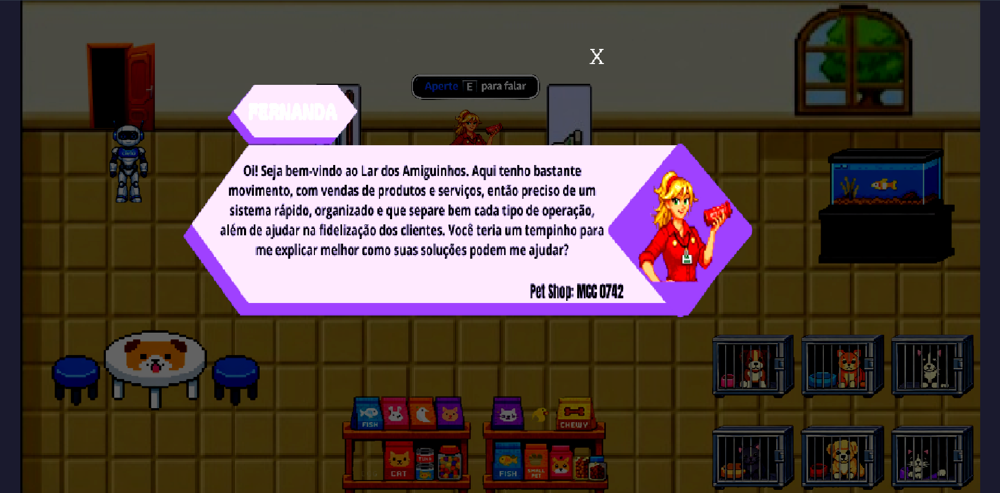<br>
  <sup>Fonte: Material produzido pelos autores, 2026</sup>

  Momento em que o jogador acessa o interior de uma loja, apresentando detalhes do NPC (pop-up) antes da interação.

  <sub>Imagem 28 -Sistema de quiz</sub><br>
  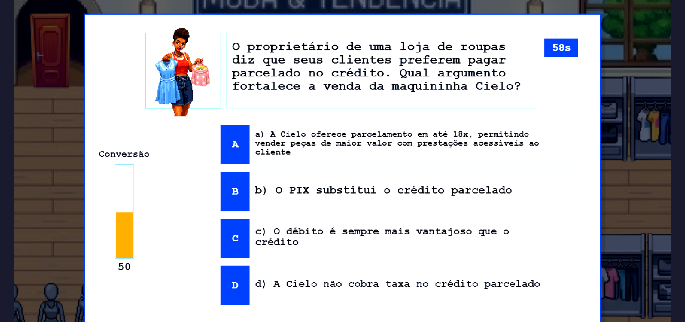<br>
  <sup>Fonte: Material produzido pelos autores, 2026</sup>

  Interface de perguntas e respostas utilizada na interação com o cliente.

  <sub>Imagem 29 -Feedback positivo (cliente conquistado)</sub><br>
  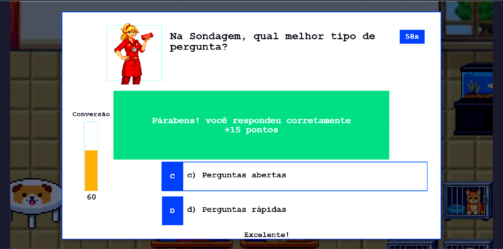<br>
  <sup>Fonte: Material produzido pelos autores, 2026</sup>

  Exemplo de sucesso no quiz, indicando conversão do cliente.

  <sub>Imagem 30 -Feedback negativo (cliente não conquistado)</sub><br>
  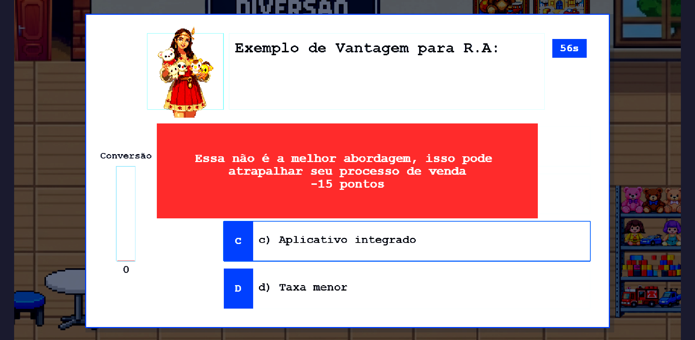<br>
  <sup>Fonte: Material produzido pelos autores, 2026</sup>
  
  Exemplo de falha na interação, mostrando a penalização.

  <sub>Imagem 31 -NPC com visual alterado (conquistado)</sub><br>
  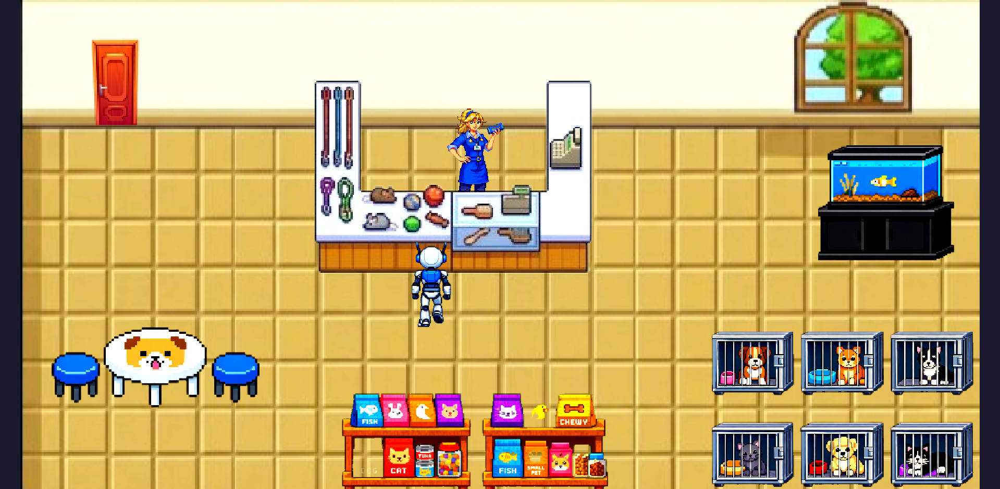<br>
  <sup>Fonte: Material produzido pelos autores, 2026</sup>

  Mudança visual do personagem (cor azul) após ser conquistado.

  <sub>Imagem 32 -Loja com balões animados</sub><br>
  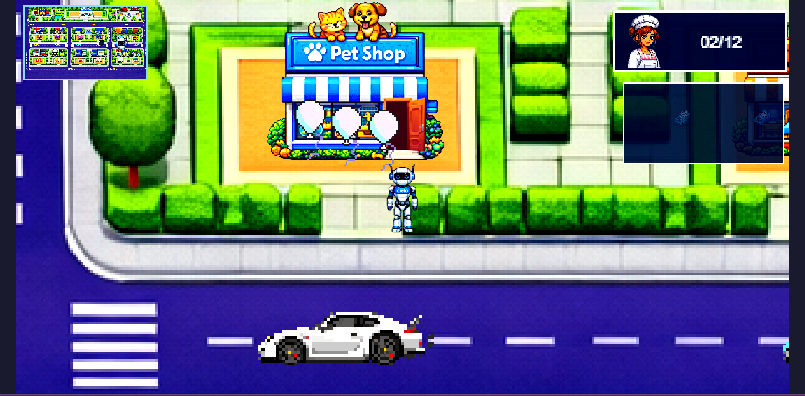<br>
  <sup>Fonte: Material produzido pelos autores, 2026</sup>

Indicação visual no mapa de que a loja foi concluída.

 <sub>Imagem 33 -Menu de pausa</sub><br>
  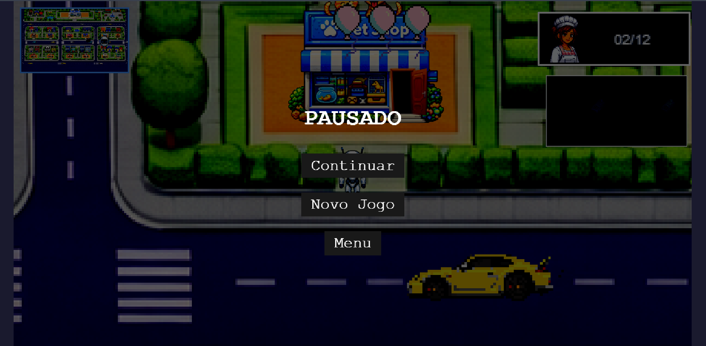<br>
  <sup>Fonte: Material produzido pelos autores, 2026</sup>

Tela acessada ao pressionar ESC, com opções de controle da partida.

   
</div>


### 4.4.5. Como executar a aplicação

A aplicação foi disponibilizada online por meio do GitLab Pages, permitindo sua execução diretamente em navegadores modernos, sem a necessidade de instalação de ferramentas adicionais ou configuração de ambiente local.

O jogo pode ser acessado por meio do link do projeto, sendo carregado automaticamente no navegador e direcionando o usuário ao menu inicial. A partir dessa tela, o jogador pode iniciar a experiência ao clicar no botão “Jogar”, sendo então conduzido ao tutorial e, posteriormente, ao ambiente principal do jogo.


Durante a jogabilidade, o personagem é movimentado utilizando as teclas W, A, S e D ou as setas direcionais. A interação com os NPCs ocorre quando o jogador se aproxima deles, iniciando o sistema de quizzes e as mecânicas de progressão.
Além disso, o jogador pode navegar livremente pelo mapa, acessar lojas, acompanhar seu progresso por meio da interface e utilizar os recursos disponíveis no jogo, como o sistema de pausa e o acesso ao tutorial durante a partida.

### 4.4.6. Dificuldades encontradas

Durante a Sprint 4, os principais desafios estiveram concentrados na integração entre sistemas que, isoladamente, já funcionavam, mas ainda precisavam operar de forma contínua dentro de uma única jornada jogável.

O primeiro desafio relevante foi o **controle de fluxo entre cenas**. Garantir a passagem correta entre menu, tutorial, Central, cidade e lojas exigiu refinamento das transições, retomada de cenas e prevenção de estados inconsistentes.

O segundo desafio foi a **persistência de progresso com `localStorage`**. Não bastava salvar dados; foi necessário definir quais estados realmente precisavam ser persistidos e como restaurá-los sem duplicar eventos, perder progresso ou reabrir conteúdos já concluídos.

Outro ponto sensível foi o **spawn dinâmico de retorno à cidade**. O sistema precisou reposicionar o jogador de modo coerente após sair das lojas e, ao mesmo tempo, impedir reentradas acidentais imediatas.

Também houve esforço técnico na **integração do sistema de quizzes**, especialmente no controle de sorteio de perguntas, temporização e regra de conquista por acertos.

Os **feedbacks visuais de progresso**, como mudança de estado dos NPCs e balões sobre lojas concluídas, exigiram sincronização com o estado salvo do jogo, evitando discrepâncias entre interface e lógica interna.

Por fim, a equipe enfrentou desafios de **organização e escalabilidade do código**, principalmente ao estruturar uma base reutilizável para múltiplas lojas, mantendo consistência visual e funcional sem multiplicar código repetido.

### 4.4.7. Critérios de pronto

Para esta sprint, uma funcionalidade foi considerada pronta quando atendia simultaneamente aos seguintes critérios:

1. **Execução sem erros visíveis**
A funcionalidade precisava operar sem travamentos, erros de console ou comportamentos incoerentes durante o uso normal.

2. **Integração correta no fluxo do MVP**
Não bastava funcionar isoladamente; a entrega precisava se conectar corretamente ao fluxo menu -> tutorial -> central -> cidade -> loja -> retorno.

3. **Persistência e restauração quando aplicável**
Funcionalidades relacionadas a progresso, HUD ou estado de NPC só eram consideradas prontas após validação de salvamento e restauração da sessão.

4. **Feedback compreensível ao jogador**
Toda funcionalidade nova precisava comunicar seu estado ao usuário de maneira clara, seja por HUD, mudança visual, balões, popups ou feedback de quiz.

5. **Teste em cenário real de uso**
As validações foram feitas com execução prática da jornada completa, incluindo entrada em lojas, resposta de quizzes, consumo de maquininhas, retorno ao mapa e uso do menu de pausa.

### 4.4.8. Limitações atuais

Mesmo com o MVP consolidado, algumas limitações permaneceram evidentes ao final da Sprint 4:

1. **Banco de perguntas ainda restrito**
O sistema de quiz já funciona estruturalmente, mas a variedade de perguntas ainda é limitada para sessões repetidas.

2. **Persistência local apenas no navegador**
O salvamento com `localStorage` resolve a continuidade local da experiência, mas não oferece sincronização entre dispositivos ou backup em nuvem.

3. **Ausência de suporte mobile**
O MVP foi pensado para execução em navegador desktop, sem adaptação específica para telas pequenas ou controles por toque.

4. **Profundidade técnica limitada em alguns subsistemas**
Embora o fluxo principal esteja completo, partes como configurações, acessibilidade e telemetria ainda não foram aprofundadas além do necessário para o MVP.

5. **Dependência de refinamentos visuais futuros**
Elementos como popups, HUDs e apresentações de NPC cumprem sua função, mas ainda possuem espaço para refinamento gráfico e padronização visual adicional.

### 4.4.9. Próximos passos

Para a continuidade do desenvolvimento, os próximos passos foram definidos com foco em robustez, refinamento e ampliação do conteúdo:

1. aprofundar a Central da Cielo como hub de orientação e recursos;
2. ampliar e balancear o banco de perguntas dos quizzes;
3. refinar HUDs, popups e transições visuais;
4. evoluir o menu de configurações e recursos de acessibilidade;
5. otimizar a organização do código para facilitar manutenção e expansão;
6. avaliar futuras camadas de persistência além do `localStorage`.

## 4.5. Revisão do MVP (sprint 5)

Durante a Sprint 5, o foco do desenvolvimento esteve no refinamento e na correção de inconsistências identificadas no MVP entregue na sprint anterior. As melhorias abrangeram navegação pelo mapa, carros, minimapa, feedback visual de conquista e correções de comportamento inesperado no tutorial e nas portas das lojas.

### 4.5.1. Funcionalidades implementadas

Nesta sprint foram entregues os seguintes refinamentos e novas funcionalidades:

. **Colisores invisíveis de ambiente**
O mapa da cidade passou a contar com colisores invisíveis posicionados sobre todos os elementos não navegáveis do cenário: árvores, arbustos, casas e bordas do mapa. Antes dessa implementação, o jogador conseguia caminhar por dentro de construções e sobre vegetação, quebrando a imersão visual.

Os colisores são definidos em `configuracao-colisores-ambiente.js` como uma lista de retângulos com posição e dimensões específicas para cada obstáculo. Durante a criação da cena da cidade, cada retângulo é instanciado como objeto estático de física (`staticGroup`) e registrado como colisor do jogador. O modo de depuração (`debug: true` no `main.js`) permite visualizar os retângulos em tempo real para facilitar ajustes de posicionamento.

. **Câmera com limites no mapa**
A câmera principal da cidade foi configurada para nunca ultrapassar as bordas do mapa usando `cameras.main.setBounds(0, 0, largura, altura)`. Antes desse ajuste, ao se aproximar das bordas, o jogador via o fundo preto além do mapa, o que causava desorientação visual. Agora a câmera para exatamente no limite do mapa, mantendo o fundo sempre preenchido.


. **Configuração diferenciada das três ruas de carros**
O sistema de carros foi expandido para cobrir três ruas distintas do mapa, cada uma com características independentes de direção, velocidade, quantidade de carros e espaçamento entre eles:

- Rua 1 (y≈2123): 4 carros em direção da esquerda para a direita, velocidade de 650 px/s, espaçamento de 3000 px;
- Rua 2 (y≈4065): 6 carros em direção da direita para a esquerda (sentido oposto), velocidade de 1000 px/s, espaçamento de 2000 px;
- Rua 3 (y≈6359): 3 carros em direção da esquerda para a direita, velocidade de 450 px/s, espaçamento de 4000 px.

O sprite do carro é espelhado horizontalmente (`setFlipX`) quando o carro se move para a esquerda, garantindo que o carro sempre pareça estar apontado na direção correta. Cada carro sorteia aleatoriamente uma entre três variantes de cor (branco, amarelo ou azul) ao ser criado, e cicla 8 frames de animação de forma independente a 8 fps.

. **Spawn do jogador na frente da porta correta ao sair de lojas**
Ao sair de qualquer loja, o jogador agora reaparece exatamente na frente da porta daquela loja no mapa da cidade. O mapeamento entre cada loja e sua coordenada de retorno está centralizado em `spawn-cidade.js` (`MapaSpawnCidade.PorLoja`), com entradas para todas as 12 lojas distribuídas nas duas fileiras do mapa. Caso a loja não esteja mapeada, o sistema usa uma posição padrão de fallback. Esse comportamento foi refinado em relação à sprint anterior, que usava uma posição genérica de retorno.

. **Correção do tutorial (não reabre ao sair de loja)**
O tutorial passou a ser exibido apenas na entrada inicial no jogo (quando `data.mostrarTutorial` é `true`). Nas versões anteriores, ao sair de uma loja e retornar ao mapa, o tutorial era reaberto automaticamente, interrompendo a jogabilidade. A correção consistiu em separar o controle de exibição do tutorial do fluxo de retorno das lojas.

. **Minimapa no canto superior esquerdo**
Foi adicionado um minimapa permanente no canto superior esquerdo da tela. Ele é composto por duas câmeras secundárias sobrepostas:

- **Câmera de borda**: levemente maior que o minimapa, exibe apenas uma cor azul sólida como moldura visual, apontada para fora do mapa para não renderizar conteúdo do jogo;
- **Câmera do minimapa**: exibe o mapa inteiro em tamanho reduzido com zoom calculado automaticamente para preencher o espaço sem bordas pretas.

Um marcador de posição — a imagem da cabeça do Marcielo — é posicionado no mundo no local exato do jogador e tem seu tamanho calculado como `32 / zoom` para sempre aparecer com 32 px na tela do minimapa, independentemente do tamanho do mapa. A câmera principal ignora o marcador para que ele só apareça no minimapa.

. **Painel de NPCs fecha ao clicar em qualquer lugar da tela**
O painel lateral que exibe o progresso de conquista dos NPCs passou a fechar automaticamente ao clicar em qualquer ponto da tela fora dele. Para evitar que o mesmo clique que abre o painel o feche imediatamente, foi implementado um controle de estado via flag `_painelAbertoNesteClique`, que descarta o primeiro evento de clique após a abertura.

. **Efeito visual de conquista**
Ao conquistar um NPC com sucesso, além da mudança de cor do sprite do NPC (de vermelho para azul), o jogo dispara um efeito visual de celebração composto por:

- **Confetes coloridos animados**: 80 retângulos com cores aleatórias (vermelho, verde, azul, amarelo, magenta, ciano e laranja) são lançados a partir do NPC com rotação e fade-out em 800–1500 ms;
- O efeito é destruído automaticamente ao término da animação, sem deixar objetos residuais na cena.

### 4.5.2. Dificuldades encontradas

Durante a Sprint 5, os principais desafios técnicos foram:

. **Posicionamento preciso dos colisores de ambiente**: cada colisor invisível precisou ser ajustado manualmente por coordenadas (x, y, largura, altura) com base na posição visual de cada elemento do mapa. O processo exigiu uso do modo de depuração do Phaser para visualizar os retângulos em tempo real e múltiplos ciclos de ajuste fino.

. **Comportamento do minimapa com múltiplas câmeras**: a composição de duas câmeras secundárias para criar a borda e o conteúdo do minimapa exigiu atenção especial à ordem de renderização e ao controle de quais objetos cada câmera ignora, para evitar que o marcador de posição apareça na câmera principal ou na câmera de borda.

. **Sincronização do estado do tutorial com o fluxo de retorno das lojas**: identificar o ponto exato no código onde o tutorial era reativado indevidamente ao sair das lojas exigiu rastreamento do fluxo de dados entre cenas (`data.mostrarTutorial`) e ajuste na lógica de controle do parâmetro.

. **Independência de animação entre carros**: garantir que cada carro ciclasse seus frames de forma independente (sem que todos trocassem de frame ao mesmo tempo) exigiu implementar um contador de tempo por instância (`_tempoFrame` e `_frameAtual`) em vez de usar o sistema nativo de animações do Phaser, que compartilharia o estado entre sprites com a mesma chave.

. **Controle do painel de NPCs sem fechamento duplo**: o evento de clique que abre o painel também dispara o listener global que o fecha, o que causava o painel abrindo e fechando instantaneamente. A solução com flag `_painelAbertoNesteClique` precisou ser validada em diferentes sequências de cliques para garantir comportamento consistente.

### 4.5.3. Critérios de pronto

Uma funcionalidade foi considerada concluída quando atendeu a todos os seguintes critérios:

. Funcionamento correto e estável durante a execução do jogo, sem comportamentos inesperados;

. Integração sem conflitos com os sistemas já existentes (lojas, quiz, câmera, física, persistência);

. Ausência de erros ou avisos relevantes no console do navegador;

. Validação manual pela equipe em diferentes fluxos de uso (entrar em loja, sair, conquistar NPC, colidir com carro, abrir e fechar painel);

. Comportamento visual condizente com a intenção de design (colisores não visíveis ao jogador, minimapa legível, confetes aparecendo apenas na conquista).

### 4.5.4. Limitações atuais

Apesar dos refinamentos entregues nesta sprint, algumas limitações permanecem:


. Os colisores de ambiente foram ajustados manualmente e podem apresentar pequenas imprecisões em regiões do mapa com elementos visuais sobrepostos ou com escalas diferentes;

. O minimapa não diferencia lojas conquistadas de lojas ainda não visitadas — exibe apenas a posição do jogador sobre o mapa geral;

. O efeito de confetes não possui controle de quantidade máxima simultânea — em situações de múltiplas conquistas rápidas, pode haver acúmulo visual temporário;

. Não há suporte a dispositivos móveis; os controles permanecem exclusivamente por teclado e mouse.

### 4.5.5. Próximos passos

Para versões futuras do jogo, as melhorias prioritárias identificadas são:


. Adição de um placar final ao término da partida, exibindo o número de NPCs conquistados e o tempo de jogo;

. Expansão do banco de perguntas por loja, reduzindo a repetição ao longo de uma mesma sessão de jogo;

. Melhorias de acessibilidade, incluindo suporte a dispositivos touch e ampliação das opções de configuração de controles.

# <a name="c5"></a>5. Testes

## 5.1. Casos de Teste (sprints 2 a 4)

Esta seção apresenta os casos de teste funcionais utilizados para validar os principais fluxos do jogo, desde a navegação no menu até as interações com clientes e o comportamento das mecânicas de negociação. Cada linha descreve uma pré-condição (estado inicial), a ação executada pelo usuário e a pós-condição esperada, permitindo verificar de forma objetiva se o sistema está se comportando conforme os requisitos definidos.
Nos testes do quiz, o principal indicador de desempenho é a quantidade de acertos nas 3 perguntas da interação.

Ao final do quiz, o resultado da interação define se o cliente foi conquistado ou não. Se o jogador acertar 2 (ou 3) perguntas, conquista o NPC e consome 1 maquininha. Se errar 2 (ou 3) perguntas, não conquista o NPC e pode tentar novamente.

Tabela 1 - Casos de teste funcionais do jogo.

| #   | pré-condição                                                      | descrição do teste                                      | pós-condição                                                                                                                                       |
| :-- | :---------------------------------------------------------------- | :------------------------------------------------------ | :------------------------------------------------------------------------------------------------------------------------------------------------- |
| 1   | Jogo na tela inicial                                              | Clicar no botão "Configurações"                         | A tela de configurações deve abrir, permitindo ajustar volume, som e contraste                                                                     |
| 2   | Jogo aberto na tela inicial                                       | Clicar no botão "Jogar"                                 | O jogo deve iniciar e exibir automaticamente o tutorial inicial em 8 partes; ao concluir, deve redirecionar para o tutorial de controles e mecânicas antes de liberar o controle ao jogador |
| 3   | Tutorial inicial aberto na etapa 2 de 8                            | Clicar no botão "Anterior"                            | O tutorial deve voltar para a etapa 1 de 8, exibindo novamente o vídeo anterior                                                                    |
| 4   | Tutorial inicial aberto na etapa 8 de 8                            | Clicar no botão "Próximo"                             | O tutorial de 8 partes deve ser finalizado e o sistema deve redirecionar automaticamente para o tutorial de controles e mecânicas                     |
| 5   | Tutorial de controles e mecânicas aberto                           | Clicar no botão "Fechar"                              | O tutorial deve ser encerrado e o controle do jogo deve ser liberado ao jogador                                                                       |
| 6   | Tutorial inicial aberto em qualquer etapa                          | Clicar no botão "Pular tudo"                          | O tutorial deve ser encerrado imediatamente e o controle do jogo deve ser liberado ao jogador                                                          |
| 7   | Jogo com personagem parado                                        | Pressionar D ou seta direita                            | Personagem deve se mover para a direita                                                                                                            |
| 8   | Jogo com personagem parado                                        | Pressionar A ou seta esquerda                           | Personagem deve se mover para a esquerda                                                                                                           |
| 9   | Jogo com personagem parado                                        | Pressionar W ou seta cima                               | Personagem deve se mover para cima                                                                                                                 |
| 10  | Jogo com personagem parado                                        | Pressionar S ou seta baixo                              | Personagem deve se mover para baixo                                                                                                                |
| 11  | Jogador navega pela cidade                                        | Observar o minimapa no canto superior esquerdo          | O minimapa deve exibir o mapa inteiro em miniatura e o marcador (cabeça do Marcielo) deve refletir a posição atual do jogador                      |
| 12  | Jogador navegando pela cidade                                      | Pressionar M                                           | O mapa completo da cidade deve abrir em overlay, exibindo a imagem com legenda das lojas e um marcador pulsante na posição atual do jogador; pressionar M ou ESC fecha o mapa |
| 13  | Jogador caminhando em direção a uma árvore ou casa no mapa        | Tentar atravessar o elemento                            | O jogador deve ser bloqueado pelo colisor invisível e não conseguir atravessar                                                                     |
| 14  | Jogador próximo à borda do mapa                                   | Tentar sair pelos limites do mapa                       | O personagem deve parar na borda; a câmera não deve mostrar fundo preto além do mapa                                                               |
| 15  | Jogador colide com um carro em qualquer rua                       | Carro atinge o jogador durante a navegação              | O personagem morre, a cena cidade reinicia e o progresso salvo é mantido                                                                           |
| 16  | Personagem próximo de uma loja                                    | Encostou na porta                                       | Personagem entra no estabelecimento                                                                                                                |
| 17  | Jogador com 0 maquininhas dentro de uma loja                      | Pressionar a tecla E                                    | O quiz não pode ser iniciado                                                                                                                        |
| 18  | Jogador dentro de uma loja com pelo menos 1 maquininha            | Pressionar a tecla E                                    | A interface de quiz é iniciada                                                                                                                      |
| 19  | Tela de quiz com 4 respostas visível                              | Clicar com botão esquerdo na resposta correta           | O sistema deve registrar 1 acerto na pergunta atual                                                                                                 |
| 20  | Tela de quiz com 4 respostas visível                              | Clicar com botão esquerdo em resposta incorreta         | O sistema deve registrar 1 erro na pergunta atual                                                                                                   |
| 21  | Tempo limite da pergunta esgotado                                 | O timer chega a 0 durante o quiz                        | A pergunta é encerrada como erro e o quiz avança automaticamente para a próxima pergunta                                                            |
| 22  | Quiz com 2 acertos e 0 erros                                      | Responder corretamente à última pergunta                | Cliente é conquistado com 3 acertos em 3                                                                                                            |
| 23  | Quiz com 2 acertos e 0 erros                                      | Responder incorretamente à última pergunta              | Cliente é conquistado com 2 acertos em 3                                                                                                            |
| 24  | Quiz com 1 acerto e 1 erro                                        | Responder corretamente à última pergunta                | Cliente é conquistado com 2 acertos em 3                                                                                                            |
| 25  | Quiz com 0 acertos e 2 erros                                      | Responder incorretamente à última pergunta              | Cliente não é conquistado; o jogador pode tentar novamente                                                                                          |
| 26  | Quiz com 1 acerto e 1 erro                                        | Responder incorretamente à última pergunta              | Cliente não é conquistado; o jogador pode tentar novamente                                                                                          |
| 27  | Quiz com 0 acertos e 2 erros                                      | Responder corretamente à última pergunta                | Cliente não é conquistado com 1 acerto em 3; o jogador pode tentar novamente                                                                        |
| 28  | Negociação finalizada com sucesso ou falha                        | Resultado da interação é definido                       | Sistema exibe feedback do resultado da negociação                                                                                                  |
| 29  | Jogador conquista um NPC (quiz bem-sucedido)                      | Finaliza o quiz com 2 ou 3 acertos                      | Efeito de confetes é exibido; 1 maquininha é consumida                                                                                             |
| 30  | Jogador falha em um quiz (quiz sem sucesso)                       | Finaliza o quiz com 2 ou 3 erros                        | O NPC não é conquistado, nenhuma maquininha é consumida e o jogador pode tentar novamente                                                          |
| 31  | Cliente já conquistado                                             | Pressionar a tecla E                                    | Nada acontece, cliente permanece com camiseta azul                                                                                                  |
| 32  | Jogo com HUD de progresso de NPC ativo e NPC em estado não interagido | Alterar o estado do NPC (conquistar ou não conquistar) e observar o HUD | O NPC deve exibir camiseta branca quando não interagido, vermelha quando não conquistado e azul quando conquistado; a cada alteração de estado, um alerta com exclamação deve piscar e só parar ao clicar para abrir o pop-up de progresso |
| 33  | Jogador em cidade com seta de indicação ativa e pelo menos uma loja não conquistada | Conquistar o NPC da loja atual e retornar ao mapa       | A seta deve atualizar o alvo automaticamente: após a conquista, deixa de apontar para a loja concluída e passa a apontar para a próxima loja mais próxima disponível |
| 34  | Jogador com os 11 NPCs já conquistados                             | Conquistar o último NPC restante                        | O jogo deve reconhecer a conquista de todos os 12 NPCs, redirecionar automaticamente para a cena final e exibir a mensagem de parabéns por ter vencido o jogo |
| 35  | Jogador se aproxima do prédio Central da Cielo no mapa            | Encosta na porta do prédio                              | O jogador deve entrar na cena da Central da Cielo                                                                                                  |
| 36  | Jogador dentro da Central da Cielo com menos de 2 maquininhas     | Pressionar a tecla E                                    | As maquininhas são recarregadas para o máximo (2); o HUD é atualizado                                                                              |
| 37  | Jogador dentro da Central da Cielo com 2 maquininhas (máximo)     | Pressionar a tecla E                                    | Não ocorre recarga; a quantidade de maquininhas permanece em 2                                                                                      |
| 38  | Jogador dentro da Central da Cielo                                | Pressionar ESC                                          | O menu de pausa deve abrir com as opções Continuar, Novo Jogo, Configurações e Menu                                                                |
| 39  | Menu de pausa aberto                                              | Clicar em "Novo Jogo"                                   | Todo o progresso salvo (incluindo maquininhas) deve ser apagado do localStorage, maquininhas zeradas a 0, e o jogo deve reiniciar do zero          |
| 40  | Jogo em execução na cidade ou dentro de loja                      | Pressionar a tecla T                                    | A tela de tutorial deve abrir como overlay sem encerrar a cena atual                                                                               |
| 41  | Tela de tutorial aberta via tecla T                               | Clicar no botão "SAIR"                                  | O tutorial deve fechar e o jogo deve retomar exatamente de onde estava                                                                             |
| 42  | Jogo com progresso salvo (NPCs conquistados, maquininhas)         | Fechar o navegador e reabrir o jogo                     | O progresso deve ser restaurado: NPCs conquistados exibem visual azul, balões aparecem nas lojas conquistadas, quantidade de maquininhas é mantida |
| 43  | Jogador navega pela cidade com seta ativa                         | Abrir o mapa (tecla M) e fechar em seguida              | A seta deve continuar apontando corretamente para o próximo objetivo após fechar o mapa                                                            |
| 44  | Jogador em cidade com 0 maquininhas e pelo menos uma loja não conquistada | Continuar navegando pelo mapa                           | A seta de indicação deve deixar de guiar para lojas e passar a apontar apenas para a Central da Cielo                                              |
| 45  | Jogador recarrega maquininhas na Central da Cielo                 | Pressionar a tecla E para recarregar e retornar ao mapa | A seta de indicação deve voltar à lógica original e apontar para a loja não conquistada mais próxima                                                |
| 46  | Jogador na cena final com mensagem de parabéns exibida            | Pressionar a tecla Espaço                               | A mensagem deve avançar para a próxima etapa da cena final                                                                                            |
| 47  | Cena final após avanço da mensagem de parabéns                    | Aguardar alguns segundos                                | Um efeito de confete de parabéns deve ser exibido temporariamente                                                                                   |
| 48  | Cena final após o término do efeito de confete                    | Aguardar exibição da interface final                    | O botão para voltar ao menu inicial deve ser exibido                                                                                                 |
| 49  | Botão de retorno ao menu inicial visível na cena final            | Clicar no botão de voltar ao menu inicial              | O jogo deve redirecionar o jogador para o menu inicial                                                                                                |

Fonte: elaborado pelo grupo.

## 5.2. Testes de jogabilidade (playtests) (sprint 5)
   
   Os testes de jogabilidade (playtests) são uma etapa fundamental no desenvolvimento de jogos, pois permitem avaliar como os jogadores interagem com o sistema, identificando dificuldades, problemas de usabilidade e oportunidades de melhoria.


   Esse tipo de teste tem como objetivo validar se as mecânicas do jogo são compreensíveis, se a interface é intuitiva e se a experiência geral é adequada para diferentes perfis de jogadores. A metodologia adotada consiste na observação da interação dos usuários com o jogo, registrando comportamentos, dificuldades e percepções. Esses dados são posteriormente analisados para orientar ajustes e melhorias no desenvolvimento. 

### 5.2.1 Registros de testes

Os playtests são sessões de teste nas quais jogadores interagem diretamente com o jogo com o objetivo de avaliar sua jogabilidade, usabilidade e experiência geral. Diferente de testes técnicos, os playtests focam na percepção do jogador, permitindo identificar dificuldades, confusões e pontos de melhoria na interação com o jogo.

**Contexto dos testes:**
Os testes foram realizados presencialmente nas dependências do Inteli (São Paulo – SP), durante as Sprints 4 e 5 do projeto. Cada sessão foi conduzida individualmente, com o testador jogando de forma livre enquanto um membro da equipe observava e registrava comportamentos sem interferir. O jogo foi executado em notebooks pessoais dos integrantes do grupo, via navegador Google Chrome, rodando localmente com a extensão Live Server do Visual Studio Code. Não houve uso de headphone — os sons do jogo estavam habilitados pelo alto-falante do dispositivo. Ao final de cada sessão, o testador respondia às perguntas do registro abaixo.

| Nome                        | Daniel   |
| ---------------------------------------- | ---------------------------------------------------------------------------------------------------------------------------------------- |
| Faixa etária | 18 | 
| Já possuía experiência prévia com games? | Sim         |
| Conseguiu iniciar o jogo?                | Sim       |
| Entendeu as regras e mecânicas do jogo?  | Sim | 
| Conseguiu progredir no jogo?             | Sim   |
| Apresentou dificuldades?                 | Sim, não entendeu como utilizava as maquininhas, não sabia onde cada estabelecimento estava e o minimapa estava muito pequeno então não ajudava  |
| Que nota deu ao jogo?               | 8.5    |
| O que gostou no jogo?         | Gostou do minimapa, das perguntas feitas no quiz e do design em geral mas principalmente os clientes e suas a troca de cor ao ser conquistado | 
| O que poderia melhorar no jogo?          | Poderia destacar mais o Marcielo na central Cielo, melhorar a qualidade da escrita ao entrar na loja, explicar a mecânica das maquininhas e ajustar o tamanho do minimapa |


| Nome                        | Luiz            |
| ---------------------------------------- | ---------------------------------------------------------------------------------------------------------------------------------------- |
| Faixa etária | 18 | 
| Já possuía experiência prévia com games? | Sim                      |
| Conseguiu iniciar o jogo?                | Sim                      |
| Entendeu as regras e mecânicas do jogo?  | Parcial, pois não sabia o que fazer dentro da central Cielo 
| Conseguiu progredir no jogo?             | Sim   |
| Apresentou dificuldades?                 | Sim, não sabia o que fazer dentro da central Cielo, teve dificuldade de entender como pegar maquininha e teve problema com as colisões externas
| Que nota deu ao jogo?               | 9.0     |
| O que gostou no jogo?                    | Gostou do contraste visual, do design em geral, minimapa, tela de diálogo, sistema de quiz e os balões que aparecem fora da loja quando ela é conquistada |
| O que poderia melhorar no jogo?          | Poderia inserir instruções mais claras sobre o que fazer no início, explicar melhor o funcionamento do HUD, melhorar a legibilidade dos elementos visuais e ajustar os problemas de colisões |

| Nome                                     | Jessica | 
| ---------------------------------------- | ---------------------------------------------------------------------------------------------------------------------------------------- |
| Faixa etária | 19 | 
| Já possuía experiência prévia com games? | Sim        |
| Conseguiu iniciar o jogo?                | Sim       |
| Entendeu as regras e mecânicas do jogo?  | Sim | 
| Conseguiu progredir no jogo?             | Sim | 
| Apresentou dificuldades?                 | Sim, não compreendeu que ao ser atropelada perderia as maquininhas e não poderia conquistar os clientes nos estabelecimentos | 
| Que nota deu ao jogo?                    | 8.0 | 
| O que gostou no jogo?                    | Gostou das mecânicas, principalmente o sistema de quiz e a troca de cor do cliente ao ser conquistado | 
| O que poderia melhorar no jogo?          | Adicionar instrução de morte para avisar que perderá as maquininhas e que necessita pegar mais na central Cielo | 

| Nome                                     | Virginia            |
| ---------------------------------------- | ---------------------------------------------------------------------------------------------------------------------------------------- |
| Faixa etária | 19 | 
| Já possuía experiência prévia com games? | Nenhuma                        |
| Conseguiu iniciar o jogo?                | Sim                      |
| Entendeu as regras e mecânicas do jogo?  | Pouco, apresentou dificuldades em compreender o objetivo do jogo e como interagir com os elementos disponíveis  |
| Conseguiu progredir no jogo?             | Com muita confusão mas conseguiu     |
| Apresentou dificuldades?                 | Sim, não sabia como fechar as mensagens inciais das lojas, não entendeu o que deveria fazer no jogo e teve dificuldade em compreender as interações básicas (ex: uso da maquininha)      | 
| Que nota deu ao jogo?                   | 6.0         |
| O que gostou no jogo?                    | Gostou do design do jogo e achou a dinâmica do jogo legal depois que entendeu como as coisas funcionavam | 
| O que poderia melhorar no jogo?          | Inserir um tutorial incial claro e guiado, tornar os botões mais visíveis e melhorar a intuitividade da interface | 

| Nome                                     | Julia                                          |
| ---------------------------------------- | ---------------------------------------------------------------------------------------------------------------------------------------- |
| Faixa etária | 20| 
| Já possuía experiência prévia com games? | Sim, é uma jogadora casual                                                                                                         |
| Conseguiu iniciar o jogo?                | Sim     |
| Entendeu as regras e mecânicas do jogo?  | Apresentou dificuldades em compreender algumas mecânicas mas compreendeu as regras. 
| Conseguiu progredir no jogo?             | Sim, mas de forma lenta, após um período de adaptação         |
| Apresentou dificuldades?                 | Sim, na movimentação do personagem, localizar as lojas no mapa e obteve dificuldade em ler os textos            |
| Que nota deu ao jogo? 8.0       |
| O que gostou no jogo?                    | Gostou das músicas e após a dificuldade, conseguiu se adaptar melhor ao jogo e passou a gostar mais da dinâmica      |
| O que poderia melhorar no jogo?          | A clareza das instruções iniciais, ajustar a legibilidade dos textos e adicionar algo no mapa que indique onde tem estabelecimentos |

A seguir estarão os testadores que possuem a faixa etária próxima aos gerentes de negócios da Cielo, na qual a idade média é de 44 anos. 


| Nome                                     | Carol               |
| ---------------------------------------- | ---------------------------------------------------------------------------------------------------------------------------------------- |
| Faixa etária | 33 | 
| Já possuía experiência prévia com games? | Sim                      |
| Conseguiu iniciar o jogo?                | Sim                      |
| Entendeu as regras e mecânicas do jogo?  | Apresentou boa compreensão geral do jogo   |
| Conseguiu progredir no jogo?             | Sim   |
| Apresentou dificuldades?                 | Sim, dificuldade em compreender alguns elementos da interface e possuiu dúvidas pontuais em relação à mecânica das maquininhas.  |
| Que nota deu ao jogo?               | 10         |
| O que gostou no jogo?                    | Gostou do design visual, minimapa e o sistema de diálogo e quiz | 
| O que poderia melhorar no jogo?          | Poderia ter mais clareza de alguns elementos da interface e um explicação melhor de determinadas mecânicas no início do jogo | 


| Nome                                     | Rogério      |
| ---------------------------------------- | ---------------------------------------------------------------------------------------------------------------------------------------- |
| Faixa etária | 35 |
| Já possuía experiência prévia com games? | Sim, é um jogador casual                |
| Conseguiu iniciar o jogo?                | Com dificuldade mas sim                |
| Entendeu as regras e mecânicas do jogo?  | Iniciou o jogo confuso, principalmente na cena inicial, mas depois começou a compreender mais as regras 
| Conseguiu progredir no jogo?             | Sim, após superar a confusão inicial                 |
| Apresentou dificuldades?                 | Sim, teve a sensação de estar "preso" na tela inicial e sentiu falta de orientações mais claras
| Que nota deu ao jogo?                    |7.5    |
| O que gostou no jogo?                    | Gostou da ideia de progressão com os NPCs e a presença de elementos dinâmicos, como a movimentação dos carros e os confetes após a conquista do cliente |
| O que poderia melhorar no jogo?          | Inserir instruções claras no início do jogo, indicar melhor o objetivo do jogador e guiar os primeiros passos para evitar a sensação de bloqueio | 


| Nome                        | Cynthia|
| ---------------------------------------- | ---------------------------------------------------------------------------------------------------------------------------------------- |
| Faixa etária | 40 | 
| Já possuía experiência prévia com games? | Não       |
| Conseguiu iniciar o jogo?                | Sim         |
| Entendeu as regras e mecânicas do jogo?  | Teve dificuldade para entender a mecânica da movimentação do personagem |
| Conseguiu progredir no jogo?             | Sim   |
| Apresentou dificuldades?                 | Sim, teve dificuldade para sair da central Cielo, não sabia que era necessário ficar tão perto do cliente para a função da tecla E funcionar e não sabia o que fazer após perder as maquininhas | 
| Que nota deu ao jogo?               | 6.0  |
| O que gostou no jogo?    | Gostou dos sons e do design de dentro dos estabelecimentos | 
| O que poderia melhorar no jogo?          | Sugeriu um diálogo dentro da central Cielo para auxiliar no que deveria fazer no jogo | 


| Nome                        | Tatiana      |
| ---------------------------------------- | ---------------------------------------------------------------------------------------------------------------------------------------- |
| Faixa etária | 42 | 
| Já possuía experiência prévia com games? | Sim         |
| Conseguiu iniciar o jogo?                | Sim         |
| Entendeu as regras e mecânicas do jogo?  | Sim | 
| Conseguiu progredir no jogo?             | Sim   |
| Apresentou dificuldades?                 | Sim, se sentiu perdida no começo dentro da central Cielo e por isso acabou demorando para entender o que eram as maquininhas e para que serviam |
| Que nota deu ao jogo?               | 8.0  |
| O que gostou no jogo?    | Gostou da dinâmica de interação com os NPCs, gostou da fluidez do jogo e do design visual e da ambientação | 
| O que poderia melhorar no jogo?          | Poderia melhorar a comunicação das mecânicas (principalmente as maquininhas) e tornar os objetivos mais explícitos nas primeiras fases | 

| Nome                        | Marcos |
| ---------------------------------------- | ---------------------------------------------------------------------------------------------------------------------------------------- |
| Faixa etária | 45 | 
| Já possuía experiência prévia com games? | Não       |
| Conseguiu iniciar o jogo?                | Sim, mas com dificuldades | 
| Entendeu as regras e mecânicas do jogo?  | Não entendeu como caminhar, nem o que deveria fazer dentro da central Cielo, estava muito perdido | 
| Conseguiu progredir no jogo?             | Sim   |
| Apresentou dificuldades?                 | Sim, começou perdido dentro da central Cielo, saiu da central sem máquinas e começou a andar perdido, quando voltou para a Cielo começou a entender e progredir no jogo | 
| Que nota deu ao jogo?               | 9.0  |
| O que gostou no jogo?    | Amou toda a ideia, o design, os carros e o mapa | 
| O que poderia melhorar no jogo?          | Poderia adicionar mais instruções no começo do jogo para que já começe entendendo e não tenha que entender como funciona sozinho | 


A partir dos testes realizados, observou-se que o jogo apresenta boa aceitação geral, principalmente em relação ao design, ambientação e elementos como o minimapa, diálogos e sistema de quiz. Jogadores com maior experiência conseguiram progredir com mais facilidade e destacaram aspectos postivos da dinâmica e da progressão. No entanto, foi recorrente entre a diferentes perfis a dificuldade de compreender o que fazer na central Cielo e como utilizar as maquininhas, indicando a falta de orientação clara no início do jogo. 

Além disso, foram identificados problemas de usabilidade e interface, como HUD pouco intuitivo, dificuldade de leitura de alguns elementos e minimapa pequeno. Jogadores com menos experiência apresentaram maior dificuldade na adaptação, reforçando a necessidade de melhorias na clareza das mecânicas e na navegação. Dessa forma, concluimos que o jogo possui uma base sólida, mas requer ajustes principalmente na comunicação com o jogador e na usabilidade para proporcionar uma experiência mais intuitiva e acessível. 

### 5.2.2 Melhorias

Com base nos resultados obtidos nos testes de jogabilidade, foram identificadas oportunidades de aprimoramento para tornar o jogo mais envolvente, desafiador e recompensador para os jogadores. A seguir, estão descritas as principais melhorias planejadas:

- **Feedbacks mais personalizados e específicos:** Desenvolver mensagens de feedback detalhadas para cada pergunta ou ação do jogador, explicando erros e acertos de forma clara. Isso melhora a experiência de aprendizado e aumenta o engajamento.

- **Mais obstáculos:** Adicionar novos tipos de obstáculos ao jogo, com diferentes níveis de dificuldade e padrões de comportamento, tornando a jogabilidade mais dinâmica e desafiadora.

- **Inimigos:** Introduzir inimigos com comportamentos variados (como perseguição, bloqueio de caminho ou ataque), enriquecendo o jogo e exigindo mais estratégia por parte do jogador, tornando a experiência mais dinâmica e divertida.

- **Resultados de quiz:** Refinar os indicadores de desempenho dos quizzes, considerando fatores como tempo de resposta, precisão e desempenho geral. Também podem ser incluídas metas por sequência de acertos para incentivar melhores resultados.

Essas melhorias visam aumentar a profundidade do jogo, promover maior engajamento dos jogadores e proporcionar uma experiência mais rica e satisfatória.

# <a name="c6"></a>6. Conclusões e trabalhos futuros (sprint 5)

A solução desenvolvida, baseada em um serious game de simulação de vendas, demonstrou forte aderência aos objetivos propostos inicialmente. Ao longo das cinco sprints, o jogo evoluiu de um protótipo básico com movimentação e uma loja para um produto completo com 12 lojas, sistema de quiz por loja, persistência de progresso, tutorial em vídeo, mapa interativo, HUDs dinâmicos e cena final.

Um dos aprendizados mais relevantes do projeto foi a importância do onboarding: os testes de jogabilidade mostraram que jogadores sem experiência prévia com jogos top-down demoraram para entender mecânicas básicas como a interação com NPCs e o uso das maquininhas. Isso levou à criação do tutorial em vídeo com 8 etapas, desenvolvido na Sprint 5 como resposta direta ao feedback dos playtests.

Outro aprendizado foi a necessidade de feedback visual imediato: respostas do quiz sem contexto eram confusas. A implementação de feedbacks personalizados por alternativa (explicando por que cada opção está certa ou errada) aumentou significativamente a clareza educativa do jogo.

Do ponto de vista técnico, a arquitetura de cenas do Phaser 3 se mostrou adequada para o escopo do projeto, mas exigiu cuidado com o gerenciamento de estado entre cenas — especialmente para manter o progresso dos NPCs consistente ao entrar e sair de lojas. A solução adotada (localStorage como fonte de verdade + estado em memória sincronizado ao criar cada cena) funcionou de forma estável nos testes finais.

### Pontos fortes

- Tutorial em vídeo com 8 mecânicas explicadas, desenvolvido com base no feedback dos playtests
- Sistema de quiz com feedbacks personalizados por alternativa, reforçando o aspecto educativo
- Persistência completa de progresso via localStorage, permitindo retomar partidas salvas
- HUDs dinâmicos com cores que mudam conforme o estado do jogo (maquininhas, progresso de NPCs)
- Mapa interativo com marcador de posição do jogador
- Identidade visual coerente com a marca Cielo (paleta azul, ícones e NPCs por loja)

### Pontos a melhorar

- O minimapa nativo foi considerado pequeno pelos testadores e de difícil leitura — substituído pelo mapa completo (tecla M), mas o minimap ainda aparece e pode confundir
- A dificuldade das perguntas do quiz não varia entre lojas — todas têm o mesmo nível de complexidade
- Banco de perguntas limitado por loja — algumas lojas compartilham o mesmo conjunto, reduzindo a variedade em sessões repetidas
- Alguns colisores do mapa ainda permitem pequenas sobreposições visuais com objetos do cenário

### Trabalhos futuros e plano de melhorias


Com base nos testes realizados, foram identificadas oportunidades relevantes de evolução do jogo, descritas a seguir com seus respectivos planos de ação:

1. Expansão do banco de perguntas
   Problema identificado: Algumas lojas compartilham o mesmo conjunto de perguntas, reduzindo a variedade em sessões repetidas.
   Plano de ação:
   Criar bancos de perguntas exclusivos para cada uma das 12 lojas
   Ampliar o número de perguntas por loja para reduzir repetição
   Revisar o conteúdo das perguntas com a equipe da Cielo para garantir atualização

2. Feedbacks personalizados
   Problema identificado: Feedbacks ainda genéricos e pouco direcionados ao aprendizado individual.
   Plano de ação:
   Criar feedbacks específicos para cada resposta do jogador
   Explicar por que a decisão foi correta ou incorreta
   Adaptar orientações conforme o desempenho do usuário

3. Inclusão de obstáculos e inimigos
   Problema identificado: Dinâmica do jogo ainda pouco desafiadora em termos de gameplay.
   Plano de ação:
   Inserir obstáculos no mapa que impactem a jornada do jogador
   Criar “inimigos” ou desafios que simulem dificuldades reais de vendas
   Aumentar a complexidade das interações ao longo do jogo

4. Evolução do flow do jogo
   Problema identificado: Possível previsibilidade na progressão das interações.
   Plano de ação:
   Introduzir eventos dinâmicos e variações de cenário
   Criar níveis ou fases com desafios progressivos
   Ajustar o ritmo entre desafio e recompensa

5. Expansão das simulações de vendas
   Problema identificado: Limitação na diversidade de cenários e perfis de clientes.
   Plano de ação:
   Adicionar novos tipos de estabelecimentos
   Incluir diferentes perfis de clientes e objeções
   Simular situações mais complexas e realistas do dia a dia comercial


A solução desenvolvida se mostrou eficaz ao transformar o treinamento comercial em uma experiência prática, imersiva e orientada à aprendizagem. A combinação de simulação realista, estrutura gamificada, uso estratégico de HUDs e um flow bem definido contribuiu diretamente para o atingimento dos objetivos do projeto.


Os pontos de melhoria identificados indicam um alto potencial de evolução, especialmente no aumento do engajamento, personalização do aprendizado e complexidade do jogo. Com a implementação das melhorias propostas, a solução tende a se consolidar como uma ferramenta ainda mais robusta e eficiente para capacitação da equipe comercial da Cielo.

# <a name="c7"></a>7. Referências

ABECS. (2024). _Balanço do setor de meios de pagamento_. https://abecs.org.br/balanco-do-setor-de-meios-de-pagamento

Banco Central do Brasil. (2023). _Relatório de economia bancária 2023_. https://www.bcb.gov.br/publicacoes/relatorioeconomiabancaria

Banco Central do Brasil. (2024). _Relatório de vigilância do sistema de pagamentos brasileiro_. https://www.bcb.gov.br

Banco Central do Brasil. (2025). _Relatórios de estabilidade e vigilância do SPB_. https://www.bcb.gov.br/publicacoes

Cielo S.A. (2023). _Relatório anual e demonstrações financeiras 2023_. https://ri.cielo.com.br

Cielo S.A. (2024). _Informações institucionais e dados operacionais_. https://www.cielo.com.br

Cielo S.A. (2025). _Portal de relações com investidores_. https://ri.cielo.com.br

ClickPetróleo e Gás. (2025). _Cielo loses historic lead in the ‘card machine war’ after competitors advance, new Central Bank rules, and the rise of Pix_. https://en.clickpetroleoegas.com.br/Cielo-loses-historic-leadership-in-the-war-of-payment-machines-after-the-advance-of-competitors--new-rules-from-the-central-bank-and-the-rise-of-Pix-btl96

CNN Brasil. (2025). _A guerra das maquininhas e a disputa no mercado de adquirentes_. https://www.cnnbrasil.com.br

Deloitte. (2024). _Relatórios sobre mercado financeiro e meios de pagamento_. https://www2.deloitte.com/br

Halliday, D., Resnick, R., & Walker, J. (2016). _Fundamentos de Física — Vol. 1: Mecânica_ (10ª ed.). LTC.

IBGE. (2022). _Censo demográfico 2022: Primeiros resultados_. https://www.ibge.gov.br/censo2022

McKinsey & Company. (2024). _Estudos sobre transformação digital e meios de pagamento_. https://www.mckinsey.com.br

Moraes, R. A., & Silva, J. P. (2021). A guerra das maquininhas: Competição e inovação no setor de adquirência brasileiro. _Revista Brasileira de Gestão e Negócios_. https://doi.org/10.7819/rbgn.v23i2.4104

PagBank. (2024). _Relatório institucional e atuação no mercado de pagamentos_. https://www.pagbank.com.br

PagSeguro Digital Ltd. (2023). _Form 20-F: Annual report 2023_. https://investors.pagseguro.com

Photon Storm Ltd. (2025). _Phaser 3 — HTML5 game framework_. https://phaser.io

Porter, M. E. (2008). The five competitive forces that shape strategy. _Harvard Business Review_.

PwC Brasil. (2024). _Relatórios sobre tendências do mercado financeiro_. https://www.pwc.com.br

Reuters. (2026, February 10). Instant payment system Pix poised to capture half of Brazil’s e-commerce market by 2028. https://www.reuters.com/world/americas/instant-payment-system-pix-poised-capture-half-brazils-e-commerce-market-by-2028-2026-02-10

Stone Co. (2024). _Formulário de referência e modelo de negócios_. https://investors.stone.co

StoneCo Ltd. (2023). _Form 20-F: Annual report 2023_. https://investors.stone.com

Subadquirente. (2025). _As tendências do mercado de meios de pagamentos no Brasil para 2025_. https://www.subadquirente.com/post/as-tend%C3%AAncias-do-mercado-de-meios-de-pagamentos-no-brasil-para-2025

Valor Econômico. (2025). _Resultados financeiros da Cielo_. https://s3.glbimg.com

Veja. (2024). Carteiras digitais ajudam cartões de crédito a se reinventar. _Veja_. https://veja.abril.com.br/economia/carteiras-digitais-ajudam-cartoes-de-credito-a-se-reinventar

Vieira, S. (2025). _Mercado de adquirência: Um gigante em disputa na era do Pix_ [Publicação no LinkedIn]. https://pt.linkedin.com/posts/sandra-vieira-servicos-financeiros_pagamentos-adquir%C3%AAncia-pix-activity-7350464091540336643-WWyA

# <a name="c8"></a>Anexos

## A.1. Diagramas

### Diagrama de cenas

Representa o fluxo de navegação entre as cenas do jogo, mostrando as transições possíveis entre menu, tutorial, cidade, lojas, pausa e central da Cielo.

Link: https://www.canva.com/design/DAHCEIJ-7zY/IdmuREdNconLz6UI9TNmkw/edit?utm_content=DAHCEIJ-7zY&utm_campaign=designshare&utm_medium=link2&utm_source=sharebutton

